# Overlap Detection Summary Report

## Overall

Total CSV rows: **2970**.
Accuracy tiers (px): **3, 5, 10**.

| Estimator | Attempt | Pairs | mAA-OP | Precision | acc@3 | acc@5 | acc@10 | false_match | no_match |
|---|---|---|---|---|---|---|---|---|---|
| PROSAC | no_mask | 2970 | 0.142 | 0.876 | 0.128 | 0.283 | 0.607 | 0.086 | 0.307 |
| PROSAC | with_mask | 2970 | 0.118 | 0.846 | 0.088 | 0.226 | 0.577 | 0.105 | 0.319 |
| PROSAC | best_of_both | 2970 | 0.154 | 0.900 | 0.150 | 0.321 | 0.631 | 0.070 | 0.299 |

## Per-configuration scoreboard
One table per estimator. Configurations are detector+descriptor; each attempt gets its own mAA-OP / acc@T / false_match / no_match columns.

### PROSAC

Sorted by mAA-OPbest_of_both (descending). 99 detector+descriptor combinations.

| Configuration | Pairs | mAA-OPno_mask | Precno_mask | acc@3no_mask | acc@5no_mask | acc@10no_mask | false_matchno_mask | no_matchno_mask | mAA-OPwith_mask | Precwith_mask | acc@3with_mask | acc@5with_mask | acc@10with_mask | false_matchwith_mask | no_matchwith_mask | mAA-OPbest_of_both | Precbest_of_both | acc@3best_of_both | acc@5best_of_both | acc@10best_of_both | false_matchbest_of_both | no_matchbest_of_both |
|---|---|---|---|---|---|---|---|---|---|---|---|---|---|---|---|---|---|---|---|---|---|---|
| USURF+DAISY | 30 | 0.380 | 0.963 | 0.433 | 0.733 | 0.867 | 0.033 | 0.100 | 0.236 | 0.852 | 0.233 | 0.400 | 0.767 | 0.133 | 0.100 | 0.380 | 0.963 | 0.433 | 0.733 | 0.867 | 0.033 | 0.100 |
| USURF+USURF | 30 | 0.370 | 0.929 | 0.467 | 0.767 | 0.867 | 0.067 | 0.067 | 0.325 | 0.857 | 0.400 | 0.700 | 0.800 | 0.133 | 0.067 | 0.370 | 0.929 | 0.467 | 0.767 | 0.867 | 0.067 | 0.067 |
| GFTT+USURF | 30 | 0.327 | 0.962 | 0.400 | 0.567 | 0.833 | 0.033 | 0.133 | 0.227 | 0.875 | 0.300 | 0.400 | 0.700 | 0.100 | 0.200 | 0.330 | 0.962 | 0.400 | 0.600 | 0.833 | 0.033 | 0.133 |
| GFTT+BRISK | 30 | 0.293 | 0.923 | 0.333 | 0.567 | 0.800 | 0.067 | 0.133 | 0.193 | 0.840 | 0.200 | 0.367 | 0.700 | 0.133 | 0.167 | 0.312 | 1.000 | 0.367 | 0.633 | 0.867 | 0.000 | 0.133 |
| USURF+BRIEF | 30 | 0.276 | 0.929 | 0.233 | 0.633 | 0.867 | 0.067 | 0.067 | 0.193 | 0.857 | 0.167 | 0.333 | 0.800 | 0.133 | 0.067 | 0.303 | 0.964 | 0.300 | 0.667 | 0.900 | 0.033 | 0.067 |
| USURF+BRISK | 30 | 0.299 | 0.923 | 0.367 | 0.600 | 0.800 | 0.067 | 0.133 | 0.186 | 0.852 | 0.167 | 0.300 | 0.767 | 0.133 | 0.100 | 0.300 | 0.926 | 0.367 | 0.600 | 0.833 | 0.067 | 0.100 |
| AGAST+SIFT | 30 | 0.275 | 0.964 | 0.300 | 0.533 | 0.900 | 0.033 | 0.067 | 0.256 | 0.962 | 0.267 | 0.500 | 0.833 | 0.033 | 0.133 | 0.289 | 0.964 | 0.333 | 0.600 | 0.900 | 0.033 | 0.067 |
| AGAST+DAISY | 30 | 0.283 | 0.964 | 0.333 | 0.433 | 0.900 | 0.033 | 0.067 | 0.210 | 0.964 | 0.133 | 0.300 | 0.900 | 0.033 | 0.067 | 0.286 | 0.964 | 0.333 | 0.467 | 0.900 | 0.033 | 0.067 |
| GFTT+DAISY | 30 | 0.275 | 0.923 | 0.300 | 0.500 | 0.800 | 0.067 | 0.133 | 0.180 | 0.960 | 0.100 | 0.300 | 0.800 | 0.033 | 0.167 | 0.276 | 0.962 | 0.300 | 0.500 | 0.833 | 0.033 | 0.133 |
| USURF+SIFT | 30 | 0.266 | 0.880 | 0.367 | 0.500 | 0.733 | 0.100 | 0.167 | 0.220 | 0.760 | 0.267 | 0.400 | 0.633 | 0.200 | 0.167 | 0.276 | 0.880 | 0.400 | 0.533 | 0.733 | 0.100 | 0.167 |
| KAZE+DAISY | 30 | 0.254 | 0.960 | 0.300 | 0.467 | 0.800 | 0.033 | 0.167 | 0.189 | 0.840 | 0.167 | 0.333 | 0.700 | 0.133 | 0.167 | 0.267 | 0.960 | 0.367 | 0.467 | 0.800 | 0.033 | 0.167 |
| AGAST+BRISK | 30 | 0.219 | 0.926 | 0.200 | 0.367 | 0.833 | 0.067 | 0.100 | 0.213 | 0.923 | 0.200 | 0.400 | 0.800 | 0.067 | 0.133 | 0.267 | 0.963 | 0.300 | 0.500 | 0.867 | 0.033 | 0.100 |
| GFTT+SIFT | 30 | 0.233 | 0.900 | 0.233 | 0.400 | 0.900 | 0.100 | 0.000 | 0.237 | 0.964 | 0.233 | 0.400 | 0.900 | 0.033 | 0.067 | 0.267 | 0.933 | 0.333 | 0.467 | 0.933 | 0.067 | 0.000 |
| AKAZE+DAISY | 30 | 0.246 | 0.852 | 0.267 | 0.400 | 0.767 | 0.133 | 0.100 | 0.173 | 0.808 | 0.167 | 0.233 | 0.700 | 0.167 | 0.133 | 0.265 | 0.889 | 0.300 | 0.433 | 0.800 | 0.100 | 0.100 |
| AGAST+USURF | 30 | 0.257 | 0.929 | 0.367 | 0.533 | 0.867 | 0.067 | 0.067 | 0.182 | 0.926 | 0.133 | 0.233 | 0.833 | 0.067 | 0.100 | 0.262 | 0.964 | 0.367 | 0.533 | 0.900 | 0.033 | 0.067 |
| KAZE+BRIEF | 30 | 0.218 | 0.962 | 0.200 | 0.433 | 0.833 | 0.033 | 0.133 | 0.216 | 0.923 | 0.200 | 0.400 | 0.800 | 0.067 | 0.133 | 0.259 | 0.962 | 0.300 | 0.533 | 0.833 | 0.033 | 0.133 |
| AGAST+RootSIFT | 30 | 0.238 | 0.963 | 0.267 | 0.433 | 0.867 | 0.033 | 0.100 | 0.187 | 0.962 | 0.133 | 0.367 | 0.833 | 0.033 | 0.133 | 0.257 | 0.963 | 0.300 | 0.500 | 0.867 | 0.033 | 0.100 |
| USURF+MLDB | 30 | 0.234 | 0.875 | 0.267 | 0.467 | 0.700 | 0.100 | 0.200 | 0.184 | 0.792 | 0.167 | 0.400 | 0.633 | 0.167 | 0.200 | 0.246 | 0.917 | 0.300 | 0.533 | 0.733 | 0.067 | 0.200 |
| GFTT+BRIEF | 30 | 0.221 | 0.963 | 0.133 | 0.467 | 0.867 | 0.033 | 0.100 | 0.169 | 0.926 | 0.100 | 0.267 | 0.833 | 0.067 | 0.100 | 0.243 | 1.000 | 0.233 | 0.500 | 0.900 | 0.000 | 0.100 |
| USURF+RootSIFT | 30 | 0.208 | 0.760 | 0.233 | 0.400 | 0.633 | 0.200 | 0.167 | 0.182 | 0.750 | 0.200 | 0.333 | 0.600 | 0.200 | 0.200 | 0.239 | 0.800 | 0.300 | 0.467 | 0.667 | 0.167 | 0.167 |
| GFTT+RootSIFT | 30 | 0.197 | 0.962 | 0.167 | 0.367 | 0.833 | 0.033 | 0.133 | 0.203 | 0.963 | 0.133 | 0.367 | 0.867 | 0.033 | 0.100 | 0.239 | 0.963 | 0.267 | 0.467 | 0.867 | 0.033 | 0.100 |
| AKAZE+SIFT | 30 | 0.216 | 0.929 | 0.167 | 0.433 | 0.867 | 0.067 | 0.067 | 0.157 | 0.852 | 0.067 | 0.267 | 0.767 | 0.133 | 0.100 | 0.237 | 0.929 | 0.200 | 0.500 | 0.867 | 0.067 | 0.067 |
| AKAZE+USURF | 30 | 0.209 | 0.840 | 0.167 | 0.433 | 0.700 | 0.133 | 0.167 | 0.172 | 0.826 | 0.133 | 0.333 | 0.633 | 0.133 | 0.233 | 0.235 | 0.920 | 0.233 | 0.433 | 0.767 | 0.067 | 0.167 |
| SIFT+BRIEF | 30 | 0.193 | 0.893 | 0.167 | 0.400 | 0.833 | 0.100 | 0.067 | 0.151 | 0.857 | 0.033 | 0.300 | 0.800 | 0.133 | 0.067 | 0.234 | 0.929 | 0.200 | 0.533 | 0.867 | 0.067 | 0.067 |
| AKAZE+RootSIFT | 30 | 0.186 | 0.889 | 0.133 | 0.333 | 0.800 | 0.100 | 0.100 | 0.173 | 0.821 | 0.133 | 0.300 | 0.767 | 0.167 | 0.067 | 0.233 | 0.929 | 0.233 | 0.433 | 0.867 | 0.067 | 0.067 |
| GFTT+MLDB | 30 | 0.213 | 0.926 | 0.167 | 0.433 | 0.833 | 0.067 | 0.100 | 0.224 | 0.926 | 0.100 | 0.467 | 0.833 | 0.067 | 0.100 | 0.231 | 0.963 | 0.200 | 0.500 | 0.867 | 0.033 | 0.100 |
| AKAZE+BRISK | 30 | 0.215 | 0.917 | 0.167 | 0.433 | 0.733 | 0.067 | 0.200 | 0.177 | 0.955 | 0.133 | 0.333 | 0.700 | 0.033 | 0.267 | 0.229 | 1.000 | 0.200 | 0.433 | 0.800 | 0.000 | 0.200 |
| KAZE+USURF | 30 | 0.205 | 0.808 | 0.267 | 0.333 | 0.700 | 0.167 | 0.133 | 0.153 | 0.792 | 0.133 | 0.300 | 0.633 | 0.167 | 0.200 | 0.227 | 0.808 | 0.333 | 0.467 | 0.700 | 0.167 | 0.133 |
| FAST+RootSIFT | 30 | 0.221 | 0.923 | 0.233 | 0.367 | 0.800 | 0.067 | 0.133 | 0.199 | 0.885 | 0.167 | 0.400 | 0.767 | 0.100 | 0.133 | 0.225 | 0.923 | 0.233 | 0.433 | 0.800 | 0.067 | 0.133 |
| KAZE+SIFT | 30 | 0.213 | 0.929 | 0.167 | 0.433 | 0.867 | 0.067 | 0.067 | 0.183 | 0.857 | 0.167 | 0.333 | 0.800 | 0.133 | 0.067 | 0.225 | 0.929 | 0.200 | 0.467 | 0.867 | 0.067 | 0.067 |
| FAST+SIFT | 30 | 0.192 | 0.920 | 0.133 | 0.300 | 0.767 | 0.067 | 0.167 | 0.213 | 0.923 | 0.133 | 0.433 | 0.800 | 0.067 | 0.133 | 0.221 | 0.923 | 0.167 | 0.467 | 0.800 | 0.067 | 0.133 |
| AGAST+MLDB | 30 | 0.188 | 0.885 | 0.167 | 0.333 | 0.767 | 0.100 | 0.133 | 0.186 | 0.846 | 0.200 | 0.367 | 0.733 | 0.133 | 0.133 | 0.220 | 0.885 | 0.300 | 0.467 | 0.767 | 0.100 | 0.133 |
| FAST+DAISY | 30 | 0.194 | 0.893 | 0.100 | 0.400 | 0.833 | 0.100 | 0.067 | 0.158 | 0.929 | 0.033 | 0.267 | 0.867 | 0.067 | 0.067 | 0.216 | 0.929 | 0.133 | 0.500 | 0.867 | 0.067 | 0.067 |
| USURF+SUFREAK | 30 | 0.206 | 0.654 | 0.200 | 0.467 | 0.567 | 0.300 | 0.133 | 0.132 | 0.640 | 0.100 | 0.233 | 0.533 | 0.300 | 0.167 | 0.210 | 0.692 | 0.233 | 0.467 | 0.600 | 0.267 | 0.133 |
| SIFT+RootSIFT | 30 | 0.195 | 0.923 | 0.133 | 0.333 | 0.800 | 0.067 | 0.133 | 0.162 | 0.960 | 0.100 | 0.267 | 0.800 | 0.033 | 0.167 | 0.200 | 0.962 | 0.167 | 0.333 | 0.833 | 0.033 | 0.133 |
| KAZE+RootSIFT | 30 | 0.199 | 0.929 | 0.167 | 0.467 | 0.867 | 0.067 | 0.067 | 0.163 | 0.893 | 0.133 | 0.300 | 0.833 | 0.100 | 0.067 | 0.199 | 0.929 | 0.167 | 0.467 | 0.867 | 0.067 | 0.067 |
| AGAST+SUFREAK | 30 | 0.174 | 0.885 | 0.100 | 0.267 | 0.767 | 0.100 | 0.133 | 0.199 | 0.923 | 0.133 | 0.333 | 0.800 | 0.067 | 0.133 | 0.196 | 0.923 | 0.133 | 0.367 | 0.800 | 0.067 | 0.133 |
| FAST+MLDB | 30 | 0.161 | 0.875 | 0.100 | 0.333 | 0.700 | 0.100 | 0.200 | 0.173 | 0.920 | 0.133 | 0.333 | 0.767 | 0.067 | 0.167 | 0.195 | 0.920 | 0.133 | 0.400 | 0.767 | 0.067 | 0.167 |
| AKAZE+BRIEF | 30 | 0.182 | 0.846 | 0.133 | 0.367 | 0.733 | 0.133 | 0.133 | 0.157 | 0.923 | 0.100 | 0.167 | 0.800 | 0.067 | 0.133 | 0.193 | 0.962 | 0.133 | 0.367 | 0.833 | 0.033 | 0.133 |
| AKAZE+MLDB | 30 | 0.162 | 0.769 | 0.100 | 0.367 | 0.667 | 0.200 | 0.133 | 0.145 | 0.769 | 0.133 | 0.233 | 0.667 | 0.200 | 0.133 | 0.190 | 0.846 | 0.200 | 0.400 | 0.733 | 0.133 | 0.133 |
| GFTT+SUFREAK | 30 | 0.177 | 0.846 | 0.200 | 0.333 | 0.733 | 0.133 | 0.133 | 0.164 | 0.885 | 0.133 | 0.300 | 0.767 | 0.100 | 0.133 | 0.189 | 0.923 | 0.200 | 0.367 | 0.800 | 0.067 | 0.133 |
| KAZE+SUFREAK | 30 | 0.175 | 0.826 | 0.167 | 0.333 | 0.633 | 0.133 | 0.233 | 0.130 | 0.792 | 0.067 | 0.233 | 0.633 | 0.167 | 0.200 | 0.189 | 0.875 | 0.167 | 0.367 | 0.700 | 0.100 | 0.200 |
| KAZE+MLDB | 30 | 0.162 | 0.929 | 0.100 | 0.267 | 0.867 | 0.067 | 0.067 | 0.161 | 0.857 | 0.067 | 0.400 | 0.800 | 0.133 | 0.067 | 0.188 | 0.964 | 0.100 | 0.467 | 0.900 | 0.033 | 0.067 |
| KAZE+BRISK | 30 | 0.187 | 1.000 | 0.100 | 0.400 | 0.800 | 0.000 | 0.200 | 0.114 | 0.955 | 0.000 | 0.167 | 0.700 | 0.033 | 0.267 | 0.187 | 1.000 | 0.100 | 0.400 | 0.800 | 0.000 | 0.200 |
| Harris+SIFT | 30 | 0.173 | 0.880 | 0.100 | 0.267 | 0.733 | 0.100 | 0.167 | 0.155 | 0.880 | 0.100 | 0.233 | 0.733 | 0.100 | 0.167 | 0.186 | 0.880 | 0.167 | 0.300 | 0.733 | 0.100 | 0.167 |
| STAR+RootSIFT | 30 | 0.171 | 0.692 | 0.200 | 0.333 | 0.600 | 0.267 | 0.133 | 0.164 | 0.654 | 0.167 | 0.300 | 0.567 | 0.300 | 0.133 | 0.182 | 0.731 | 0.233 | 0.333 | 0.633 | 0.233 | 0.133 |
| SIFT+MLDB | 30 | 0.179 | 0.885 | 0.100 | 0.300 | 0.767 | 0.100 | 0.133 | 0.145 | 0.846 | 0.033 | 0.233 | 0.733 | 0.133 | 0.133 | 0.179 | 0.885 | 0.100 | 0.300 | 0.767 | 0.100 | 0.133 |
| FAST+BRIEF | 30 | 0.177 | 0.929 | 0.033 | 0.333 | 0.867 | 0.067 | 0.067 | 0.147 | 0.929 | 0.000 | 0.233 | 0.867 | 0.067 | 0.067 | 0.177 | 0.929 | 0.033 | 0.333 | 0.867 | 0.067 | 0.067 |
| AKAZE+SUFREAK | 30 | 0.166 | 0.769 | 0.167 | 0.267 | 0.667 | 0.200 | 0.133 | 0.139 | 0.654 | 0.133 | 0.200 | 0.567 | 0.300 | 0.133 | 0.177 | 0.808 | 0.200 | 0.300 | 0.700 | 0.167 | 0.133 |
| AGAST+BRIEF | 30 | 0.170 | 0.929 | 0.100 | 0.267 | 0.867 | 0.067 | 0.067 | 0.131 | 0.929 | 0.000 | 0.200 | 0.867 | 0.067 | 0.067 | 0.176 | 0.929 | 0.100 | 0.300 | 0.867 | 0.067 | 0.067 |
| BRISK+MLDB | 30 | 0.162 | 0.960 | 0.067 | 0.300 | 0.800 | 0.033 | 0.167 | 0.183 | 0.920 | 0.100 | 0.367 | 0.767 | 0.067 | 0.167 | 0.174 | 0.960 | 0.100 | 0.367 | 0.800 | 0.033 | 0.167 |
| STAR+USURF | 30 | 0.166 | 0.727 | 0.200 | 0.300 | 0.533 | 0.200 | 0.267 | 0.099 | 0.500 | 0.100 | 0.167 | 0.300 | 0.300 | 0.400 | 0.173 | 0.773 | 0.200 | 0.333 | 0.567 | 0.167 | 0.267 |
| STAR+SIFT | 30 | 0.167 | 0.720 | 0.167 | 0.333 | 0.600 | 0.233 | 0.167 | 0.140 | 0.720 | 0.133 | 0.200 | 0.600 | 0.233 | 0.167 | 0.172 | 0.800 | 0.167 | 0.333 | 0.667 | 0.167 | 0.167 |
| Harris+MLDB | 30 | 0.161 | 0.923 | 0.067 | 0.333 | 0.800 | 0.067 | 0.133 | 0.157 | 0.885 | 0.033 | 0.333 | 0.767 | 0.100 | 0.133 | 0.169 | 0.923 | 0.067 | 0.400 | 0.800 | 0.067 | 0.133 |
| STAR+DAISY | 30 | 0.150 | 0.731 | 0.133 | 0.233 | 0.633 | 0.233 | 0.133 | 0.124 | 0.667 | 0.133 | 0.233 | 0.533 | 0.267 | 0.200 | 0.166 | 0.808 | 0.167 | 0.267 | 0.700 | 0.167 | 0.133 |
| FAST+USURF | 30 | 0.147 | 0.926 | 0.067 | 0.200 | 0.833 | 0.067 | 0.100 | 0.135 | 0.926 | 0.033 | 0.200 | 0.833 | 0.067 | 0.100 | 0.166 | 0.926 | 0.100 | 0.267 | 0.833 | 0.067 | 0.100 |
| SIFT+DAISY | 30 | 0.158 | 0.960 | 0.067 | 0.300 | 0.800 | 0.033 | 0.167 | 0.113 | 0.880 | 0.000 | 0.133 | 0.733 | 0.100 | 0.167 | 0.165 | 1.000 | 0.067 | 0.333 | 0.867 | 0.000 | 0.133 |
| Harris+RootSIFT | 30 | 0.148 | 0.923 | 0.033 | 0.167 | 0.800 | 0.067 | 0.133 | 0.151 | 0.889 | 0.033 | 0.200 | 0.800 | 0.100 | 0.100 | 0.162 | 0.926 | 0.067 | 0.200 | 0.833 | 0.067 | 0.100 |
| STAR+BRISK | 30 | 0.147 | 0.850 | 0.100 | 0.300 | 0.567 | 0.100 | 0.333 | 0.096 | 0.812 | 0.033 | 0.167 | 0.433 | 0.100 | 0.467 | 0.159 | 0.900 | 0.100 | 0.333 | 0.600 | 0.067 | 0.333 |
| STAR+MLDB | 30 | 0.139 | 0.615 | 0.100 | 0.233 | 0.533 | 0.333 | 0.133 | 0.135 | 0.615 | 0.100 | 0.267 | 0.533 | 0.333 | 0.133 | 0.156 | 0.692 | 0.133 | 0.300 | 0.600 | 0.267 | 0.133 |
| FAST+SUFREAK | 30 | 0.151 | 0.963 | 0.000 | 0.333 | 0.867 | 0.033 | 0.100 | 0.152 | 0.929 | 0.000 | 0.367 | 0.867 | 0.067 | 0.067 | 0.155 | 0.929 | 0.000 | 0.400 | 0.867 | 0.067 | 0.067 |
| BRISK+RootSIFT | 30 | 0.147 | 0.875 | 0.100 | 0.233 | 0.700 | 0.100 | 0.200 | 0.131 | 0.875 | 0.067 | 0.200 | 0.700 | 0.100 | 0.200 | 0.153 | 0.917 | 0.100 | 0.267 | 0.733 | 0.067 | 0.200 |
| Harris+DAISY | 30 | 0.127 | 0.818 | 0.033 | 0.200 | 0.600 | 0.133 | 0.267 | 0.125 | 0.818 | 0.033 | 0.200 | 0.600 | 0.133 | 0.267 | 0.153 | 0.909 | 0.067 | 0.233 | 0.667 | 0.067 | 0.267 |
| SIFT+SIFT | 30 | 0.131 | 0.870 | 0.067 | 0.133 | 0.667 | 0.100 | 0.233 | 0.136 | 0.875 | 0.067 | 0.233 | 0.700 | 0.100 | 0.200 | 0.152 | 0.917 | 0.067 | 0.267 | 0.733 | 0.067 | 0.200 |
| Harris+SUFREAK | 30 | 0.152 | 0.920 | 0.067 | 0.300 | 0.767 | 0.067 | 0.167 | 0.107 | 0.880 | 0.000 | 0.167 | 0.733 | 0.100 | 0.167 | 0.152 | 0.920 | 0.067 | 0.300 | 0.767 | 0.067 | 0.167 |
| STAR+BRIEF | 30 | 0.149 | 0.846 | 0.133 | 0.200 | 0.733 | 0.133 | 0.133 | 0.122 | 0.769 | 0.100 | 0.167 | 0.667 | 0.200 | 0.133 | 0.150 | 0.885 | 0.133 | 0.200 | 0.767 | 0.100 | 0.133 |
| SIFT+BRISK | 30 | 0.124 | 0.895 | 0.033 | 0.233 | 0.567 | 0.067 | 0.367 | 0.116 | 0.833 | 0.067 | 0.233 | 0.500 | 0.100 | 0.400 | 0.147 | 0.905 | 0.067 | 0.333 | 0.633 | 0.067 | 0.300 |
| FAST+BRISK | 30 | 0.138 | 0.893 | 0.000 | 0.267 | 0.833 | 0.100 | 0.067 | 0.140 | 0.893 | 0.033 | 0.233 | 0.833 | 0.100 | 0.067 | 0.145 | 0.893 | 0.033 | 0.267 | 0.833 | 0.100 | 0.067 |
| STAR+SUFREAK | 30 | 0.140 | 0.769 | 0.100 | 0.233 | 0.667 | 0.200 | 0.133 | 0.105 | 0.593 | 0.067 | 0.167 | 0.533 | 0.367 | 0.100 | 0.145 | 0.815 | 0.100 | 0.233 | 0.733 | 0.167 | 0.100 |
| Harris+BRIEF | 30 | 0.128 | 0.846 | 0.067 | 0.133 | 0.733 | 0.133 | 0.133 | 0.146 | 0.885 | 0.067 | 0.200 | 0.767 | 0.100 | 0.133 | 0.144 | 0.885 | 0.100 | 0.200 | 0.767 | 0.100 | 0.133 |
| BRISK+USURF | 30 | 0.139 | 0.913 | 0.067 | 0.300 | 0.700 | 0.067 | 0.233 | 0.116 | 0.870 | 0.033 | 0.200 | 0.667 | 0.100 | 0.233 | 0.139 | 0.913 | 0.067 | 0.300 | 0.700 | 0.067 | 0.233 |
| BRISK+BRISK | 30 | 0.127 | 0.852 | 0.033 | 0.167 | 0.767 | 0.133 | 0.100 | 0.136 | 0.815 | 0.067 | 0.167 | 0.733 | 0.167 | 0.100 | 0.138 | 0.852 | 0.067 | 0.200 | 0.767 | 0.133 | 0.100 |
| Harris+BRISK | 30 | 0.129 | 0.905 | 0.067 | 0.200 | 0.633 | 0.067 | 0.300 | 0.137 | 0.900 | 0.067 | 0.233 | 0.600 | 0.067 | 0.333 | 0.137 | 0.905 | 0.067 | 0.267 | 0.633 | 0.067 | 0.300 |
| BRISK+BRIEF | 30 | 0.125 | 0.750 | 0.067 | 0.200 | 0.600 | 0.200 | 0.200 | 0.098 | 0.720 | 0.000 | 0.100 | 0.600 | 0.233 | 0.167 | 0.137 | 0.760 | 0.067 | 0.233 | 0.633 | 0.200 | 0.167 |
| BRISK+SIFT | 30 | 0.111 | 0.783 | 0.033 | 0.133 | 0.600 | 0.167 | 0.233 | 0.123 | 0.760 | 0.067 | 0.167 | 0.633 | 0.200 | 0.167 | 0.136 | 0.800 | 0.067 | 0.200 | 0.667 | 0.167 | 0.167 |
| SIFT+SUFREAK | 30 | 0.119 | 0.800 | 0.033 | 0.200 | 0.667 | 0.167 | 0.167 | 0.081 | 0.792 | 0.000 | 0.100 | 0.633 | 0.167 | 0.200 | 0.121 | 0.880 | 0.033 | 0.200 | 0.733 | 0.100 | 0.167 |
| BRISK+SUFREAK | 30 | 0.107 | 0.682 | 0.067 | 0.167 | 0.500 | 0.233 | 0.267 | 0.105 | 0.667 | 0.033 | 0.200 | 0.467 | 0.233 | 0.300 | 0.117 | 0.682 | 0.067 | 0.200 | 0.500 | 0.233 | 0.267 |
| Harris+USURF | 30 | 0.113 | 0.882 | 0.067 | 0.233 | 0.500 | 0.067 | 0.433 | 0.103 | 0.824 | 0.067 | 0.200 | 0.467 | 0.100 | 0.433 | 0.113 | 0.882 | 0.067 | 0.233 | 0.500 | 0.067 | 0.433 |
| KAZE+LIOP | 30 | 0.095 | 0.933 | 0.033 | 0.167 | 0.467 | 0.033 | 0.500 | 0.075 | 0.923 | 0.033 | 0.100 | 0.400 | 0.033 | 0.567 | 0.106 | 0.941 | 0.033 | 0.233 | 0.533 | 0.033 | 0.433 |
| BRISK+DAISY | 30 | 0.093 | 0.850 | 0.000 | 0.167 | 0.567 | 0.100 | 0.333 | 0.077 | 0.850 | 0.000 | 0.100 | 0.567 | 0.100 | 0.333 | 0.097 | 0.857 | 0.000 | 0.167 | 0.600 | 0.100 | 0.300 |
| AKAZE+LIOP | 30 | 0.086 | 0.833 | 0.100 | 0.133 | 0.167 | 0.033 | 0.800 | 0.063 | 0.750 | 0.067 | 0.100 | 0.100 | 0.033 | 0.867 | 0.086 | 0.833 | 0.100 | 0.133 | 0.167 | 0.033 | 0.800 |
| SIFT+LIOP | 30 | 0.033 | 0.900 | 0.000 | 0.000 | 0.300 | 0.033 | 0.667 | 0.034 | 1.000 | 0.000 | 0.033 | 0.200 | 0.000 | 0.800 | 0.051 | 0.909 | 0.000 | 0.033 | 0.333 | 0.033 | 0.633 |
| SIFT+USURF | 30 | 0.027 | 1.000 | 0.033 | 0.033 | 0.033 | 0.000 | 0.967 | 0.000 | N/A | 0.000 | 0.000 | 0.000 | 0.000 | 1.000 | 0.027 | 1.000 | 0.033 | 0.033 | 0.033 | 0.000 | 0.967 |
| MSER+RootSIFT | 30 | 0.024 | 1.000 | 0.033 | 0.033 | 0.033 | 0.000 | 0.967 | 0.000 | N/A | 0.000 | 0.000 | 0.000 | 0.000 | 1.000 | 0.024 | 1.000 | 0.033 | 0.033 | 0.033 | 0.000 | 0.967 |
| MSER+LIOP | 30 | 0.016 | 0.167 | 0.000 | 0.033 | 0.033 | 0.167 | 0.800 | 0.008 | 0.125 | 0.000 | 0.000 | 0.033 | 0.233 | 0.733 | 0.016 | 0.100 | 0.000 | 0.033 | 0.033 | 0.300 | 0.667 |
| STAR+LIOP | 30 | 0.010 | 0.667 | 0.000 | 0.000 | 0.067 | 0.033 | 0.900 | 0.010 | 1.000 | 0.000 | 0.000 | 0.067 | 0.000 | 0.933 | 0.010 | 0.667 | 0.000 | 0.000 | 0.067 | 0.033 | 0.900 |
| MSER+BRIEF | 30 | 0.008 | 1.000 | 0.000 | 0.000 | 0.033 | 0.000 | 0.967 | 0.000 | N/A | 0.000 | 0.000 | 0.000 | 0.000 | 1.000 | 0.008 | 1.000 | 0.000 | 0.000 | 0.033 | 0.000 | 0.967 |
| FAST+LIOP | 30 | 0.000 | N/A | 0.000 | 0.000 | 0.000 | 0.000 | 1.000 | 0.000 | N/A | 0.000 | 0.000 | 0.000 | 0.000 | 1.000 | 0.000 | N/A | 0.000 | 0.000 | 0.000 | 0.000 | 1.000 |
| GFTT+LIOP | 30 | 0.000 | N/A | 0.000 | 0.000 | 0.000 | 0.000 | 1.000 | 0.000 | N/A | 0.000 | 0.000 | 0.000 | 0.000 | 1.000 | 0.000 | N/A | 0.000 | 0.000 | 0.000 | 0.000 | 1.000 |
| Harris+LIOP | 30 | 0.000 | N/A | 0.000 | 0.000 | 0.000 | 0.000 | 1.000 | 0.000 | N/A | 0.000 | 0.000 | 0.000 | 0.000 | 1.000 | 0.000 | N/A | 0.000 | 0.000 | 0.000 | 0.000 | 1.000 |
| BRISK+LIOP | 30 | 0.000 | N/A | 0.000 | 0.000 | 0.000 | 0.000 | 1.000 | 0.000 | N/A | 0.000 | 0.000 | 0.000 | 0.000 | 1.000 | 0.000 | N/A | 0.000 | 0.000 | 0.000 | 0.000 | 1.000 |
| AGAST+LIOP | 30 | 0.000 | N/A | 0.000 | 0.000 | 0.000 | 0.000 | 1.000 | 0.000 | N/A | 0.000 | 0.000 | 0.000 | 0.000 | 1.000 | 0.000 | N/A | 0.000 | 0.000 | 0.000 | 0.000 | 1.000 |
| USURF+LIOP | 30 | 0.000 | N/A | 0.000 | 0.000 | 0.000 | 0.000 | 1.000 | 0.000 | N/A | 0.000 | 0.000 | 0.000 | 0.000 | 1.000 | 0.000 | N/A | 0.000 | 0.000 | 0.000 | 0.000 | 1.000 |
| MSER+SIFT | 30 | 0.000 | N/A | 0.000 | 0.000 | 0.000 | 0.000 | 1.000 | 0.000 | N/A | 0.000 | 0.000 | 0.000 | 0.000 | 1.000 | 0.000 | N/A | 0.000 | 0.000 | 0.000 | 0.000 | 1.000 |
| MSER+USURF | 30 | 0.000 | N/A | 0.000 | 0.000 | 0.000 | 0.000 | 1.000 | 0.000 | N/A | 0.000 | 0.000 | 0.000 | 0.000 | 1.000 | 0.000 | N/A | 0.000 | 0.000 | 0.000 | 0.000 | 1.000 |
| MSER+DAISY | 30 | 0.000 | N/A | 0.000 | 0.000 | 0.000 | 0.000 | 1.000 | 0.000 | N/A | 0.000 | 0.000 | 0.000 | 0.000 | 1.000 | 0.000 | N/A | 0.000 | 0.000 | 0.000 | 0.000 | 1.000 |
| MSER+BRISK | 30 | 0.000 | N/A | 0.000 | 0.000 | 0.000 | 0.000 | 1.000 | 0.000 | N/A | 0.000 | 0.000 | 0.000 | 0.000 | 1.000 | 0.000 | N/A | 0.000 | 0.000 | 0.000 | 0.000 | 1.000 |
| MSER+SUFREAK | 30 | 0.000 | N/A | 0.000 | 0.000 | 0.000 | 0.000 | 1.000 | 0.000 | N/A | 0.000 | 0.000 | 0.000 | 0.000 | 1.000 | 0.000 | N/A | 0.000 | 0.000 | 0.000 | 0.000 | 1.000 |
| MSER+MLDB | 30 | 0.000 | N/A | 0.000 | 0.000 | 0.000 | 0.000 | 1.000 | 0.000 | N/A | 0.000 | 0.000 | 0.000 | 0.000 | 1.000 | 0.000 | N/A | 0.000 | 0.000 | 0.000 | 0.000 | 1.000 |

## mAA-OP matrices (detector × descriptor)
One heatmap per (estimator × attempt). Rows/columns are sorted by descending mean mAA-OP, so the strongest detectors sit at the top and the strongest descriptors at the left. Colour: red (low) → white → blue (high). Colour scale: 0.0 → 0.4.

### PROSAC — no_mask

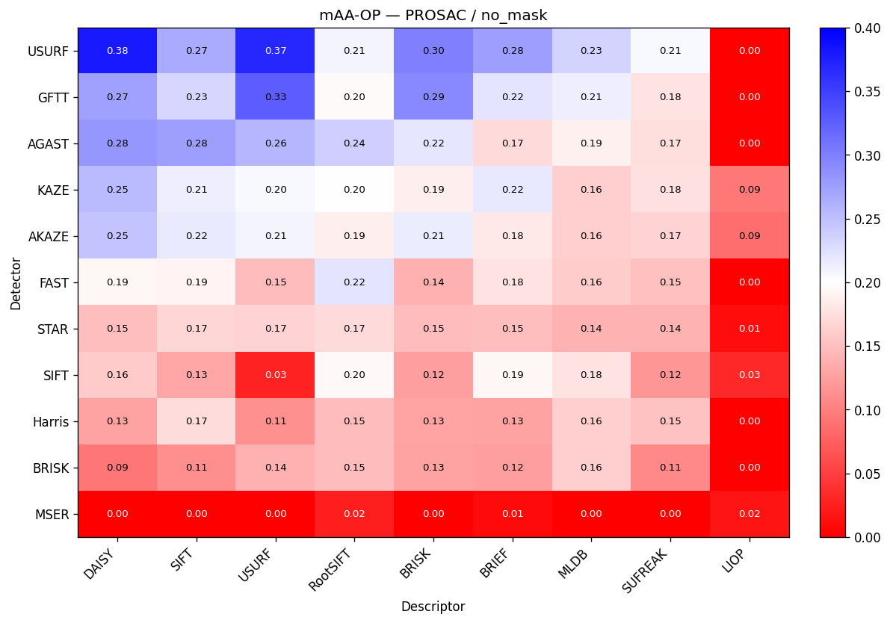

| Detector | DAISY | SIFT | USURF | RootSIFT | BRISK | BRIEF | MLDB | SUFREAK | LIOP |
|---|---|---|---|---|---|---|---|---|---|
| USURF | 0.380 | 0.266 | 0.370 | 0.208 | 0.299 | 0.276 | 0.234 | 0.206 | 0.000 |
| GFTT | 0.275 | 0.233 | 0.327 | 0.197 | 0.293 | 0.221 | 0.213 | 0.177 | 0.000 |
| AGAST | 0.283 | 0.275 | 0.257 | 0.238 | 0.219 | 0.170 | 0.188 | 0.174 | 0.000 |
| KAZE | 0.254 | 0.213 | 0.205 | 0.199 | 0.187 | 0.218 | 0.162 | 0.175 | 0.095 |
| AKAZE | 0.246 | 0.216 | 0.209 | 0.186 | 0.215 | 0.182 | 0.162 | 0.166 | 0.086 |
| FAST | 0.194 | 0.192 | 0.147 | 0.221 | 0.138 | 0.177 | 0.161 | 0.151 | 0.000 |
| STAR | 0.150 | 0.167 | 0.166 | 0.171 | 0.147 | 0.149 | 0.139 | 0.140 | 0.010 |
| SIFT | 0.158 | 0.131 | 0.027 | 0.195 | 0.124 | 0.193 | 0.179 | 0.119 | 0.033 |
| Harris | 0.127 | 0.173 | 0.113 | 0.148 | 0.129 | 0.128 | 0.161 | 0.152 | 0.000 |
| BRISK | 0.093 | 0.111 | 0.139 | 0.147 | 0.127 | 0.125 | 0.162 | 0.107 | 0.000 |
| MSER | 0.000 | 0.000 | 0.000 | 0.024 | 0.000 | 0.008 | 0.000 | 0.000 | 0.016 |

### PROSAC — with_mask

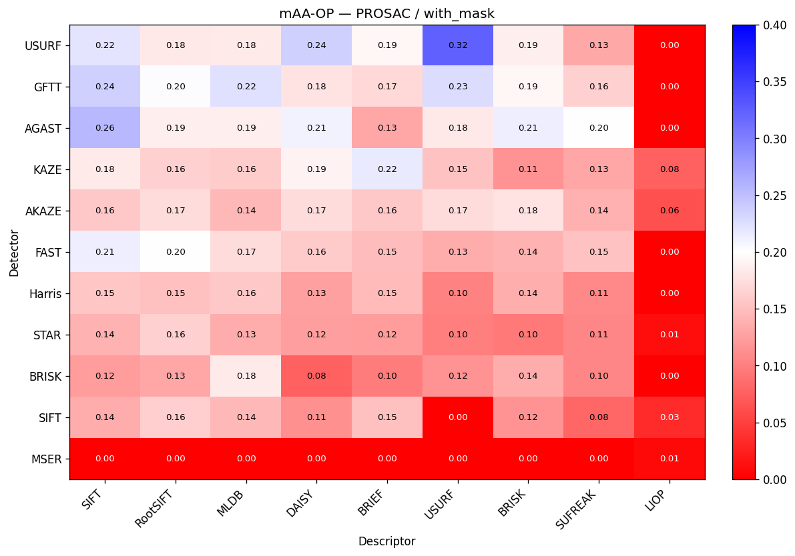

| Detector | SIFT | RootSIFT | MLDB | DAISY | BRIEF | USURF | BRISK | SUFREAK | LIOP |
|---|---|---|---|---|---|---|---|---|---|
| USURF | 0.220 | 0.182 | 0.184 | 0.236 | 0.193 | 0.325 | 0.186 | 0.132 | 0.000 |
| GFTT | 0.237 | 0.203 | 0.224 | 0.180 | 0.169 | 0.227 | 0.193 | 0.164 | 0.000 |
| AGAST | 0.256 | 0.187 | 0.186 | 0.210 | 0.131 | 0.182 | 0.213 | 0.199 | 0.000 |
| KAZE | 0.183 | 0.163 | 0.161 | 0.189 | 0.216 | 0.153 | 0.114 | 0.130 | 0.075 |
| AKAZE | 0.157 | 0.173 | 0.145 | 0.173 | 0.157 | 0.172 | 0.177 | 0.139 | 0.063 |
| FAST | 0.213 | 0.199 | 0.173 | 0.158 | 0.147 | 0.135 | 0.140 | 0.152 | 0.000 |
| Harris | 0.155 | 0.151 | 0.157 | 0.125 | 0.146 | 0.103 | 0.137 | 0.107 | 0.000 |
| STAR | 0.140 | 0.164 | 0.135 | 0.124 | 0.122 | 0.099 | 0.096 | 0.105 | 0.010 |
| BRISK | 0.123 | 0.131 | 0.183 | 0.077 | 0.098 | 0.116 | 0.136 | 0.105 | 0.000 |
| SIFT | 0.136 | 0.162 | 0.145 | 0.113 | 0.151 | 0.000 | 0.116 | 0.081 | 0.034 |
| MSER | 0.000 | 0.000 | 0.000 | 0.000 | 0.000 | 0.000 | 0.000 | 0.000 | 0.008 |

### PROSAC — best_of_both

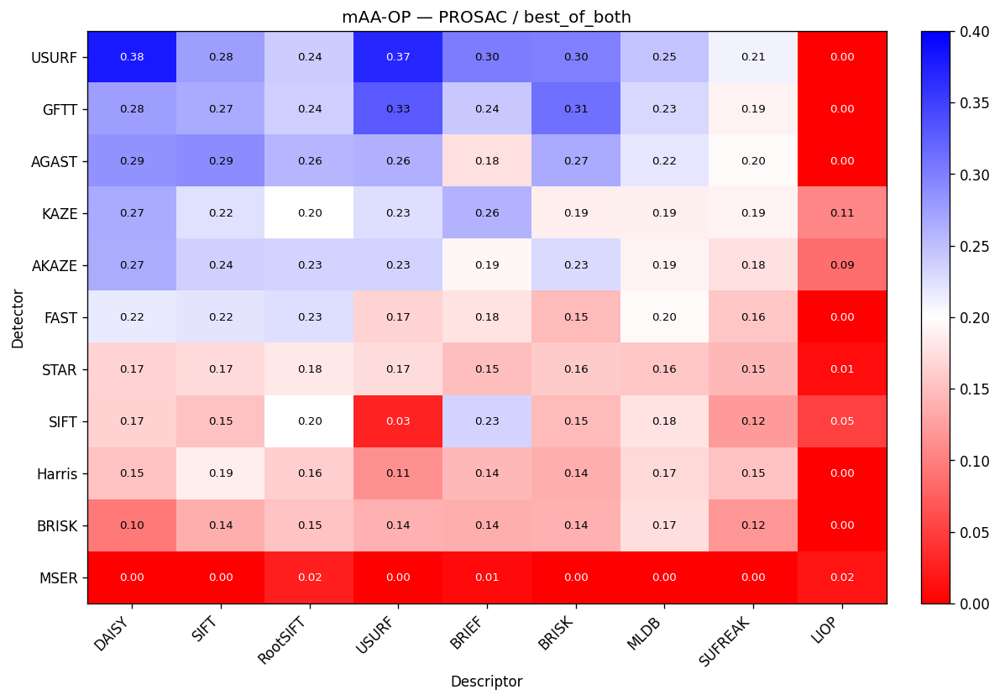

| Detector | DAISY | SIFT | RootSIFT | USURF | BRIEF | BRISK | MLDB | SUFREAK | LIOP |
|---|---|---|---|---|---|---|---|---|---|
| USURF | 0.380 | 0.276 | 0.239 | 0.370 | 0.303 | 0.300 | 0.246 | 0.210 | 0.000 |
| GFTT | 0.276 | 0.267 | 0.239 | 0.330 | 0.243 | 0.312 | 0.231 | 0.189 | 0.000 |
| AGAST | 0.286 | 0.289 | 0.257 | 0.262 | 0.176 | 0.267 | 0.220 | 0.196 | 0.000 |
| KAZE | 0.267 | 0.225 | 0.199 | 0.227 | 0.259 | 0.187 | 0.188 | 0.189 | 0.106 |
| AKAZE | 0.265 | 0.237 | 0.233 | 0.235 | 0.193 | 0.229 | 0.190 | 0.177 | 0.086 |
| FAST | 0.216 | 0.221 | 0.225 | 0.166 | 0.177 | 0.145 | 0.195 | 0.155 | 0.000 |
| STAR | 0.166 | 0.172 | 0.182 | 0.173 | 0.150 | 0.159 | 0.156 | 0.145 | 0.010 |
| SIFT | 0.165 | 0.152 | 0.200 | 0.027 | 0.234 | 0.147 | 0.179 | 0.121 | 0.051 |
| Harris | 0.153 | 0.186 | 0.162 | 0.113 | 0.144 | 0.137 | 0.169 | 0.152 | 0.000 |
| BRISK | 0.097 | 0.136 | 0.153 | 0.139 | 0.137 | 0.138 | 0.174 | 0.117 | 0.000 |
| MSER | 0.000 | 0.000 | 0.024 | 0.000 | 0.008 | 0.000 | 0.000 | 0.000 | 0.016 |

## Precision matrices (detector × descriptor)
One heatmap per (estimator × attempt). Rows/columns are sorted by descending mean Precision, so the strongest detectors sit at the top and the strongest descriptors at the left. Colour: red (0) → white (0.5) → green (1). Colour scale: 0.0 → 1.0.

### PROSAC — no_mask

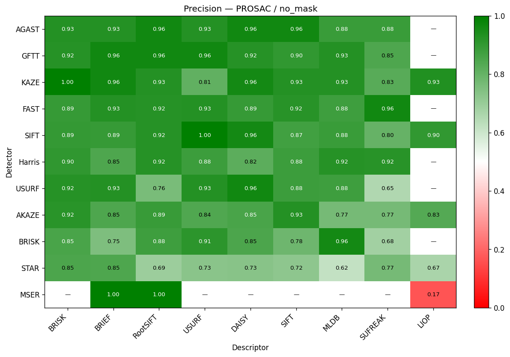

| Detector | BRISK | BRIEF | RootSIFT | USURF | DAISY | SIFT | MLDB | SUFREAK | LIOP |
|---|---|---|---|---|---|---|---|---|---|
| AGAST | 0.926 | 0.929 | 0.963 | 0.929 | 0.964 | 0.964 | 0.885 | 0.885 | N/A |
| GFTT | 0.923 | 0.963 | 0.962 | 0.962 | 0.923 | 0.900 | 0.926 | 0.846 | N/A |
| KAZE | 1.000 | 0.962 | 0.929 | 0.808 | 0.960 | 0.929 | 0.929 | 0.826 | 0.933 |
| FAST | 0.893 | 0.929 | 0.923 | 0.926 | 0.893 | 0.920 | 0.875 | 0.963 | N/A |
| SIFT | 0.895 | 0.893 | 0.923 | 1.000 | 0.960 | 0.870 | 0.885 | 0.800 | 0.900 |
| Harris | 0.905 | 0.846 | 0.923 | 0.882 | 0.818 | 0.880 | 0.923 | 0.920 | N/A |
| USURF | 0.923 | 0.929 | 0.760 | 0.929 | 0.963 | 0.880 | 0.875 | 0.654 | N/A |
| AKAZE | 0.917 | 0.846 | 0.889 | 0.840 | 0.852 | 0.929 | 0.769 | 0.769 | 0.833 |
| BRISK | 0.852 | 0.750 | 0.875 | 0.913 | 0.850 | 0.783 | 0.960 | 0.682 | N/A |
| STAR | 0.850 | 0.846 | 0.692 | 0.727 | 0.731 | 0.720 | 0.615 | 0.769 | 0.667 |
| MSER | N/A | 1.000 | 1.000 | N/A | N/A | N/A | N/A | N/A | 0.167 |

### PROSAC — with_mask

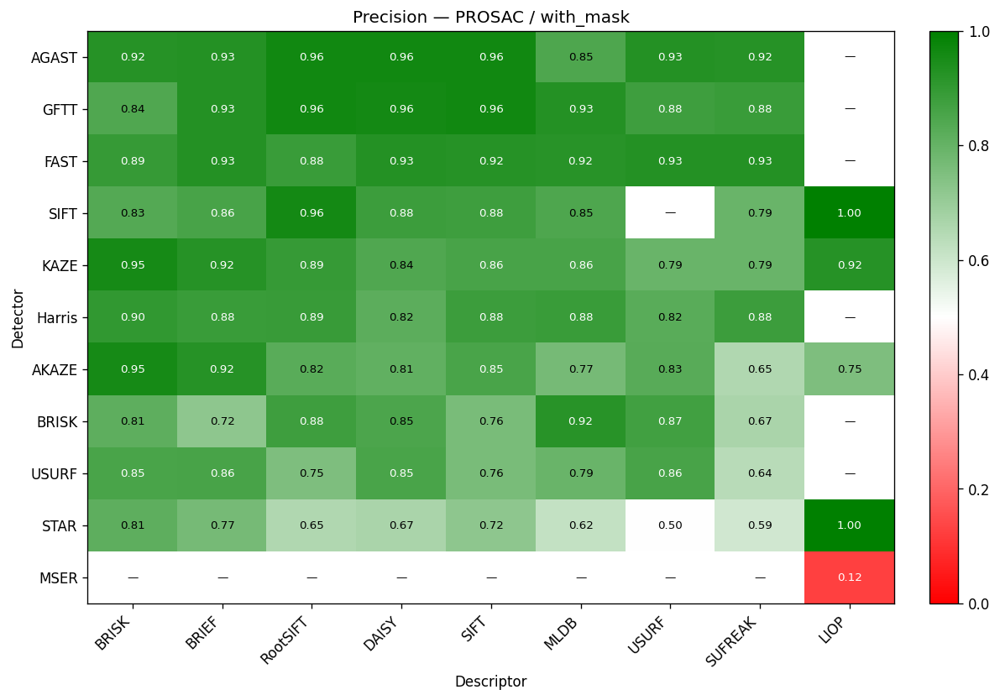

| Detector | BRISK | BRIEF | RootSIFT | DAISY | SIFT | MLDB | USURF | SUFREAK | LIOP |
|---|---|---|---|---|---|---|---|---|---|
| AGAST | 0.923 | 0.929 | 0.962 | 0.964 | 0.962 | 0.846 | 0.926 | 0.923 | N/A |
| GFTT | 0.840 | 0.926 | 0.963 | 0.960 | 0.964 | 0.926 | 0.875 | 0.885 | N/A |
| FAST | 0.893 | 0.929 | 0.885 | 0.929 | 0.923 | 0.920 | 0.926 | 0.929 | N/A |
| SIFT | 0.833 | 0.857 | 0.960 | 0.880 | 0.875 | 0.846 | N/A | 0.792 | 1.000 |
| KAZE | 0.955 | 0.923 | 0.893 | 0.840 | 0.857 | 0.857 | 0.792 | 0.792 | 0.923 |
| Harris | 0.900 | 0.885 | 0.889 | 0.818 | 0.880 | 0.885 | 0.824 | 0.880 | N/A |
| AKAZE | 0.955 | 0.923 | 0.821 | 0.808 | 0.852 | 0.769 | 0.826 | 0.654 | 0.750 |
| BRISK | 0.815 | 0.720 | 0.875 | 0.850 | 0.760 | 0.920 | 0.870 | 0.667 | N/A |
| USURF | 0.852 | 0.857 | 0.750 | 0.852 | 0.760 | 0.792 | 0.857 | 0.640 | N/A |
| STAR | 0.812 | 0.769 | 0.654 | 0.667 | 0.720 | 0.615 | 0.500 | 0.593 | 1.000 |
| MSER | N/A | N/A | N/A | N/A | N/A | N/A | N/A | N/A | 0.125 |

### PROSAC — best_of_both

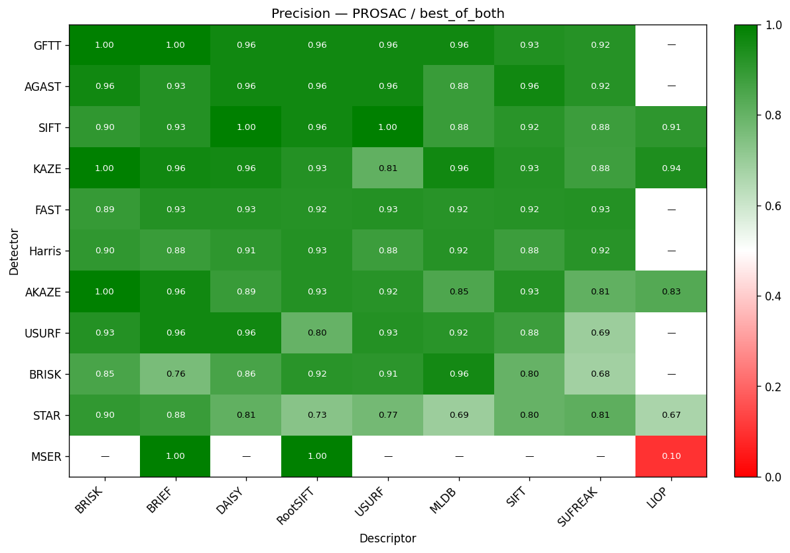

| Detector | BRISK | BRIEF | DAISY | RootSIFT | USURF | MLDB | SIFT | SUFREAK | LIOP |
|---|---|---|---|---|---|---|---|---|---|
| GFTT | 1.000 | 1.000 | 0.962 | 0.963 | 0.962 | 0.963 | 0.933 | 0.923 | N/A |
| AGAST | 0.963 | 0.929 | 0.964 | 0.963 | 0.964 | 0.885 | 0.964 | 0.923 | N/A |
| SIFT | 0.905 | 0.929 | 1.000 | 0.962 | 1.000 | 0.885 | 0.917 | 0.880 | 0.909 |
| KAZE | 1.000 | 0.962 | 0.960 | 0.929 | 0.808 | 0.964 | 0.929 | 0.875 | 0.941 |
| FAST | 0.893 | 0.929 | 0.929 | 0.923 | 0.926 | 0.920 | 0.923 | 0.929 | N/A |
| Harris | 0.905 | 0.885 | 0.909 | 0.926 | 0.882 | 0.923 | 0.880 | 0.920 | N/A |
| AKAZE | 1.000 | 0.962 | 0.889 | 0.929 | 0.920 | 0.846 | 0.929 | 0.808 | 0.833 |
| USURF | 0.926 | 0.964 | 0.963 | 0.800 | 0.929 | 0.917 | 0.880 | 0.692 | N/A |
| BRISK | 0.852 | 0.760 | 0.857 | 0.917 | 0.913 | 0.960 | 0.800 | 0.682 | N/A |
| STAR | 0.900 | 0.885 | 0.808 | 0.731 | 0.773 | 0.692 | 0.800 | 0.815 | 0.667 |
| MSER | N/A | 1.000 | N/A | 1.000 | N/A | N/A | N/A | N/A | 0.100 |

## PCR matrices (detector × descriptor)
One heatmap per (estimator × attempt). Rows/columns are sorted by descending mean PCR, so the strongest detectors sit at the top and the strongest descriptors at the left. Colour: red (0) → white (0.5) → magenta (1). Colour scale: 0.0 → 1.0.

### PROSAC — no_mask

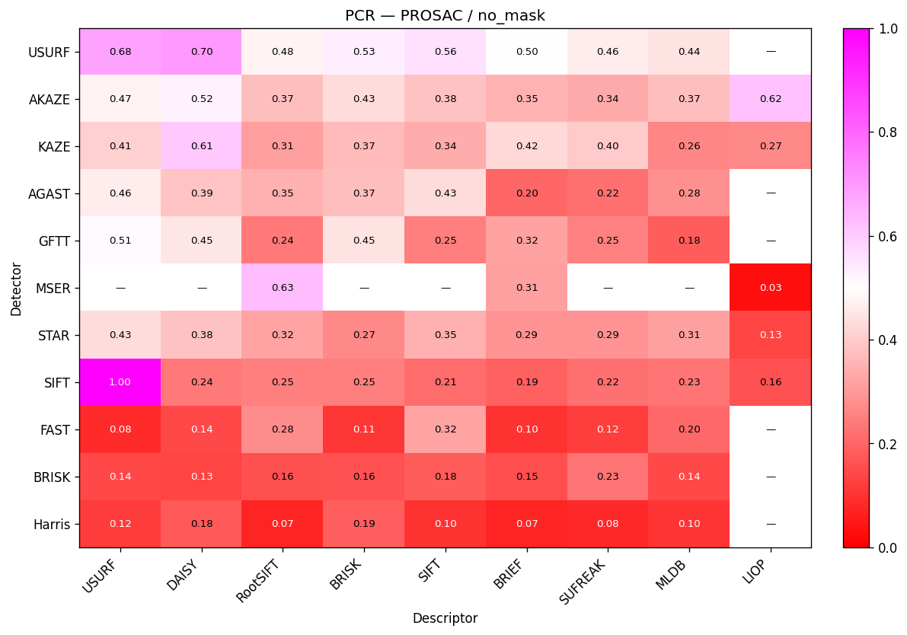

| Detector | USURF | DAISY | RootSIFT | BRISK | SIFT | BRIEF | SUFREAK | MLDB | LIOP |
|---|---|---|---|---|---|---|---|---|---|
| USURF | 0.682 | 0.703 | 0.480 | 0.535 | 0.560 | 0.503 | 0.463 | 0.443 | N/A |
| AKAZE | 0.475 | 0.524 | 0.375 | 0.433 | 0.379 | 0.349 | 0.336 | 0.372 | 0.620 |
| KAZE | 0.407 | 0.607 | 0.311 | 0.366 | 0.337 | 0.424 | 0.398 | 0.263 | 0.269 |
| AGAST | 0.464 | 0.386 | 0.347 | 0.372 | 0.431 | 0.201 | 0.219 | 0.282 | N/A |
| GFTT | 0.510 | 0.450 | 0.240 | 0.449 | 0.248 | 0.318 | 0.252 | 0.182 | N/A |
| MSER | N/A | N/A | 0.632 | N/A | N/A | 0.313 | N/A | N/A | 0.028 |
| STAR | 0.431 | 0.382 | 0.322 | 0.268 | 0.345 | 0.290 | 0.292 | 0.314 | 0.134 |
| SIFT | 1.000 | 0.241 | 0.250 | 0.250 | 0.214 | 0.190 | 0.220 | 0.229 | 0.161 |
| FAST | 0.083 | 0.144 | 0.277 | 0.106 | 0.324 | 0.101 | 0.123 | 0.204 | N/A |
| BRISK | 0.141 | 0.134 | 0.160 | 0.161 | 0.182 | 0.153 | 0.230 | 0.144 | N/A |
| Harris | 0.119 | 0.179 | 0.073 | 0.186 | 0.099 | 0.074 | 0.081 | 0.102 | N/A |

### PROSAC — with_mask

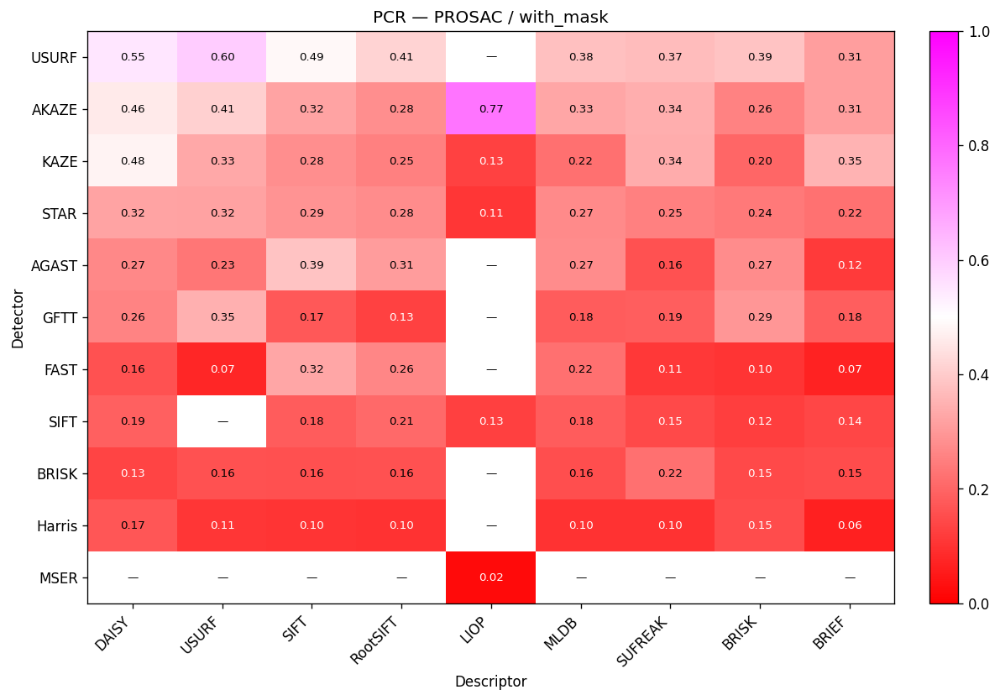

| Detector | DAISY | USURF | SIFT | RootSIFT | LIOP | MLDB | SUFREAK | BRISK | BRIEF |
|---|---|---|---|---|---|---|---|---|---|
| USURF | 0.550 | 0.598 | 0.487 | 0.414 | N/A | 0.376 | 0.369 | 0.387 | 0.312 |
| AKAZE | 0.459 | 0.410 | 0.320 | 0.279 | 0.772 | 0.325 | 0.341 | 0.256 | 0.310 |
| KAZE | 0.477 | 0.329 | 0.278 | 0.251 | 0.130 | 0.219 | 0.338 | 0.203 | 0.352 |
| STAR | 0.323 | 0.319 | 0.292 | 0.275 | 0.106 | 0.271 | 0.253 | 0.240 | 0.225 |
| AGAST | 0.266 | 0.232 | 0.386 | 0.308 | N/A | 0.274 | 0.162 | 0.274 | 0.117 |
| GFTT | 0.262 | 0.345 | 0.173 | 0.130 | N/A | 0.180 | 0.186 | 0.295 | 0.185 |
| FAST | 0.161 | 0.075 | 0.324 | 0.262 | N/A | 0.221 | 0.110 | 0.103 | 0.068 |
| SIFT | 0.189 | N/A | 0.181 | 0.210 | 0.128 | 0.182 | 0.146 | 0.122 | 0.139 |
| BRISK | 0.134 | 0.164 | 0.158 | 0.163 | N/A | 0.156 | 0.219 | 0.148 | 0.151 |
| Harris | 0.170 | 0.109 | 0.105 | 0.100 | N/A | 0.101 | 0.101 | 0.149 | 0.063 |
| MSER | N/A | N/A | N/A | N/A | 0.021 | N/A | N/A | N/A | N/A |

### PROSAC — best_of_both

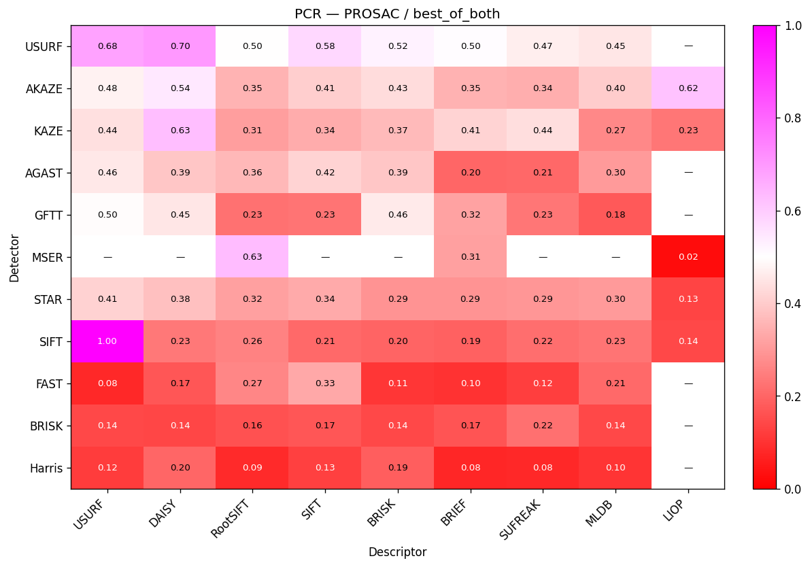

| Detector | USURF | DAISY | RootSIFT | SIFT | BRISK | BRIEF | SUFREAK | MLDB | LIOP |
|---|---|---|---|---|---|---|---|---|---|
| USURF | 0.682 | 0.703 | 0.497 | 0.575 | 0.524 | 0.504 | 0.466 | 0.453 | N/A |
| AKAZE | 0.475 | 0.544 | 0.354 | 0.406 | 0.431 | 0.349 | 0.341 | 0.402 | 0.620 |
| KAZE | 0.439 | 0.625 | 0.311 | 0.338 | 0.366 | 0.415 | 0.436 | 0.268 | 0.231 |
| AGAST | 0.457 | 0.387 | 0.363 | 0.415 | 0.390 | 0.202 | 0.206 | 0.302 | N/A |
| GFTT | 0.496 | 0.450 | 0.225 | 0.227 | 0.457 | 0.318 | 0.233 | 0.178 | N/A |
| MSER | N/A | N/A | 0.632 | N/A | N/A | 0.313 | N/A | N/A | 0.024 |
| STAR | 0.412 | 0.376 | 0.316 | 0.335 | 0.289 | 0.291 | 0.295 | 0.301 | 0.134 |
| SIFT | 1.000 | 0.234 | 0.255 | 0.208 | 0.198 | 0.194 | 0.218 | 0.229 | 0.143 |
| FAST | 0.081 | 0.171 | 0.266 | 0.328 | 0.109 | 0.101 | 0.121 | 0.207 | N/A |
| BRISK | 0.141 | 0.140 | 0.162 | 0.168 | 0.144 | 0.168 | 0.221 | 0.144 | N/A |
| Harris | 0.119 | 0.201 | 0.085 | 0.126 | 0.186 | 0.076 | 0.081 | 0.103 | N/A |

## Match rate matrices (detector × descriptor)
One heatmap per (estimator × attempt). Rows/columns are sorted by descending mean Match rate, so the strongest detectors sit at the top and the strongest descriptors at the left. Colour: red (0) → white (0.5) → azure (1). Colour scale: 0.0 → 1.0.

### PROSAC — no_mask

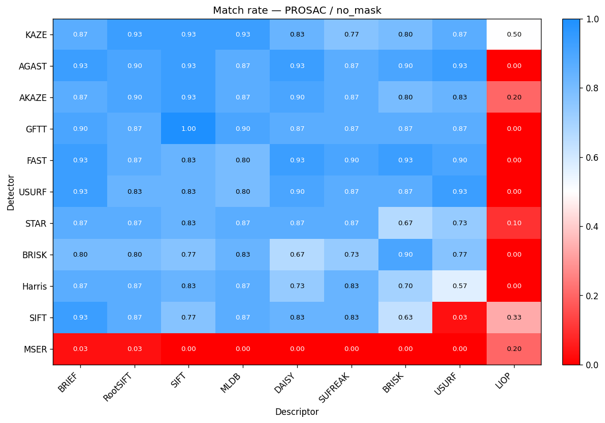

| Detector | BRIEF | RootSIFT | SIFT | MLDB | DAISY | SUFREAK | BRISK | USURF | LIOP |
|---|---|---|---|---|---|---|---|---|---|
| KAZE | 0.867 | 0.933 | 0.933 | 0.933 | 0.833 | 0.767 | 0.800 | 0.867 | 0.500 |
| AGAST | 0.933 | 0.900 | 0.933 | 0.867 | 0.933 | 0.867 | 0.900 | 0.933 | 0.000 |
| AKAZE | 0.867 | 0.900 | 0.933 | 0.867 | 0.900 | 0.867 | 0.800 | 0.833 | 0.200 |
| GFTT | 0.900 | 0.867 | 1.000 | 0.900 | 0.867 | 0.867 | 0.867 | 0.867 | 0.000 |
| FAST | 0.933 | 0.867 | 0.833 | 0.800 | 0.933 | 0.900 | 0.933 | 0.900 | 0.000 |
| USURF | 0.933 | 0.833 | 0.833 | 0.800 | 0.900 | 0.867 | 0.867 | 0.933 | 0.000 |
| STAR | 0.867 | 0.867 | 0.833 | 0.867 | 0.867 | 0.867 | 0.667 | 0.733 | 0.100 |
| BRISK | 0.800 | 0.800 | 0.767 | 0.833 | 0.667 | 0.733 | 0.900 | 0.767 | 0.000 |
| Harris | 0.867 | 0.867 | 0.833 | 0.867 | 0.733 | 0.833 | 0.700 | 0.567 | 0.000 |
| SIFT | 0.933 | 0.867 | 0.767 | 0.867 | 0.833 | 0.833 | 0.633 | 0.033 | 0.333 |
| MSER | 0.033 | 0.033 | 0.000 | 0.000 | 0.000 | 0.000 | 0.000 | 0.000 | 0.200 |

### PROSAC — with_mask

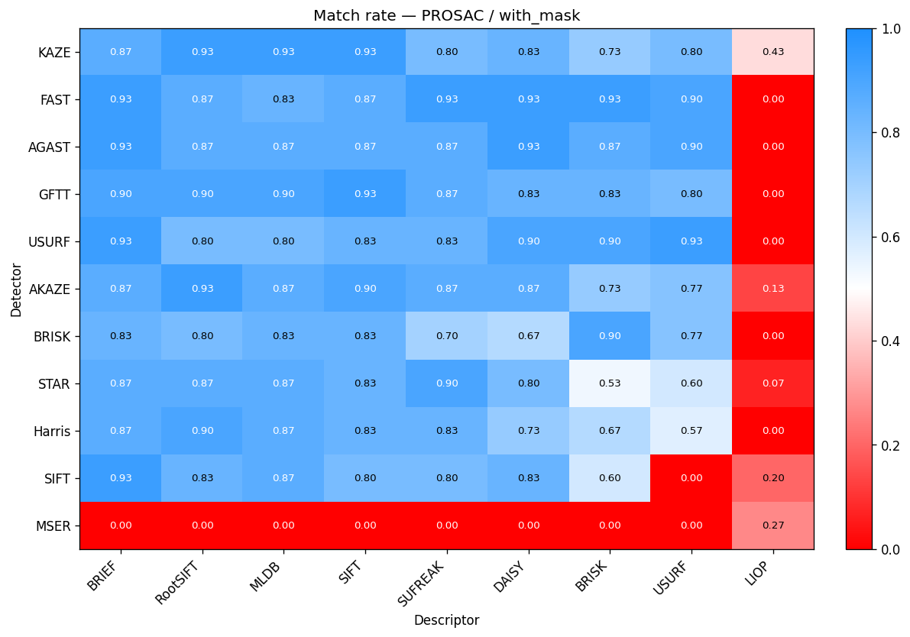

| Detector | BRIEF | RootSIFT | MLDB | SIFT | SUFREAK | DAISY | BRISK | USURF | LIOP |
|---|---|---|---|---|---|---|---|---|---|
| KAZE | 0.867 | 0.933 | 0.933 | 0.933 | 0.800 | 0.833 | 0.733 | 0.800 | 0.433 |
| FAST | 0.933 | 0.867 | 0.833 | 0.867 | 0.933 | 0.933 | 0.933 | 0.900 | 0.000 |
| AGAST | 0.933 | 0.867 | 0.867 | 0.867 | 0.867 | 0.933 | 0.867 | 0.900 | 0.000 |
| GFTT | 0.900 | 0.900 | 0.900 | 0.933 | 0.867 | 0.833 | 0.833 | 0.800 | 0.000 |
| USURF | 0.933 | 0.800 | 0.800 | 0.833 | 0.833 | 0.900 | 0.900 | 0.933 | 0.000 |
| AKAZE | 0.867 | 0.933 | 0.867 | 0.900 | 0.867 | 0.867 | 0.733 | 0.767 | 0.133 |
| BRISK | 0.833 | 0.800 | 0.833 | 0.833 | 0.700 | 0.667 | 0.900 | 0.767 | 0.000 |
| STAR | 0.867 | 0.867 | 0.867 | 0.833 | 0.900 | 0.800 | 0.533 | 0.600 | 0.067 |
| Harris | 0.867 | 0.900 | 0.867 | 0.833 | 0.833 | 0.733 | 0.667 | 0.567 | 0.000 |
| SIFT | 0.933 | 0.833 | 0.867 | 0.800 | 0.800 | 0.833 | 0.600 | 0.000 | 0.200 |
| MSER | 0.000 | 0.000 | 0.000 | 0.000 | 0.000 | 0.000 | 0.000 | 0.000 | 0.267 |

### PROSAC — best_of_both

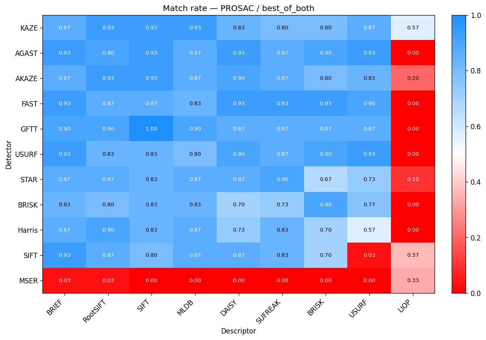

| Detector | BRIEF | RootSIFT | SIFT | MLDB | DAISY | SUFREAK | BRISK | USURF | LIOP |
|---|---|---|---|---|---|---|---|---|---|
| KAZE | 0.867 | 0.933 | 0.933 | 0.933 | 0.833 | 0.800 | 0.800 | 0.867 | 0.567 |
| AGAST | 0.933 | 0.900 | 0.933 | 0.867 | 0.933 | 0.867 | 0.900 | 0.933 | 0.000 |
| AKAZE | 0.867 | 0.933 | 0.933 | 0.867 | 0.900 | 0.867 | 0.800 | 0.833 | 0.200 |
| FAST | 0.933 | 0.867 | 0.867 | 0.833 | 0.933 | 0.933 | 0.933 | 0.900 | 0.000 |
| GFTT | 0.900 | 0.900 | 1.000 | 0.900 | 0.867 | 0.867 | 0.867 | 0.867 | 0.000 |
| USURF | 0.933 | 0.833 | 0.833 | 0.800 | 0.900 | 0.867 | 0.900 | 0.933 | 0.000 |
| STAR | 0.867 | 0.867 | 0.833 | 0.867 | 0.867 | 0.900 | 0.667 | 0.733 | 0.100 |
| BRISK | 0.833 | 0.800 | 0.833 | 0.833 | 0.700 | 0.733 | 0.900 | 0.767 | 0.000 |
| Harris | 0.867 | 0.900 | 0.833 | 0.867 | 0.733 | 0.833 | 0.700 | 0.567 | 0.000 |
| SIFT | 0.933 | 0.867 | 0.800 | 0.867 | 0.867 | 0.833 | 0.700 | 0.033 | 0.367 |
| MSER | 0.033 | 0.033 | 0.000 | 0.000 | 0.000 | 0.000 | 0.000 | 0.000 | 0.333 |

## Fallback benefit (best_of_both vs. single attempt)
For each detector+descriptor combo, how much would mAA-OP improve if the policy ran `mask_mode = both` and kept the better of the two attempts per pair? Δ < 0 means a single attempt is already as good as the picker. One table per estimator.

### PROSAC

| Configuration | mAA-OPno_mask | mAA-OPwith_mask | mAA-OPbest | Δ vs. no_mask | Δ vs. with_mask |
|---|---|---|---|---|---|
| USURF+DAISY | 0.380 | 0.236 | 0.380 | 0.000 | 0.143 |
| GFTT+BRISK | 0.293 | 0.193 | 0.312 | 0.019 | 0.119 |
| USURF+BRISK | 0.299 | 0.186 | 0.300 | 0.001 | 0.113 |
| USURF+BRIEF | 0.276 | 0.193 | 0.303 | 0.026 | 0.110 |
| GFTT+USURF | 0.327 | 0.227 | 0.330 | 0.003 | 0.103 |
| GFTT+DAISY | 0.275 | 0.180 | 0.276 | 0.002 | 0.097 |
| AKAZE+DAISY | 0.246 | 0.173 | 0.265 | 0.019 | 0.092 |
| SIFT+BRIEF | 0.193 | 0.151 | 0.234 | 0.041 | 0.082 |
| AGAST+USURF | 0.257 | 0.182 | 0.262 | 0.005 | 0.080 |
| AKAZE+SIFT | 0.216 | 0.157 | 0.237 | 0.021 | 0.079 |
| USURF+SUFREAK | 0.206 | 0.132 | 0.210 | 0.004 | 0.078 |
| KAZE+DAISY | 0.254 | 0.189 | 0.267 | 0.012 | 0.078 |
| AGAST+DAISY | 0.283 | 0.210 | 0.286 | 0.003 | 0.075 |
| STAR+USURF | 0.166 | 0.099 | 0.173 | 0.007 | 0.074 |
| GFTT+BRIEF | 0.221 | 0.169 | 0.243 | 0.022 | 0.074 |
| KAZE+USURF | 0.205 | 0.153 | 0.227 | 0.022 | 0.074 |
| KAZE+BRISK | 0.187 | 0.114 | 0.187 | 0.000 | 0.073 |
| AGAST+RootSIFT | 0.238 | 0.187 | 0.257 | 0.018 | 0.070 |
| STAR+BRISK | 0.147 | 0.096 | 0.159 | 0.012 | 0.063 |
| AKAZE+USURF | 0.209 | 0.172 | 0.235 | 0.026 | 0.063 |
| USURF+MLDB | 0.234 | 0.184 | 0.246 | 0.013 | 0.062 |
| AKAZE+RootSIFT | 0.186 | 0.173 | 0.233 | 0.047 | 0.061 |
| KAZE+SUFREAK | 0.175 | 0.130 | 0.189 | 0.014 | 0.059 |
| FAST+DAISY | 0.194 | 0.158 | 0.216 | 0.023 | 0.058 |
| USURF+RootSIFT | 0.208 | 0.182 | 0.239 | 0.031 | 0.057 |
| USURF+SIFT | 0.266 | 0.220 | 0.276 | 0.010 | 0.055 |
| AGAST+BRISK | 0.219 | 0.213 | 0.267 | 0.048 | 0.054 |
| SIFT+DAISY | 0.158 | 0.113 | 0.165 | 0.007 | 0.053 |
| AKAZE+BRISK | 0.215 | 0.177 | 0.229 | 0.014 | 0.052 |
| AKAZE+MLDB | 0.162 | 0.145 | 0.190 | 0.028 | 0.046 |
| AGAST+BRIEF | 0.170 | 0.131 | 0.176 | 0.006 | 0.045 |
| USURF+USURF | 0.370 | 0.325 | 0.370 | 0.000 | 0.045 |
| Harris+SUFREAK | 0.152 | 0.107 | 0.152 | 0.000 | 0.045 |
| KAZE+BRIEF | 0.218 | 0.216 | 0.259 | 0.041 | 0.043 |
| STAR+DAISY | 0.150 | 0.124 | 0.166 | 0.016 | 0.042 |
| KAZE+SIFT | 0.213 | 0.183 | 0.225 | 0.012 | 0.041 |
| SIFT+SUFREAK | 0.119 | 0.081 | 0.121 | 0.002 | 0.040 |
| STAR+SUFREAK | 0.140 | 0.105 | 0.145 | 0.005 | 0.040 |
| BRISK+BRIEF | 0.125 | 0.098 | 0.137 | 0.012 | 0.038 |
| SIFT+RootSIFT | 0.195 | 0.162 | 0.200 | 0.005 | 0.038 |
| AKAZE+SUFREAK | 0.166 | 0.139 | 0.177 | 0.010 | 0.038 |
| KAZE+RootSIFT | 0.199 | 0.163 | 0.199 | 0.000 | 0.036 |
| GFTT+RootSIFT | 0.197 | 0.203 | 0.239 | 0.042 | 0.036 |
| AKAZE+BRIEF | 0.182 | 0.157 | 0.193 | 0.010 | 0.036 |
| SIFT+MLDB | 0.179 | 0.145 | 0.179 | 0.000 | 0.034 |
| AGAST+MLDB | 0.188 | 0.186 | 0.220 | 0.032 | 0.034 |
| AGAST+SIFT | 0.275 | 0.256 | 0.289 | 0.014 | 0.033 |
| Harris+SIFT | 0.173 | 0.155 | 0.186 | 0.014 | 0.032 |
| FAST+USURF | 0.147 | 0.135 | 0.166 | 0.018 | 0.031 |
| STAR+SIFT | 0.167 | 0.140 | 0.172 | 0.004 | 0.031 |
| SIFT+BRISK | 0.124 | 0.116 | 0.147 | 0.023 | 0.031 |
| KAZE+LIOP | 0.095 | 0.075 | 0.106 | 0.011 | 0.031 |
| FAST+BRIEF | 0.177 | 0.147 | 0.177 | 0.000 | 0.030 |
| GFTT+SIFT | 0.233 | 0.237 | 0.267 | 0.034 | 0.029 |
| Harris+DAISY | 0.127 | 0.125 | 0.153 | 0.026 | 0.028 |
| STAR+BRIEF | 0.149 | 0.122 | 0.150 | 0.001 | 0.027 |
| SIFT+USURF | 0.027 | 0.000 | 0.027 | 0.000 | 0.027 |
| KAZE+MLDB | 0.162 | 0.161 | 0.188 | 0.026 | 0.027 |
| FAST+RootSIFT | 0.221 | 0.199 | 0.225 | 0.005 | 0.027 |
| GFTT+SUFREAK | 0.177 | 0.164 | 0.189 | 0.012 | 0.026 |
| MSER+RootSIFT | 0.024 | 0.000 | 0.024 | 0.000 | 0.024 |
| AKAZE+LIOP | 0.086 | 0.063 | 0.086 | 0.000 | 0.023 |
| BRISK+USURF | 0.139 | 0.116 | 0.139 | 0.000 | 0.023 |
| BRISK+RootSIFT | 0.147 | 0.131 | 0.153 | 0.006 | 0.022 |
| FAST+MLDB | 0.161 | 0.173 | 0.195 | 0.035 | 0.022 |
| STAR+MLDB | 0.139 | 0.135 | 0.156 | 0.016 | 0.021 |
| BRISK+DAISY | 0.093 | 0.077 | 0.097 | 0.004 | 0.020 |
| STAR+RootSIFT | 0.171 | 0.164 | 0.182 | 0.012 | 0.018 |
| SIFT+LIOP | 0.033 | 0.034 | 0.051 | 0.019 | 0.017 |
| SIFT+SIFT | 0.131 | 0.136 | 0.152 | 0.022 | 0.017 |
| BRISK+SIFT | 0.111 | 0.123 | 0.136 | 0.025 | 0.013 |
| BRISK+SUFREAK | 0.107 | 0.105 | 0.117 | 0.010 | 0.012 |
| Harris+MLDB | 0.161 | 0.157 | 0.169 | 0.008 | 0.012 |
| Harris+RootSIFT | 0.148 | 0.151 | 0.162 | 0.014 | 0.011 |
| Harris+USURF | 0.113 | 0.103 | 0.113 | 0.000 | 0.010 |
| MSER+LIOP | 0.016 | 0.008 | 0.016 | 0.000 | 0.009 |
| MSER+BRIEF | 0.008 | 0.000 | 0.008 | 0.000 | 0.008 |
| FAST+SIFT | 0.192 | 0.213 | 0.221 | 0.029 | 0.008 |
| GFTT+MLDB | 0.213 | 0.224 | 0.231 | 0.018 | 0.006 |
| FAST+BRISK | 0.138 | 0.140 | 0.145 | 0.008 | 0.005 |
| FAST+SUFREAK | 0.151 | 0.152 | 0.155 | 0.004 | 0.003 |
| BRISK+BRISK | 0.127 | 0.136 | 0.138 | 0.011 | 0.002 |
| Harris+BRISK | 0.129 | 0.137 | 0.137 | 0.008 | 0.000 |
| MSER+SUFREAK | 0.000 | 0.000 | 0.000 | 0.000 | 0.000 |
| USURF+LIOP | 0.000 | 0.000 | 0.000 | 0.000 | 0.000 |
| GFTT+LIOP | 0.000 | 0.000 | 0.000 | 0.000 | 0.000 |
| FAST+LIOP | 0.000 | 0.000 | 0.000 | 0.000 | 0.000 |
| Harris+LIOP | 0.000 | 0.000 | 0.000 | 0.000 | 0.000 |
| MSER+DAISY | 0.000 | 0.000 | 0.000 | 0.000 | 0.000 |
| AGAST+LIOP | 0.000 | 0.000 | 0.000 | 0.000 | 0.000 |
| BRISK+LIOP | 0.000 | 0.000 | 0.000 | 0.000 | 0.000 |
| MSER+MLDB | 0.000 | 0.000 | 0.000 | 0.000 | 0.000 |
| MSER+BRISK | 0.000 | 0.000 | 0.000 | 0.000 | 0.000 |
| MSER+SIFT | 0.000 | 0.000 | 0.000 | 0.000 | 0.000 |
| MSER+USURF | 0.000 | 0.000 | 0.000 | 0.000 | 0.000 |
| STAR+LIOP | 0.010 | 0.010 | 0.010 | 0.000 | -0.000 |
| Harris+BRIEF | 0.128 | 0.146 | 0.144 | 0.016 | -0.002 |
| AGAST+SUFREAK | 0.174 | 0.199 | 0.196 | 0.022 | -0.003 |
| BRISK+MLDB | 0.162 | 0.183 | 0.174 | 0.012 | -0.009 |