# Overlap Detection Summary Report

## Overall

Total CSV rows: **495**.
Accuracy tiers (px): **3, 5, 10**.

| Estimator | Attempt | Pairs | mAA-OP | Precision | acc@3 | acc@5 | acc@10 | false_match | no_match |
|---|---|---|---|---|---|---|---|---|---|
| PROSAC | no_mask | 495 | 0.139 | 0.866 | 0.139 | 0.279 | 0.495 | 0.077 | 0.428 |
| PROSAC | with_mask | 495 | 0.100 | 0.836 | 0.079 | 0.174 | 0.453 | 0.089 | 0.459 |
| PROSAC | best_of_both | 495 | 0.151 | 0.903 | 0.158 | 0.301 | 0.527 | 0.057 | 0.416 |

## Per-configuration scoreboard
One table per estimator. Configurations are detector+descriptor; each attempt gets its own mAA-OP / acc@T / false_match / no_match columns.

### PROSAC

Sorted by mAA-OPbest_of_both (descending). 99 detector+descriptor combinations.

| Configuration | Pairs | mAA-OPno_mask | Precno_mask | acc@3no_mask | acc@5no_mask | acc@10no_mask | false_matchno_mask | no_matchno_mask | mAA-OPwith_mask | Precwith_mask | acc@3with_mask | acc@5with_mask | acc@10with_mask | false_matchwith_mask | no_matchwith_mask | mAA-OPbest_of_both | Precbest_of_both | acc@3best_of_both | acc@5best_of_both | acc@10best_of_both | false_matchbest_of_both | no_matchbest_of_both |
|---|---|---|---|---|---|---|---|---|---|---|---|---|---|---|---|---|---|---|---|---|---|---|
| AGAST+SIFT | 5 | 0.534 | 1.000 | 0.600 | 0.800 | 1.000 | 0.000 | 0.000 | 0.440 | 1.000 | 0.600 | 0.800 | 0.800 | 0.000 | 0.200 | 0.534 | 1.000 | 0.600 | 0.800 | 1.000 | 0.000 | 0.000 |
| USURF+DAISY | 5 | 0.522 | 1.000 | 0.600 | 0.800 | 1.000 | 0.000 | 0.000 | 0.427 | 1.000 | 0.600 | 0.600 | 1.000 | 0.000 | 0.000 | 0.522 | 1.000 | 0.600 | 0.800 | 1.000 | 0.000 | 0.000 |
| USURF+USURF | 5 | 0.470 | 0.800 | 0.600 | 0.800 | 0.800 | 0.200 | 0.000 | 0.351 | 0.600 | 0.400 | 0.600 | 0.600 | 0.400 | 0.000 | 0.470 | 0.800 | 0.600 | 0.800 | 0.800 | 0.200 | 0.000 |
| AGAST+DAISY | 5 | 0.445 | 1.000 | 0.400 | 0.800 | 1.000 | 0.000 | 0.000 | 0.265 | 1.000 | 0.000 | 0.600 | 1.000 | 0.000 | 0.000 | 0.456 | 1.000 | 0.400 | 1.000 | 1.000 | 0.000 | 0.000 |
| USURF+BRISK | 5 | 0.418 | 1.000 | 0.600 | 0.600 | 0.800 | 0.000 | 0.200 | 0.230 | 0.600 | 0.200 | 0.200 | 0.600 | 0.400 | 0.000 | 0.418 | 0.800 | 0.600 | 0.600 | 0.800 | 0.200 | 0.000 |
| SIFT+BRIEF | 5 | 0.306 | 0.800 | 0.400 | 0.400 | 0.800 | 0.200 | 0.000 | 0.214 | 0.800 | 0.000 | 0.400 | 0.800 | 0.200 | 0.000 | 0.414 | 1.000 | 0.400 | 0.800 | 1.000 | 0.000 | 0.000 |
| KAZE+BRIEF | 5 | 0.319 | 1.000 | 0.200 | 0.400 | 0.800 | 0.000 | 0.200 | 0.333 | 1.000 | 0.200 | 0.400 | 0.800 | 0.000 | 0.200 | 0.405 | 1.000 | 0.400 | 0.400 | 0.800 | 0.000 | 0.200 |
| GFTT+BRISK | 5 | 0.402 | 1.000 | 0.600 | 0.600 | 0.800 | 0.000 | 0.200 | 0.211 | 0.667 | 0.200 | 0.200 | 0.400 | 0.200 | 0.400 | 0.402 | 1.000 | 0.600 | 0.600 | 0.800 | 0.000 | 0.200 |
| KAZE+SIFT | 5 | 0.341 | 1.000 | 0.200 | 0.800 | 1.000 | 0.000 | 0.000 | 0.293 | 1.000 | 0.200 | 0.400 | 1.000 | 0.000 | 0.000 | 0.400 | 1.000 | 0.400 | 0.800 | 1.000 | 0.000 | 0.000 |
| FAST+BRIEF | 5 | 0.385 | 1.000 | 0.200 | 0.600 | 1.000 | 0.000 | 0.000 | 0.234 | 1.000 | 0.000 | 0.400 | 1.000 | 0.000 | 0.000 | 0.385 | 1.000 | 0.200 | 0.600 | 1.000 | 0.000 | 0.000 |
| GFTT+MLDB | 5 | 0.344 | 1.000 | 0.200 | 0.400 | 1.000 | 0.000 | 0.000 | 0.380 | 1.000 | 0.400 | 0.400 | 1.000 | 0.000 | 0.000 | 0.373 | 1.000 | 0.400 | 0.400 | 1.000 | 0.000 | 0.000 |
| USURF+BRIEF | 5 | 0.337 | 0.800 | 0.400 | 0.800 | 0.800 | 0.200 | 0.000 | 0.168 | 0.800 | 0.000 | 0.200 | 0.800 | 0.200 | 0.000 | 0.371 | 1.000 | 0.400 | 0.800 | 1.000 | 0.000 | 0.000 |
| AKAZE+SIFT | 5 | 0.308 | 0.800 | 0.200 | 0.600 | 0.800 | 0.200 | 0.000 | 0.290 | 1.000 | 0.200 | 0.400 | 0.800 | 0.000 | 0.200 | 0.364 | 0.800 | 0.400 | 0.600 | 0.800 | 0.200 | 0.000 |
| AKAZE+RootSIFT | 5 | 0.242 | 0.800 | 0.200 | 0.200 | 0.800 | 0.200 | 0.000 | 0.303 | 1.000 | 0.200 | 0.400 | 1.000 | 0.000 | 0.000 | 0.364 | 1.000 | 0.400 | 0.400 | 1.000 | 0.000 | 0.000 |
| AGAST+USURF | 5 | 0.329 | 0.800 | 0.200 | 0.800 | 0.800 | 0.200 | 0.000 | 0.313 | 1.000 | 0.200 | 0.400 | 0.800 | 0.000 | 0.200 | 0.363 | 1.000 | 0.200 | 0.800 | 1.000 | 0.000 | 0.000 |
| GFTT+BRIEF | 5 | 0.310 | 1.000 | 0.000 | 0.800 | 1.000 | 0.000 | 0.000 | 0.218 | 0.800 | 0.200 | 0.200 | 0.800 | 0.200 | 0.000 | 0.354 | 1.000 | 0.200 | 0.800 | 1.000 | 0.000 | 0.000 |
| GFTT+SIFT | 5 | 0.344 | 1.000 | 0.200 | 0.600 | 1.000 | 0.000 | 0.000 | 0.318 | 1.000 | 0.200 | 0.400 | 0.800 | 0.000 | 0.200 | 0.344 | 1.000 | 0.200 | 0.600 | 1.000 | 0.000 | 0.000 |
| GFTT+DAISY | 5 | 0.339 | 1.000 | 0.200 | 0.600 | 0.800 | 0.000 | 0.200 | 0.237 | 1.000 | 0.200 | 0.200 | 0.800 | 0.000 | 0.200 | 0.339 | 1.000 | 0.200 | 0.600 | 0.800 | 0.000 | 0.200 |
| AKAZE+DAISY | 5 | 0.338 | 0.600 | 0.400 | 0.400 | 0.600 | 0.400 | 0.000 | 0.079 | 0.500 | 0.000 | 0.000 | 0.400 | 0.400 | 0.200 | 0.338 | 0.600 | 0.400 | 0.400 | 0.600 | 0.400 | 0.000 |
| GFTT+USURF | 5 | 0.336 | 1.000 | 0.200 | 0.600 | 0.600 | 0.000 | 0.400 | 0.066 | 1.000 | 0.000 | 0.000 | 0.400 | 0.000 | 0.600 | 0.336 | 1.000 | 0.200 | 0.600 | 0.600 | 0.000 | 0.400 |
| GFTT+SUFREAK | 5 | 0.298 | 1.000 | 0.400 | 0.400 | 0.800 | 0.000 | 0.200 | 0.168 | 0.750 | 0.000 | 0.400 | 0.600 | 0.200 | 0.200 | 0.330 | 1.000 | 0.400 | 0.600 | 0.800 | 0.000 | 0.200 |
| FAST+DAISY | 5 | 0.324 | 1.000 | 0.200 | 0.600 | 1.000 | 0.000 | 0.000 | 0.213 | 1.000 | 0.000 | 0.400 | 1.000 | 0.000 | 0.000 | 0.329 | 1.000 | 0.200 | 0.800 | 1.000 | 0.000 | 0.000 |
| GFTT+RootSIFT | 5 | 0.284 | 1.000 | 0.200 | 0.600 | 0.800 | 0.000 | 0.200 | 0.190 | 1.000 | 0.000 | 0.200 | 1.000 | 0.000 | 0.000 | 0.314 | 1.000 | 0.200 | 0.600 | 1.000 | 0.000 | 0.000 |
| AGAST+BRIEF | 5 | 0.313 | 1.000 | 0.200 | 0.400 | 1.000 | 0.000 | 0.000 | 0.179 | 1.000 | 0.000 | 0.200 | 1.000 | 0.000 | 0.000 | 0.313 | 1.000 | 0.200 | 0.400 | 1.000 | 0.000 | 0.000 |
| USURF+SUFREAK | 5 | 0.311 | 0.500 | 0.400 | 0.400 | 0.400 | 0.400 | 0.200 | 0.184 | 0.667 | 0.200 | 0.200 | 0.400 | 0.200 | 0.400 | 0.311 | 0.500 | 0.400 | 0.400 | 0.400 | 0.400 | 0.200 |
| KAZE+DAISY | 5 | 0.300 | 1.000 | 0.400 | 0.400 | 0.600 | 0.000 | 0.400 | 0.161 | 1.000 | 0.000 | 0.200 | 0.600 | 0.000 | 0.400 | 0.300 | 1.000 | 0.400 | 0.400 | 0.600 | 0.000 | 0.400 |
| AGAST+BRISK | 5 | 0.195 | 0.750 | 0.000 | 0.400 | 0.600 | 0.200 | 0.200 | 0.233 | 1.000 | 0.200 | 0.200 | 0.600 | 0.000 | 0.400 | 0.294 | 1.000 | 0.200 | 0.400 | 0.800 | 0.000 | 0.200 |
| AGAST+SUFREAK | 5 | 0.292 | 0.750 | 0.200 | 0.400 | 0.600 | 0.200 | 0.200 | 0.277 | 0.750 | 0.200 | 0.400 | 0.600 | 0.200 | 0.200 | 0.292 | 0.750 | 0.200 | 0.400 | 0.600 | 0.200 | 0.200 |
| AKAZE+USURF | 5 | 0.290 | 1.000 | 0.200 | 0.400 | 0.600 | 0.000 | 0.400 | 0.267 | 1.000 | 0.200 | 0.400 | 0.400 | 0.000 | 0.600 | 0.290 | 1.000 | 0.200 | 0.400 | 0.600 | 0.000 | 0.400 |
| USURF+RootSIFT | 5 | 0.280 | 1.000 | 0.200 | 0.400 | 0.600 | 0.000 | 0.400 | 0.196 | 1.000 | 0.200 | 0.200 | 0.400 | 0.000 | 0.600 | 0.280 | 1.000 | 0.200 | 0.400 | 0.600 | 0.000 | 0.400 |
| SIFT+MLDB | 5 | 0.277 | 1.000 | 0.200 | 0.400 | 0.600 | 0.000 | 0.400 | 0.136 | 1.000 | 0.000 | 0.200 | 0.600 | 0.000 | 0.400 | 0.277 | 1.000 | 0.200 | 0.400 | 0.600 | 0.000 | 0.400 |
| FAST+SIFT | 5 | 0.129 | 1.000 | 0.000 | 0.200 | 0.400 | 0.000 | 0.600 | 0.274 | 1.000 | 0.200 | 0.400 | 0.600 | 0.000 | 0.400 | 0.275 | 1.000 | 0.200 | 0.400 | 0.600 | 0.000 | 0.400 |
| AGAST+RootSIFT | 5 | 0.205 | 1.000 | 0.000 | 0.600 | 0.800 | 0.000 | 0.200 | 0.221 | 1.000 | 0.200 | 0.200 | 0.800 | 0.000 | 0.200 | 0.272 | 1.000 | 0.200 | 0.600 | 0.800 | 0.000 | 0.200 |
| KAZE+USURF | 5 | 0.269 | 0.667 | 0.400 | 0.400 | 0.400 | 0.200 | 0.400 | 0.044 | 0.500 | 0.000 | 0.000 | 0.200 | 0.200 | 0.600 | 0.269 | 0.667 | 0.400 | 0.400 | 0.400 | 0.200 | 0.400 |
| AKAZE+MLDB | 5 | 0.267 | 0.750 | 0.400 | 0.400 | 0.600 | 0.200 | 0.200 | 0.064 | 0.750 | 0.000 | 0.000 | 0.600 | 0.200 | 0.200 | 0.267 | 0.750 | 0.400 | 0.400 | 0.600 | 0.200 | 0.200 |
| FAST+RootSIFT | 5 | 0.264 | 1.000 | 0.200 | 0.400 | 0.600 | 0.000 | 0.400 | 0.124 | 0.667 | 0.000 | 0.200 | 0.400 | 0.200 | 0.400 | 0.264 | 1.000 | 0.200 | 0.400 | 0.600 | 0.000 | 0.400 |
| BRISK+BRISK | 5 | 0.263 | 0.750 | 0.200 | 0.400 | 0.600 | 0.200 | 0.200 | 0.272 | 0.750 | 0.200 | 0.400 | 0.600 | 0.200 | 0.200 | 0.263 | 0.750 | 0.200 | 0.400 | 0.600 | 0.200 | 0.200 |
| AKAZE+BRIEF | 5 | 0.259 | 0.750 | 0.200 | 0.400 | 0.600 | 0.200 | 0.200 | 0.230 | 0.750 | 0.200 | 0.200 | 0.600 | 0.200 | 0.200 | 0.259 | 0.750 | 0.200 | 0.400 | 0.600 | 0.200 | 0.200 |
| SIFT+BRISK | 5 | 0.242 | 1.000 | 0.200 | 0.400 | 0.400 | 0.000 | 0.600 | 0.213 | 1.000 | 0.200 | 0.400 | 0.400 | 0.000 | 0.600 | 0.242 | 1.000 | 0.200 | 0.400 | 0.400 | 0.000 | 0.600 |
| STAR+RootSIFT | 5 | 0.231 | 0.750 | 0.200 | 0.200 | 0.600 | 0.200 | 0.200 | 0.231 | 0.750 | 0.200 | 0.200 | 0.600 | 0.200 | 0.200 | 0.231 | 0.750 | 0.200 | 0.200 | 0.600 | 0.200 | 0.200 |
| STAR+BRIEF | 5 | 0.223 | 0.750 | 0.200 | 0.200 | 0.600 | 0.200 | 0.200 | 0.170 | 0.500 | 0.200 | 0.200 | 0.400 | 0.400 | 0.200 | 0.229 | 1.000 | 0.200 | 0.200 | 0.800 | 0.000 | 0.200 |
| STAR+SUFREAK | 5 | 0.229 | 1.000 | 0.200 | 0.200 | 0.800 | 0.000 | 0.200 | 0.041 | 0.250 | 0.000 | 0.000 | 0.200 | 0.600 | 0.200 | 0.229 | 1.000 | 0.200 | 0.200 | 0.800 | 0.000 | 0.200 |
| SIFT+RootSIFT | 5 | 0.203 | 0.750 | 0.000 | 0.400 | 0.600 | 0.200 | 0.200 | 0.160 | 1.000 | 0.000 | 0.200 | 0.600 | 0.000 | 0.400 | 0.226 | 1.000 | 0.000 | 0.400 | 0.800 | 0.000 | 0.200 |
| SIFT+DAISY | 5 | 0.223 | 1.000 | 0.000 | 0.600 | 0.800 | 0.000 | 0.200 | 0.063 | 0.500 | 0.000 | 0.000 | 0.400 | 0.400 | 0.200 | 0.223 | 1.000 | 0.000 | 0.600 | 0.800 | 0.000 | 0.200 |
| AKAZE+SUFREAK | 5 | 0.217 | 0.500 | 0.200 | 0.200 | 0.400 | 0.400 | 0.200 | 0.217 | 0.500 | 0.200 | 0.200 | 0.400 | 0.400 | 0.200 | 0.217 | 0.500 | 0.200 | 0.200 | 0.400 | 0.400 | 0.200 |
| SIFT+SUFREAK | 5 | 0.216 | 1.000 | 0.000 | 0.400 | 0.800 | 0.000 | 0.200 | 0.037 | 0.667 | 0.000 | 0.000 | 0.400 | 0.200 | 0.400 | 0.216 | 1.000 | 0.000 | 0.400 | 0.800 | 0.000 | 0.200 |
| STAR+MLDB | 5 | 0.216 | 0.500 | 0.200 | 0.200 | 0.400 | 0.400 | 0.200 | 0.045 | 0.250 | 0.000 | 0.000 | 0.200 | 0.600 | 0.200 | 0.216 | 0.500 | 0.200 | 0.200 | 0.400 | 0.400 | 0.200 |
| STAR+SIFT | 5 | 0.192 | 0.667 | 0.200 | 0.200 | 0.400 | 0.200 | 0.400 | 0.203 | 1.000 | 0.200 | 0.200 | 0.600 | 0.000 | 0.400 | 0.199 | 1.000 | 0.200 | 0.200 | 0.600 | 0.000 | 0.400 |
| USURF+SIFT | 5 | 0.198 | 1.000 | 0.200 | 0.200 | 0.400 | 0.000 | 0.600 | 0.196 | 1.000 | 0.200 | 0.200 | 0.400 | 0.000 | 0.600 | 0.198 | 1.000 | 0.200 | 0.200 | 0.400 | 0.000 | 0.600 |
| USURF+MLDB | 5 | 0.190 | 1.000 | 0.200 | 0.200 | 0.400 | 0.000 | 0.600 | 0.130 | 1.000 | 0.000 | 0.200 | 0.400 | 0.000 | 0.600 | 0.190 | 1.000 | 0.200 | 0.200 | 0.400 | 0.000 | 0.600 |
| KAZE+BRISK | 5 | 0.186 | 1.000 | 0.200 | 0.200 | 0.400 | 0.000 | 0.600 | 0.046 | 1.000 | 0.000 | 0.000 | 0.200 | 0.000 | 0.800 | 0.186 | 1.000 | 0.200 | 0.200 | 0.400 | 0.000 | 0.600 |
| STAR+DAISY | 5 | 0.185 | 0.500 | 0.200 | 0.200 | 0.400 | 0.400 | 0.200 | 0.194 | 0.667 | 0.200 | 0.200 | 0.400 | 0.200 | 0.400 | 0.185 | 0.500 | 0.200 | 0.200 | 0.400 | 0.400 | 0.200 |
| FAST+SUFREAK | 5 | 0.182 | 1.000 | 0.000 | 0.400 | 1.000 | 0.000 | 0.000 | 0.161 | 1.000 | 0.000 | 0.200 | 1.000 | 0.000 | 0.000 | 0.182 | 1.000 | 0.000 | 0.400 | 1.000 | 0.000 | 0.000 |
| Harris+SIFT | 5 | 0.181 | 0.667 | 0.200 | 0.200 | 0.400 | 0.200 | 0.400 | 0.188 | 0.667 | 0.200 | 0.200 | 0.400 | 0.200 | 0.400 | 0.181 | 0.667 | 0.200 | 0.200 | 0.400 | 0.200 | 0.400 |
| AGAST+MLDB | 5 | 0.172 | 1.000 | 0.000 | 0.200 | 0.800 | 0.000 | 0.200 | 0.095 | 0.750 | 0.000 | 0.000 | 0.600 | 0.200 | 0.200 | 0.172 | 1.000 | 0.000 | 0.200 | 0.800 | 0.000 | 0.200 |
| BRISK+BRIEF | 5 | 0.166 | 0.500 | 0.200 | 0.200 | 0.400 | 0.400 | 0.200 | 0.069 | 0.500 | 0.000 | 0.000 | 0.400 | 0.400 | 0.200 | 0.166 | 0.500 | 0.200 | 0.200 | 0.400 | 0.400 | 0.200 |
| KAZE+SUFREAK | 5 | 0.101 | 1.000 | 0.000 | 0.200 | 0.200 | 0.000 | 0.800 | 0.164 | 1.000 | 0.000 | 0.400 | 0.400 | 0.000 | 0.600 | 0.165 | 1.000 | 0.000 | 0.400 | 0.400 | 0.000 | 0.600 |
| STAR+USURF | 5 | 0.165 | 1.000 | 0.200 | 0.200 | 0.200 | 0.000 | 0.800 | 0.100 | 1.000 | 0.000 | 0.200 | 0.200 | 0.000 | 0.800 | 0.165 | 1.000 | 0.200 | 0.200 | 0.200 | 0.000 | 0.800 |
| FAST+BRISK | 5 | 0.164 | 1.000 | 0.000 | 0.200 | 1.000 | 0.000 | 0.000 | 0.168 | 1.000 | 0.000 | 0.200 | 1.000 | 0.000 | 0.000 | 0.164 | 1.000 | 0.000 | 0.200 | 1.000 | 0.000 | 0.000 |
| KAZE+MLDB | 5 | 0.132 | 1.000 | 0.000 | 0.200 | 1.000 | 0.000 | 0.000 | 0.166 | 0.800 | 0.000 | 0.400 | 0.800 | 0.200 | 0.000 | 0.164 | 1.000 | 0.000 | 0.400 | 1.000 | 0.000 | 0.000 |
| FAST+USURF | 5 | 0.160 | 1.000 | 0.000 | 0.200 | 0.800 | 0.000 | 0.200 | 0.153 | 1.000 | 0.000 | 0.200 | 0.800 | 0.000 | 0.200 | 0.160 | 1.000 | 0.000 | 0.200 | 0.800 | 0.000 | 0.200 |
| Harris+MLDB | 5 | 0.159 | 1.000 | 0.000 | 0.200 | 0.600 | 0.000 | 0.400 | 0.125 | 0.667 | 0.000 | 0.200 | 0.400 | 0.200 | 0.400 | 0.159 | 1.000 | 0.000 | 0.200 | 0.600 | 0.000 | 0.400 |
| SIFT+SIFT | 5 | 0.047 | 0.333 | 0.000 | 0.000 | 0.200 | 0.400 | 0.400 | 0.156 | 0.750 | 0.000 | 0.200 | 0.600 | 0.200 | 0.200 | 0.158 | 0.750 | 0.000 | 0.200 | 0.600 | 0.200 | 0.200 |
| FAST+MLDB | 5 | 0.124 | 0.667 | 0.000 | 0.200 | 0.400 | 0.200 | 0.400 | 0.151 | 1.000 | 0.000 | 0.200 | 0.600 | 0.000 | 0.400 | 0.154 | 1.000 | 0.000 | 0.200 | 0.600 | 0.000 | 0.400 |
| KAZE+RootSIFT | 5 | 0.153 | 1.000 | 0.000 | 0.200 | 1.000 | 0.000 | 0.000 | 0.147 | 1.000 | 0.000 | 0.200 | 1.000 | 0.000 | 0.000 | 0.153 | 1.000 | 0.000 | 0.200 | 1.000 | 0.000 | 0.000 |
| BRISK+USURF | 5 | 0.151 | 1.000 | 0.200 | 0.200 | 0.200 | 0.000 | 0.800 | 0.151 | 1.000 | 0.200 | 0.200 | 0.200 | 0.000 | 0.800 | 0.151 | 1.000 | 0.200 | 0.200 | 0.200 | 0.000 | 0.800 |
| BRISK+SUFREAK | 5 | 0.148 | 0.500 | 0.200 | 0.200 | 0.200 | 0.200 | 0.600 | 0.168 | 0.500 | 0.200 | 0.200 | 0.200 | 0.200 | 0.600 | 0.148 | 0.500 | 0.200 | 0.200 | 0.200 | 0.200 | 0.600 |
| Harris+RootSIFT | 5 | 0.119 | 0.667 | 0.000 | 0.200 | 0.400 | 0.200 | 0.400 | 0.143 | 0.750 | 0.000 | 0.200 | 0.600 | 0.200 | 0.200 | 0.137 | 0.750 | 0.000 | 0.200 | 0.600 | 0.200 | 0.200 |
| KAZE+LIOP | 5 | 0.127 | 1.000 | 0.000 | 0.200 | 0.400 | 0.000 | 0.600 | 0.079 | 1.000 | 0.000 | 0.000 | 0.400 | 0.000 | 0.600 | 0.127 | 1.000 | 0.000 | 0.200 | 0.400 | 0.000 | 0.600 |
| BRISK+SIFT | 5 | 0.058 | 1.000 | 0.000 | 0.000 | 0.400 | 0.000 | 0.600 | 0.118 | 1.000 | 0.000 | 0.200 | 0.400 | 0.000 | 0.600 | 0.122 | 1.000 | 0.000 | 0.200 | 0.400 | 0.000 | 0.600 |
| AKAZE+LIOP | 5 | 0.103 | 1.000 | 0.000 | 0.200 | 0.200 | 0.000 | 0.800 | 0.101 | 1.000 | 0.000 | 0.200 | 0.200 | 0.000 | 0.800 | 0.103 | 1.000 | 0.000 | 0.200 | 0.200 | 0.000 | 0.800 |
| Harris+BRISK | 5 | 0.087 | 1.000 | 0.000 | 0.200 | 0.200 | 0.000 | 0.800 | 0.000 | N/A | 0.000 | 0.000 | 0.000 | 0.000 | 1.000 | 0.087 | 1.000 | 0.000 | 0.200 | 0.200 | 0.000 | 0.800 |
| BRISK+RootSIFT | 5 | 0.076 | 1.000 | 0.000 | 0.000 | 0.400 | 0.000 | 0.600 | 0.050 | 1.000 | 0.000 | 0.000 | 0.400 | 0.000 | 0.600 | 0.076 | 1.000 | 0.000 | 0.000 | 0.400 | 0.000 | 0.600 |
| Harris+BRIEF | 5 | 0.073 | 0.750 | 0.000 | 0.000 | 0.600 | 0.200 | 0.200 | 0.081 | 0.750 | 0.000 | 0.000 | 0.600 | 0.200 | 0.200 | 0.073 | 0.750 | 0.000 | 0.000 | 0.600 | 0.200 | 0.200 |
| BRISK+MLDB | 5 | 0.069 | 1.000 | 0.000 | 0.000 | 0.400 | 0.000 | 0.600 | 0.079 | 1.000 | 0.000 | 0.000 | 0.400 | 0.000 | 0.600 | 0.069 | 1.000 | 0.000 | 0.000 | 0.400 | 0.000 | 0.600 |
| Harris+SUFREAK | 5 | 0.056 | 1.000 | 0.000 | 0.000 | 0.600 | 0.000 | 0.400 | 0.047 | 0.667 | 0.000 | 0.000 | 0.400 | 0.200 | 0.400 | 0.056 | 1.000 | 0.000 | 0.000 | 0.600 | 0.000 | 0.400 |
| Harris+DAISY | 5 | 0.000 | 0.000 | 0.000 | 0.000 | 0.000 | 0.200 | 0.800 | 0.045 | 1.000 | 0.000 | 0.000 | 0.200 | 0.000 | 0.800 | 0.045 | 1.000 | 0.000 | 0.000 | 0.200 | 0.000 | 0.800 |
| BRISK+DAISY | 5 | 0.044 | 1.000 | 0.000 | 0.000 | 0.200 | 0.000 | 0.800 | 0.040 | 1.000 | 0.000 | 0.000 | 0.200 | 0.000 | 0.800 | 0.044 | 1.000 | 0.000 | 0.000 | 0.200 | 0.000 | 0.800 |
| AKAZE+BRISK | 5 | 0.044 | 1.000 | 0.000 | 0.000 | 0.400 | 0.000 | 0.600 | 0.036 | 1.000 | 0.000 | 0.000 | 0.200 | 0.000 | 0.800 | 0.044 | 1.000 | 0.000 | 0.000 | 0.400 | 0.000 | 0.600 |
| SIFT+LIOP | 5 | 0.038 | 1.000 | 0.000 | 0.000 | 0.200 | 0.000 | 0.800 | 0.000 | N/A | 0.000 | 0.000 | 0.000 | 0.000 | 1.000 | 0.038 | 1.000 | 0.000 | 0.000 | 0.200 | 0.000 | 0.800 |
| GFTT+LIOP | 5 | 0.000 | N/A | 0.000 | 0.000 | 0.000 | 0.000 | 1.000 | 0.000 | N/A | 0.000 | 0.000 | 0.000 | 0.000 | 1.000 | 0.000 | N/A | 0.000 | 0.000 | 0.000 | 0.000 | 1.000 |
| Harris+LIOP | 5 | 0.000 | N/A | 0.000 | 0.000 | 0.000 | 0.000 | 1.000 | 0.000 | N/A | 0.000 | 0.000 | 0.000 | 0.000 | 1.000 | 0.000 | N/A | 0.000 | 0.000 | 0.000 | 0.000 | 1.000 |
| Harris+USURF | 5 | 0.000 | N/A | 0.000 | 0.000 | 0.000 | 0.000 | 1.000 | 0.000 | N/A | 0.000 | 0.000 | 0.000 | 0.000 | 1.000 | 0.000 | N/A | 0.000 | 0.000 | 0.000 | 0.000 | 1.000 |
| FAST+LIOP | 5 | 0.000 | N/A | 0.000 | 0.000 | 0.000 | 0.000 | 1.000 | 0.000 | N/A | 0.000 | 0.000 | 0.000 | 0.000 | 1.000 | 0.000 | N/A | 0.000 | 0.000 | 0.000 | 0.000 | 1.000 |
| SIFT+USURF | 5 | 0.000 | N/A | 0.000 | 0.000 | 0.000 | 0.000 | 1.000 | 0.000 | N/A | 0.000 | 0.000 | 0.000 | 0.000 | 1.000 | 0.000 | N/A | 0.000 | 0.000 | 0.000 | 0.000 | 1.000 |
| BRISK+LIOP | 5 | 0.000 | N/A | 0.000 | 0.000 | 0.000 | 0.000 | 1.000 | 0.000 | N/A | 0.000 | 0.000 | 0.000 | 0.000 | 1.000 | 0.000 | N/A | 0.000 | 0.000 | 0.000 | 0.000 | 1.000 |
| AGAST+LIOP | 5 | 0.000 | N/A | 0.000 | 0.000 | 0.000 | 0.000 | 1.000 | 0.000 | N/A | 0.000 | 0.000 | 0.000 | 0.000 | 1.000 | 0.000 | N/A | 0.000 | 0.000 | 0.000 | 0.000 | 1.000 |
| USURF+LIOP | 5 | 0.000 | N/A | 0.000 | 0.000 | 0.000 | 0.000 | 1.000 | 0.000 | N/A | 0.000 | 0.000 | 0.000 | 0.000 | 1.000 | 0.000 | N/A | 0.000 | 0.000 | 0.000 | 0.000 | 1.000 |
| STAR+BRISK | 5 | 0.000 | N/A | 0.000 | 0.000 | 0.000 | 0.000 | 1.000 | 0.000 | N/A | 0.000 | 0.000 | 0.000 | 0.000 | 1.000 | 0.000 | N/A | 0.000 | 0.000 | 0.000 | 0.000 | 1.000 |
| STAR+LIOP | 5 | 0.000 | N/A | 0.000 | 0.000 | 0.000 | 0.000 | 1.000 | 0.000 | N/A | 0.000 | 0.000 | 0.000 | 0.000 | 1.000 | 0.000 | N/A | 0.000 | 0.000 | 0.000 | 0.000 | 1.000 |
| MSER+SIFT | 5 | 0.000 | N/A | 0.000 | 0.000 | 0.000 | 0.000 | 1.000 | 0.000 | N/A | 0.000 | 0.000 | 0.000 | 0.000 | 1.000 | 0.000 | N/A | 0.000 | 0.000 | 0.000 | 0.000 | 1.000 |
| MSER+RootSIFT | 5 | 0.000 | N/A | 0.000 | 0.000 | 0.000 | 0.000 | 1.000 | 0.000 | N/A | 0.000 | 0.000 | 0.000 | 0.000 | 1.000 | 0.000 | N/A | 0.000 | 0.000 | 0.000 | 0.000 | 1.000 |
| MSER+USURF | 5 | 0.000 | N/A | 0.000 | 0.000 | 0.000 | 0.000 | 1.000 | 0.000 | N/A | 0.000 | 0.000 | 0.000 | 0.000 | 1.000 | 0.000 | N/A | 0.000 | 0.000 | 0.000 | 0.000 | 1.000 |
| MSER+BRIEF | 5 | 0.000 | N/A | 0.000 | 0.000 | 0.000 | 0.000 | 1.000 | 0.000 | N/A | 0.000 | 0.000 | 0.000 | 0.000 | 1.000 | 0.000 | N/A | 0.000 | 0.000 | 0.000 | 0.000 | 1.000 |
| MSER+BRISK | 5 | 0.000 | N/A | 0.000 | 0.000 | 0.000 | 0.000 | 1.000 | 0.000 | N/A | 0.000 | 0.000 | 0.000 | 0.000 | 1.000 | 0.000 | N/A | 0.000 | 0.000 | 0.000 | 0.000 | 1.000 |
| MSER+DAISY | 5 | 0.000 | N/A | 0.000 | 0.000 | 0.000 | 0.000 | 1.000 | 0.000 | N/A | 0.000 | 0.000 | 0.000 | 0.000 | 1.000 | 0.000 | N/A | 0.000 | 0.000 | 0.000 | 0.000 | 1.000 |
| MSER+SUFREAK | 5 | 0.000 | N/A | 0.000 | 0.000 | 0.000 | 0.000 | 1.000 | 0.000 | N/A | 0.000 | 0.000 | 0.000 | 0.000 | 1.000 | 0.000 | N/A | 0.000 | 0.000 | 0.000 | 0.000 | 1.000 |
| MSER+MLDB | 5 | 0.000 | N/A | 0.000 | 0.000 | 0.000 | 0.000 | 1.000 | 0.000 | N/A | 0.000 | 0.000 | 0.000 | 0.000 | 1.000 | 0.000 | N/A | 0.000 | 0.000 | 0.000 | 0.000 | 1.000 |
| MSER+LIOP | 5 | 0.000 | 0.000 | 0.000 | 0.000 | 0.000 | 0.400 | 0.600 | 0.000 | N/A | 0.000 | 0.000 | 0.000 | 0.000 | 1.000 | 0.000 | 0.000 | 0.000 | 0.000 | 0.000 | 0.400 | 0.600 |

## mAA-OP matrices (detector × descriptor)
One heatmap per (estimator × attempt). Rows/columns are sorted by descending mean mAA-OP, so the strongest detectors sit at the top and the strongest descriptors at the left. Colour: red (low) → white → blue (high). Colour scale: 0.0 → 0.6.

### PROSAC — no_mask

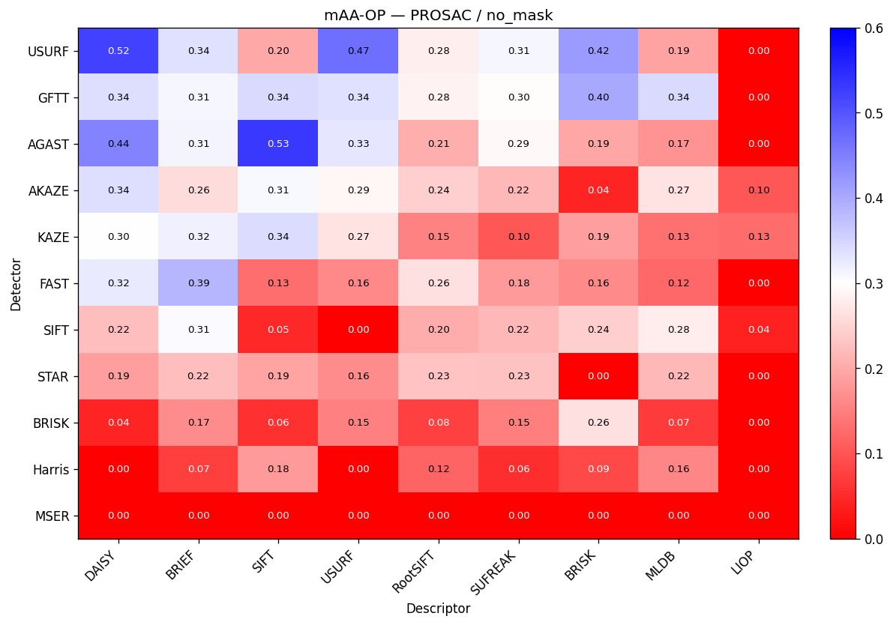

| Detector | DAISY | BRIEF | SIFT | USURF | RootSIFT | SUFREAK | BRISK | MLDB | LIOP |
|---|---|---|---|---|---|---|---|---|---|
| USURF | 0.522 | 0.337 | 0.198 | 0.470 | 0.280 | 0.311 | 0.418 | 0.190 | 0.000 |
| GFTT | 0.339 | 0.310 | 0.344 | 0.336 | 0.284 | 0.298 | 0.402 | 0.344 | 0.000 |
| AGAST | 0.445 | 0.313 | 0.534 | 0.329 | 0.205 | 0.292 | 0.195 | 0.172 | 0.000 |
| AKAZE | 0.338 | 0.259 | 0.308 | 0.290 | 0.242 | 0.217 | 0.044 | 0.267 | 0.103 |
| KAZE | 0.300 | 0.319 | 0.341 | 0.269 | 0.153 | 0.101 | 0.186 | 0.132 | 0.127 |
| FAST | 0.324 | 0.385 | 0.129 | 0.160 | 0.264 | 0.182 | 0.164 | 0.124 | 0.000 |
| SIFT | 0.223 | 0.306 | 0.047 | 0.000 | 0.203 | 0.216 | 0.242 | 0.277 | 0.038 |
| STAR | 0.185 | 0.223 | 0.192 | 0.165 | 0.231 | 0.229 | 0.000 | 0.216 | 0.000 |
| BRISK | 0.044 | 0.166 | 0.058 | 0.151 | 0.076 | 0.148 | 0.263 | 0.069 | 0.000 |
| Harris | 0.000 | 0.073 | 0.181 | 0.000 | 0.119 | 0.056 | 0.087 | 0.159 | 0.000 |
| MSER | 0.000 | 0.000 | 0.000 | 0.000 | 0.000 | 0.000 | 0.000 | 0.000 | 0.000 |

### PROSAC — with_mask

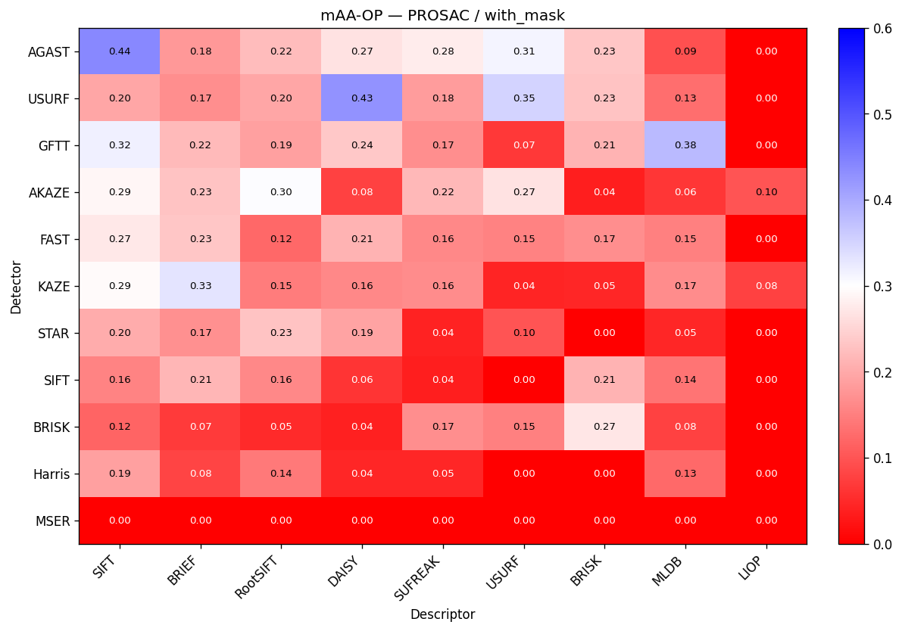

| Detector | SIFT | BRIEF | RootSIFT | DAISY | SUFREAK | USURF | BRISK | MLDB | LIOP |
|---|---|---|---|---|---|---|---|---|---|
| AGAST | 0.440 | 0.179 | 0.221 | 0.265 | 0.277 | 0.313 | 0.233 | 0.095 | 0.000 |
| USURF | 0.196 | 0.168 | 0.196 | 0.427 | 0.184 | 0.351 | 0.230 | 0.130 | 0.000 |
| GFTT | 0.318 | 0.218 | 0.190 | 0.237 | 0.168 | 0.066 | 0.211 | 0.380 | 0.000 |
| AKAZE | 0.290 | 0.230 | 0.303 | 0.079 | 0.217 | 0.267 | 0.036 | 0.064 | 0.101 |
| FAST | 0.274 | 0.234 | 0.124 | 0.213 | 0.161 | 0.153 | 0.168 | 0.151 | 0.000 |
| KAZE | 0.293 | 0.333 | 0.147 | 0.161 | 0.164 | 0.044 | 0.046 | 0.166 | 0.079 |
| STAR | 0.203 | 0.170 | 0.231 | 0.194 | 0.041 | 0.100 | 0.000 | 0.045 | 0.000 |
| SIFT | 0.156 | 0.214 | 0.160 | 0.063 | 0.037 | 0.000 | 0.213 | 0.136 | 0.000 |
| BRISK | 0.118 | 0.069 | 0.050 | 0.040 | 0.168 | 0.151 | 0.272 | 0.079 | 0.000 |
| Harris | 0.188 | 0.081 | 0.143 | 0.045 | 0.047 | 0.000 | 0.000 | 0.125 | 0.000 |
| MSER | 0.000 | 0.000 | 0.000 | 0.000 | 0.000 | 0.000 | 0.000 | 0.000 | 0.000 |

### PROSAC — best_of_both

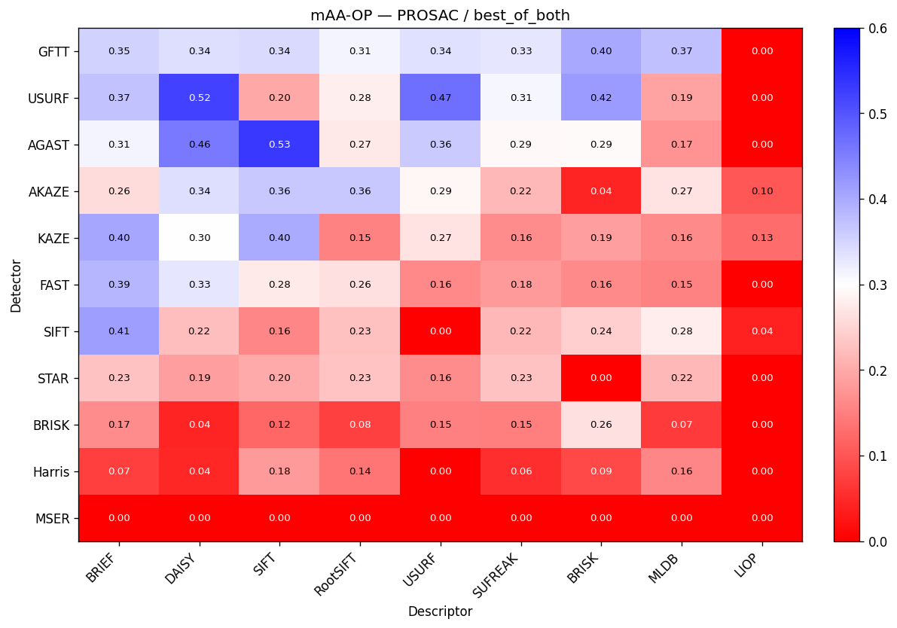

| Detector | BRIEF | DAISY | SIFT | RootSIFT | USURF | SUFREAK | BRISK | MLDB | LIOP |
|---|---|---|---|---|---|---|---|---|---|
| GFTT | 0.354 | 0.339 | 0.344 | 0.314 | 0.336 | 0.330 | 0.402 | 0.373 | 0.000 |
| USURF | 0.371 | 0.522 | 0.198 | 0.280 | 0.470 | 0.311 | 0.418 | 0.190 | 0.000 |
| AGAST | 0.313 | 0.456 | 0.534 | 0.272 | 0.363 | 0.292 | 0.294 | 0.172 | 0.000 |
| AKAZE | 0.259 | 0.338 | 0.364 | 0.364 | 0.290 | 0.217 | 0.044 | 0.267 | 0.103 |
| KAZE | 0.405 | 0.300 | 0.400 | 0.153 | 0.269 | 0.165 | 0.186 | 0.164 | 0.127 |
| FAST | 0.385 | 0.329 | 0.275 | 0.264 | 0.160 | 0.182 | 0.164 | 0.154 | 0.000 |
| SIFT | 0.414 | 0.223 | 0.158 | 0.226 | 0.000 | 0.216 | 0.242 | 0.277 | 0.038 |
| STAR | 0.229 | 0.185 | 0.199 | 0.231 | 0.165 | 0.229 | 0.000 | 0.216 | 0.000 |
| BRISK | 0.166 | 0.044 | 0.122 | 0.076 | 0.151 | 0.148 | 0.263 | 0.069 | 0.000 |
| Harris | 0.073 | 0.045 | 0.181 | 0.137 | 0.000 | 0.056 | 0.087 | 0.159 | 0.000 |
| MSER | 0.000 | 0.000 | 0.000 | 0.000 | 0.000 | 0.000 | 0.000 | 0.000 | 0.000 |

## Precision matrices (detector × descriptor)
One heatmap per (estimator × attempt). Rows/columns are sorted by descending mean Precision, so the strongest detectors sit at the top and the strongest descriptors at the left. Colour: red (0) → white (0.5) → green (1). Colour scale: 0.0 → 1.0.

### PROSAC — no_mask

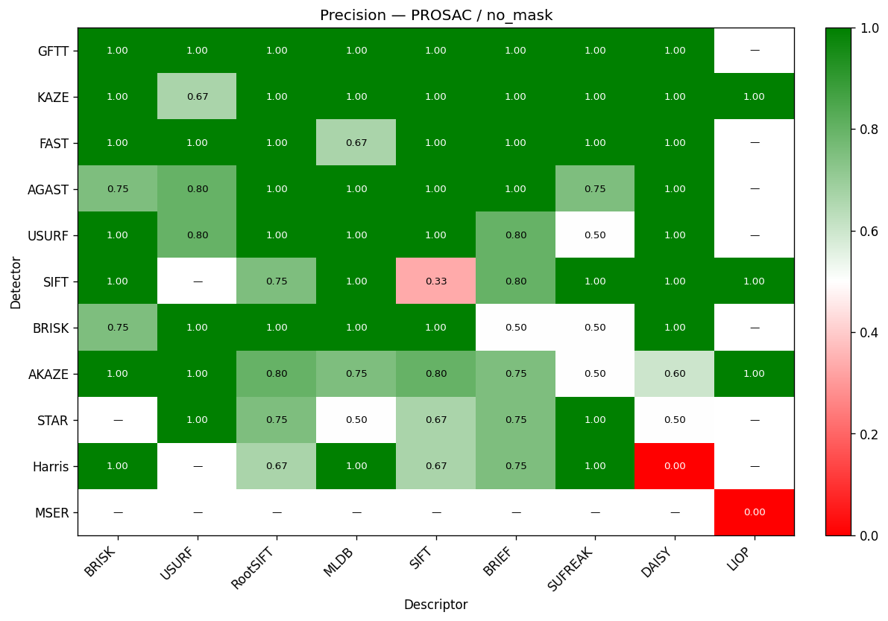

| Detector | BRISK | USURF | RootSIFT | MLDB | SIFT | BRIEF | SUFREAK | DAISY | LIOP |
|---|---|---|---|---|---|---|---|---|---|
| GFTT | 1.000 | 1.000 | 1.000 | 1.000 | 1.000 | 1.000 | 1.000 | 1.000 | N/A |
| KAZE | 1.000 | 0.667 | 1.000 | 1.000 | 1.000 | 1.000 | 1.000 | 1.000 | 1.000 |
| FAST | 1.000 | 1.000 | 1.000 | 0.667 | 1.000 | 1.000 | 1.000 | 1.000 | N/A |
| AGAST | 0.750 | 0.800 | 1.000 | 1.000 | 1.000 | 1.000 | 0.750 | 1.000 | N/A |
| USURF | 1.000 | 0.800 | 1.000 | 1.000 | 1.000 | 0.800 | 0.500 | 1.000 | N/A |
| SIFT | 1.000 | N/A | 0.750 | 1.000 | 0.333 | 0.800 | 1.000 | 1.000 | 1.000 |
| BRISK | 0.750 | 1.000 | 1.000 | 1.000 | 1.000 | 0.500 | 0.500 | 1.000 | N/A |
| AKAZE | 1.000 | 1.000 | 0.800 | 0.750 | 0.800 | 0.750 | 0.500 | 0.600 | 1.000 |
| STAR | N/A | 1.000 | 0.750 | 0.500 | 0.667 | 0.750 | 1.000 | 0.500 | N/A |
| Harris | 1.000 | N/A | 0.667 | 1.000 | 0.667 | 0.750 | 1.000 | 0.000 | N/A |
| MSER | N/A | N/A | N/A | N/A | N/A | N/A | N/A | N/A | 0.000 |

### PROSAC — with_mask

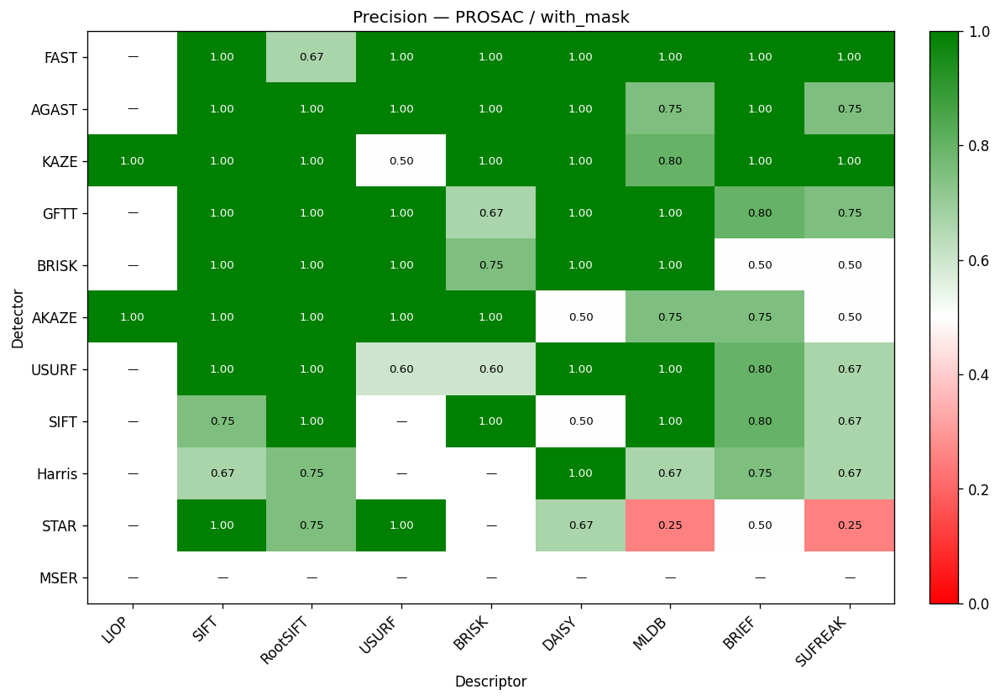

| Detector | LIOP | SIFT | RootSIFT | USURF | BRISK | DAISY | MLDB | BRIEF | SUFREAK |
|---|---|---|---|---|---|---|---|---|---|
| FAST | N/A | 1.000 | 0.667 | 1.000 | 1.000 | 1.000 | 1.000 | 1.000 | 1.000 |
| AGAST | N/A | 1.000 | 1.000 | 1.000 | 1.000 | 1.000 | 0.750 | 1.000 | 0.750 |
| KAZE | 1.000 | 1.000 | 1.000 | 0.500 | 1.000 | 1.000 | 0.800 | 1.000 | 1.000 |
| GFTT | N/A | 1.000 | 1.000 | 1.000 | 0.667 | 1.000 | 1.000 | 0.800 | 0.750 |
| BRISK | N/A | 1.000 | 1.000 | 1.000 | 0.750 | 1.000 | 1.000 | 0.500 | 0.500 |
| AKAZE | 1.000 | 1.000 | 1.000 | 1.000 | 1.000 | 0.500 | 0.750 | 0.750 | 0.500 |
| USURF | N/A | 1.000 | 1.000 | 0.600 | 0.600 | 1.000 | 1.000 | 0.800 | 0.667 |
| SIFT | N/A | 0.750 | 1.000 | N/A | 1.000 | 0.500 | 1.000 | 0.800 | 0.667 |
| Harris | N/A | 0.667 | 0.750 | N/A | N/A | 1.000 | 0.667 | 0.750 | 0.667 |
| STAR | N/A | 1.000 | 0.750 | 1.000 | N/A | 0.667 | 0.250 | 0.500 | 0.250 |
| MSER | N/A | N/A | N/A | N/A | N/A | N/A | N/A | N/A | N/A |

### PROSAC — best_of_both

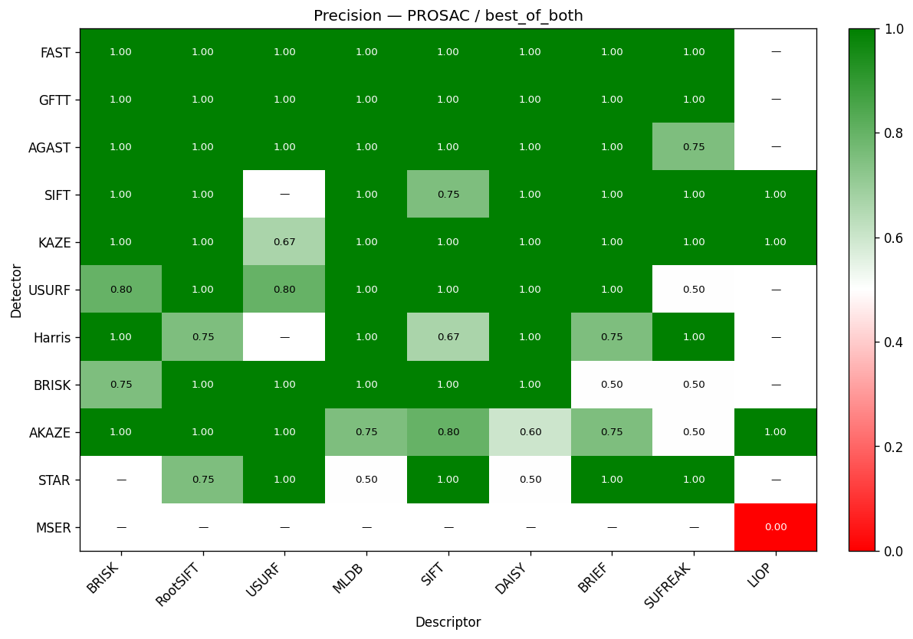

| Detector | BRISK | RootSIFT | USURF | MLDB | SIFT | DAISY | BRIEF | SUFREAK | LIOP |
|---|---|---|---|---|---|---|---|---|---|
| FAST | 1.000 | 1.000 | 1.000 | 1.000 | 1.000 | 1.000 | 1.000 | 1.000 | N/A |
| GFTT | 1.000 | 1.000 | 1.000 | 1.000 | 1.000 | 1.000 | 1.000 | 1.000 | N/A |
| AGAST | 1.000 | 1.000 | 1.000 | 1.000 | 1.000 | 1.000 | 1.000 | 0.750 | N/A |
| SIFT | 1.000 | 1.000 | N/A | 1.000 | 0.750 | 1.000 | 1.000 | 1.000 | 1.000 |
| KAZE | 1.000 | 1.000 | 0.667 | 1.000 | 1.000 | 1.000 | 1.000 | 1.000 | 1.000 |
| USURF | 0.800 | 1.000 | 0.800 | 1.000 | 1.000 | 1.000 | 1.000 | 0.500 | N/A |
| Harris | 1.000 | 0.750 | N/A | 1.000 | 0.667 | 1.000 | 0.750 | 1.000 | N/A |
| BRISK | 0.750 | 1.000 | 1.000 | 1.000 | 1.000 | 1.000 | 0.500 | 0.500 | N/A |
| AKAZE | 1.000 | 1.000 | 1.000 | 0.750 | 0.800 | 0.600 | 0.750 | 0.500 | 1.000 |
| STAR | N/A | 0.750 | 1.000 | 0.500 | 1.000 | 0.500 | 1.000 | 1.000 | N/A |
| MSER | N/A | N/A | N/A | N/A | N/A | N/A | N/A | N/A | 0.000 |

## PCR matrices (detector × descriptor)
One heatmap per (estimator × attempt). Rows/columns are sorted by descending mean PCR, so the strongest detectors sit at the top and the strongest descriptors at the left. Colour: red (0) → white (0.5) → magenta (1). Colour scale: 0.0 → 1.0.

### PROSAC — no_mask

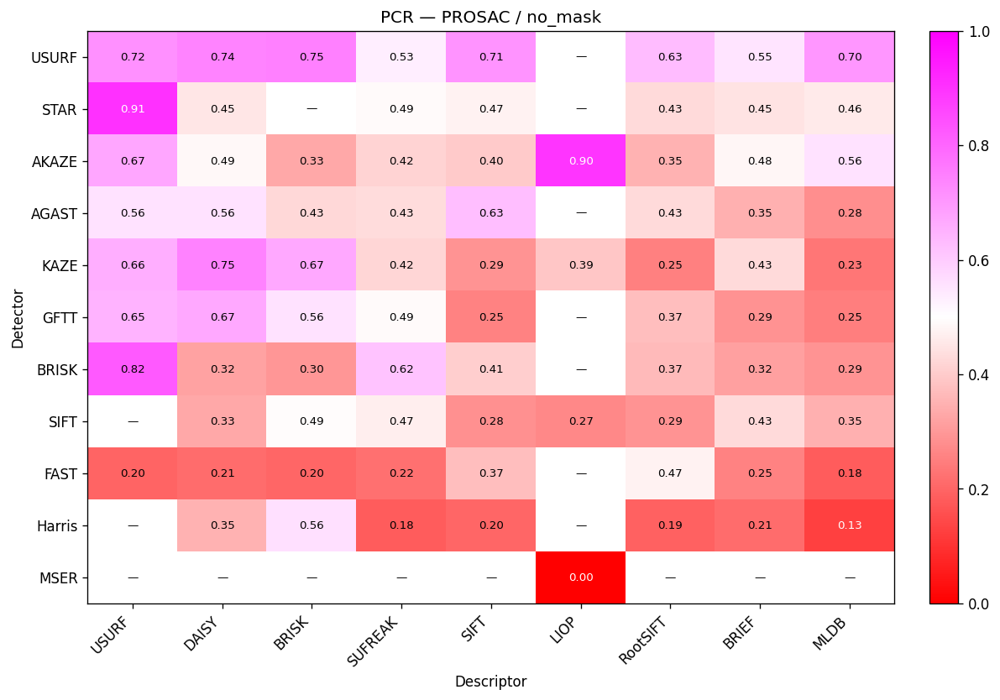

| Detector | USURF | DAISY | BRISK | SUFREAK | SIFT | LIOP | RootSIFT | BRIEF | MLDB |
|---|---|---|---|---|---|---|---|---|---|
| USURF | 0.718 | 0.738 | 0.747 | 0.534 | 0.708 | N/A | 0.631 | 0.553 | 0.703 |
| STAR | 0.906 | 0.449 | N/A | 0.490 | 0.475 | N/A | 0.427 | 0.446 | 0.459 |
| AKAZE | 0.673 | 0.486 | 0.331 | 0.415 | 0.395 | 0.898 | 0.351 | 0.481 | 0.557 |
| AGAST | 0.558 | 0.557 | 0.425 | 0.432 | 0.627 | N/A | 0.427 | 0.347 | 0.280 |
| KAZE | 0.659 | 0.746 | 0.668 | 0.419 | 0.289 | 0.388 | 0.250 | 0.426 | 0.234 |
| GFTT | 0.648 | 0.669 | 0.555 | 0.488 | 0.254 | N/A | 0.375 | 0.286 | 0.248 |
| BRISK | 0.823 | 0.320 | 0.297 | 0.616 | 0.405 | N/A | 0.367 | 0.316 | 0.292 |
| SIFT | N/A | 0.330 | 0.493 | 0.468 | 0.285 | 0.268 | 0.291 | 0.428 | 0.346 |
| FAST | 0.199 | 0.212 | 0.201 | 0.221 | 0.374 | N/A | 0.474 | 0.255 | 0.182 |
| Harris | N/A | 0.349 | 0.561 | 0.181 | 0.201 | N/A | 0.192 | 0.213 | 0.127 |
| MSER | N/A | N/A | N/A | N/A | N/A | 0.000 | N/A | N/A | N/A |

### PROSAC — with_mask

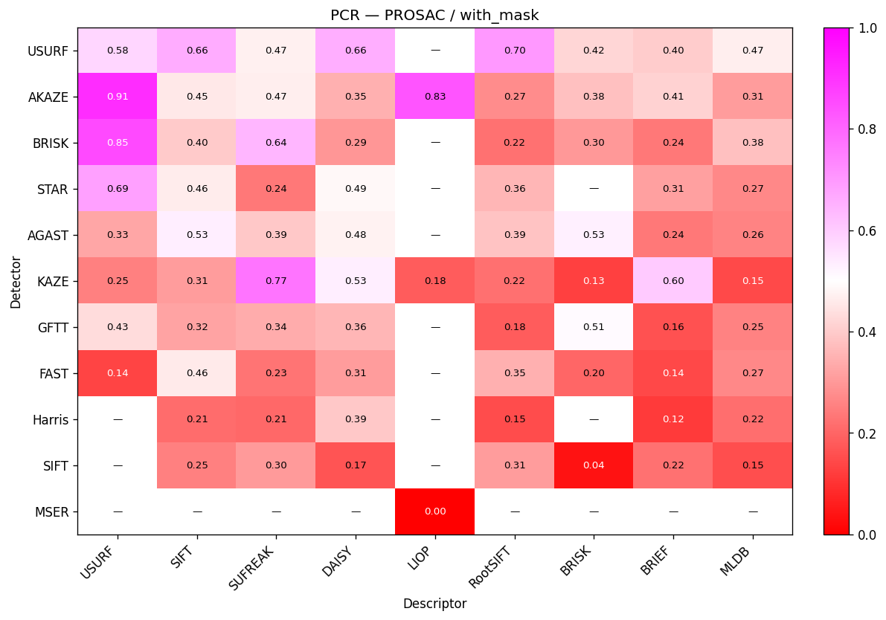

| Detector | USURF | SIFT | SUFREAK | DAISY | LIOP | RootSIFT | BRISK | BRIEF | MLDB |
|---|---|---|---|---|---|---|---|---|---|
| USURF | 0.579 | 0.664 | 0.471 | 0.658 | N/A | 0.701 | 0.422 | 0.402 | 0.465 |
| AKAZE | 0.911 | 0.453 | 0.466 | 0.345 | 0.833 | 0.274 | 0.375 | 0.413 | 0.307 |
| BRISK | 0.852 | 0.397 | 0.644 | 0.295 | N/A | 0.224 | 0.298 | 0.238 | 0.376 |
| STAR | 0.686 | 0.462 | 0.238 | 0.488 | N/A | 0.357 | N/A | 0.313 | 0.269 |
| AGAST | 0.325 | 0.535 | 0.395 | 0.477 | N/A | 0.385 | 0.531 | 0.236 | 0.261 |
| KAZE | 0.252 | 0.308 | 0.773 | 0.534 | 0.181 | 0.221 | 0.129 | 0.602 | 0.148 |
| GFTT | 0.431 | 0.321 | 0.340 | 0.357 | N/A | 0.183 | 0.512 | 0.161 | 0.254 |
| FAST | 0.136 | 0.460 | 0.228 | 0.305 | N/A | 0.345 | 0.202 | 0.141 | 0.268 |
| Harris | N/A | 0.213 | 0.205 | 0.394 | N/A | 0.152 | N/A | 0.115 | 0.219 |
| SIFT | N/A | 0.254 | 0.302 | 0.168 | N/A | 0.306 | 0.035 | 0.224 | 0.153 |
| MSER | N/A | N/A | N/A | N/A | 0.000 | N/A | N/A | N/A | N/A |

### PROSAC — best_of_both

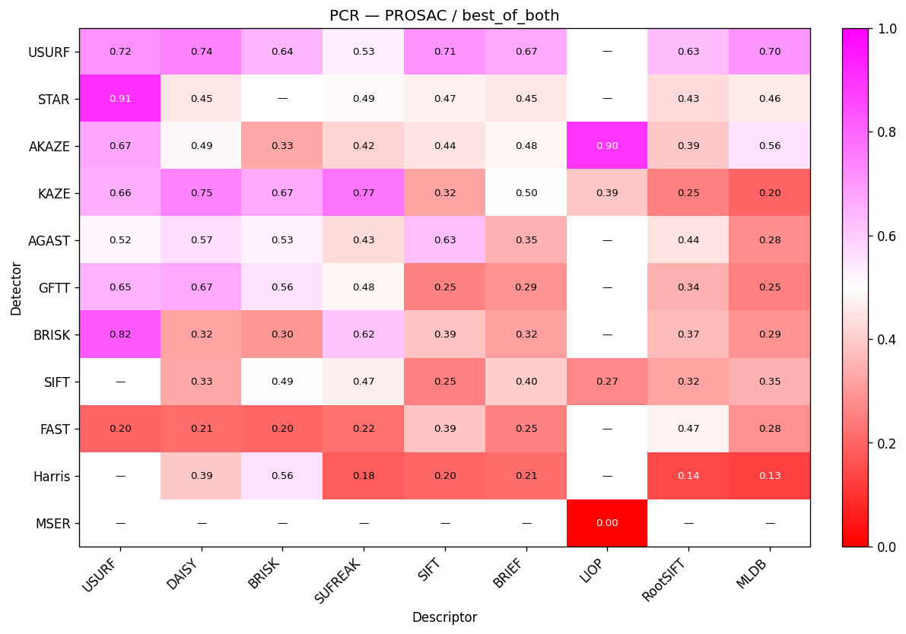

| Detector | USURF | DAISY | BRISK | SUFREAK | SIFT | BRIEF | LIOP | RootSIFT | MLDB |
|---|---|---|---|---|---|---|---|---|---|
| USURF | 0.718 | 0.738 | 0.644 | 0.534 | 0.708 | 0.669 | N/A | 0.631 | 0.703 |
| STAR | 0.906 | 0.449 | N/A | 0.490 | 0.470 | 0.452 | N/A | 0.427 | 0.459 |
| AKAZE | 0.673 | 0.486 | 0.331 | 0.415 | 0.444 | 0.481 | 0.898 | 0.392 | 0.557 |
| KAZE | 0.659 | 0.746 | 0.668 | 0.772 | 0.324 | 0.503 | 0.388 | 0.250 | 0.196 |
| AGAST | 0.517 | 0.566 | 0.526 | 0.432 | 0.627 | 0.347 | N/A | 0.444 | 0.280 |
| GFTT | 0.648 | 0.669 | 0.555 | 0.482 | 0.254 | 0.290 | N/A | 0.345 | 0.253 |
| BRISK | 0.823 | 0.320 | 0.297 | 0.616 | 0.385 | 0.316 | N/A | 0.367 | 0.292 |
| SIFT | N/A | 0.330 | 0.493 | 0.468 | 0.253 | 0.400 | 0.268 | 0.324 | 0.346 |
| FAST | 0.199 | 0.212 | 0.201 | 0.221 | 0.386 | 0.255 | N/A | 0.474 | 0.281 |
| Harris | N/A | 0.394 | 0.561 | 0.181 | 0.201 | 0.213 | N/A | 0.144 | 0.127 |
| MSER | N/A | N/A | N/A | N/A | N/A | N/A | 0.000 | N/A | N/A |

## Match rate matrices (detector × descriptor)
One heatmap per (estimator × attempt). Rows/columns are sorted by descending mean Match rate, so the strongest detectors sit at the top and the strongest descriptors at the left. Colour: red (0) → white (0.5) → azure (1). Colour scale: 0.0 → 1.0.

### PROSAC — no_mask

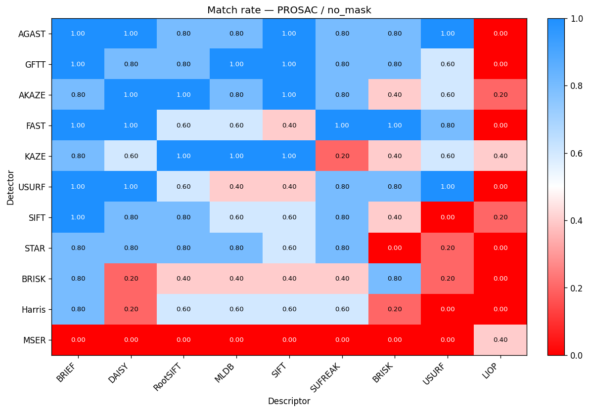

| Detector | BRIEF | DAISY | RootSIFT | MLDB | SIFT | SUFREAK | BRISK | USURF | LIOP |
|---|---|---|---|---|---|---|---|---|---|
| AGAST | 1.000 | 1.000 | 0.800 | 0.800 | 1.000 | 0.800 | 0.800 | 1.000 | 0.000 |
| GFTT | 1.000 | 0.800 | 0.800 | 1.000 | 1.000 | 0.800 | 0.800 | 0.600 | 0.000 |
| AKAZE | 0.800 | 1.000 | 1.000 | 0.800 | 1.000 | 0.800 | 0.400 | 0.600 | 0.200 |
| FAST | 1.000 | 1.000 | 0.600 | 0.600 | 0.400 | 1.000 | 1.000 | 0.800 | 0.000 |
| KAZE | 0.800 | 0.600 | 1.000 | 1.000 | 1.000 | 0.200 | 0.400 | 0.600 | 0.400 |
| USURF | 1.000 | 1.000 | 0.600 | 0.400 | 0.400 | 0.800 | 0.800 | 1.000 | 0.000 |
| SIFT | 1.000 | 0.800 | 0.800 | 0.600 | 0.600 | 0.800 | 0.400 | 0.000 | 0.200 |
| STAR | 0.800 | 0.800 | 0.800 | 0.800 | 0.600 | 0.800 | 0.000 | 0.200 | 0.000 |
| BRISK | 0.800 | 0.200 | 0.400 | 0.400 | 0.400 | 0.400 | 0.800 | 0.200 | 0.000 |
| Harris | 0.800 | 0.200 | 0.600 | 0.600 | 0.600 | 0.600 | 0.200 | 0.000 | 0.000 |
| MSER | 0.000 | 0.000 | 0.000 | 0.000 | 0.000 | 0.000 | 0.000 | 0.000 | 0.400 |

### PROSAC — with_mask

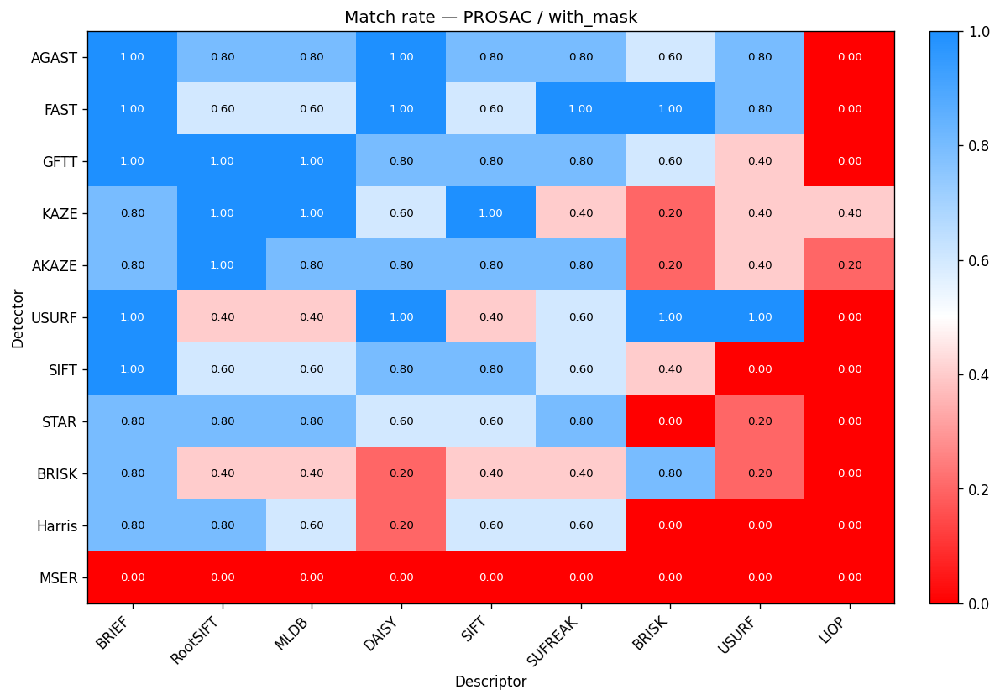

| Detector | BRIEF | RootSIFT | MLDB | DAISY | SIFT | SUFREAK | BRISK | USURF | LIOP |
|---|---|---|---|---|---|---|---|---|---|
| AGAST | 1.000 | 0.800 | 0.800 | 1.000 | 0.800 | 0.800 | 0.600 | 0.800 | 0.000 |
| FAST | 1.000 | 0.600 | 0.600 | 1.000 | 0.600 | 1.000 | 1.000 | 0.800 | 0.000 |
| GFTT | 1.000 | 1.000 | 1.000 | 0.800 | 0.800 | 0.800 | 0.600 | 0.400 | 0.000 |
| KAZE | 0.800 | 1.000 | 1.000 | 0.600 | 1.000 | 0.400 | 0.200 | 0.400 | 0.400 |
| AKAZE | 0.800 | 1.000 | 0.800 | 0.800 | 0.800 | 0.800 | 0.200 | 0.400 | 0.200 |
| USURF | 1.000 | 0.400 | 0.400 | 1.000 | 0.400 | 0.600 | 1.000 | 1.000 | 0.000 |
| SIFT | 1.000 | 0.600 | 0.600 | 0.800 | 0.800 | 0.600 | 0.400 | 0.000 | 0.000 |
| STAR | 0.800 | 0.800 | 0.800 | 0.600 | 0.600 | 0.800 | 0.000 | 0.200 | 0.000 |
| BRISK | 0.800 | 0.400 | 0.400 | 0.200 | 0.400 | 0.400 | 0.800 | 0.200 | 0.000 |
| Harris | 0.800 | 0.800 | 0.600 | 0.200 | 0.600 | 0.600 | 0.000 | 0.000 | 0.000 |
| MSER | 0.000 | 0.000 | 0.000 | 0.000 | 0.000 | 0.000 | 0.000 | 0.000 | 0.000 |

### PROSAC — best_of_both

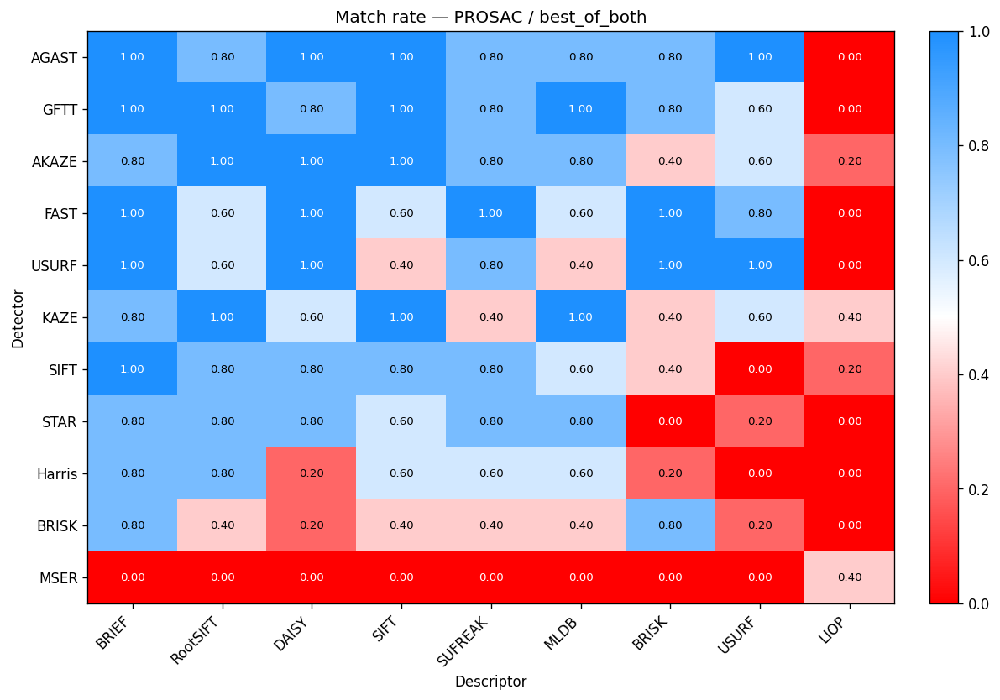

| Detector | BRIEF | RootSIFT | DAISY | SIFT | SUFREAK | MLDB | BRISK | USURF | LIOP |
|---|---|---|---|---|---|---|---|---|---|
| AGAST | 1.000 | 0.800 | 1.000 | 1.000 | 0.800 | 0.800 | 0.800 | 1.000 | 0.000 |
| GFTT | 1.000 | 1.000 | 0.800 | 1.000 | 0.800 | 1.000 | 0.800 | 0.600 | 0.000 |
| AKAZE | 0.800 | 1.000 | 1.000 | 1.000 | 0.800 | 0.800 | 0.400 | 0.600 | 0.200 |
| FAST | 1.000 | 0.600 | 1.000 | 0.600 | 1.000 | 0.600 | 1.000 | 0.800 | 0.000 |
| USURF | 1.000 | 0.600 | 1.000 | 0.400 | 0.800 | 0.400 | 1.000 | 1.000 | 0.000 |
| KAZE | 0.800 | 1.000 | 0.600 | 1.000 | 0.400 | 1.000 | 0.400 | 0.600 | 0.400 |
| SIFT | 1.000 | 0.800 | 0.800 | 0.800 | 0.800 | 0.600 | 0.400 | 0.000 | 0.200 |
| STAR | 0.800 | 0.800 | 0.800 | 0.600 | 0.800 | 0.800 | 0.000 | 0.200 | 0.000 |
| Harris | 0.800 | 0.800 | 0.200 | 0.600 | 0.600 | 0.600 | 0.200 | 0.000 | 0.000 |
| BRISK | 0.800 | 0.400 | 0.200 | 0.400 | 0.400 | 0.400 | 0.800 | 0.200 | 0.000 |
| MSER | 0.000 | 0.000 | 0.000 | 0.000 | 0.000 | 0.000 | 0.000 | 0.000 | 0.400 |

## Fallback benefit (best_of_both vs. single attempt)
For each detector+descriptor combo, how much would mAA-OP improve if the policy ran `mask_mode = both` and kept the better of the two attempts per pair? Δ < 0 means a single attempt is already as good as the picker. One table per estimator.

### PROSAC

| Configuration | mAA-OPno_mask | mAA-OPwith_mask | mAA-OPbest | Δ vs. no_mask | Δ vs. with_mask |
|---|---|---|---|---|---|
| GFTT+USURF | 0.336 | 0.066 | 0.336 | 0.000 | 0.270 |
| AKAZE+DAISY | 0.338 | 0.079 | 0.338 | 0.000 | 0.259 |
| KAZE+USURF | 0.269 | 0.044 | 0.269 | 0.000 | 0.226 |
| AKAZE+MLDB | 0.267 | 0.064 | 0.267 | 0.000 | 0.203 |
| USURF+BRIEF | 0.337 | 0.168 | 0.371 | 0.034 | 0.202 |
| SIFT+BRIEF | 0.306 | 0.214 | 0.414 | 0.108 | 0.200 |
| GFTT+BRISK | 0.402 | 0.211 | 0.402 | 0.000 | 0.191 |
| AGAST+DAISY | 0.445 | 0.265 | 0.456 | 0.011 | 0.190 |
| USURF+BRISK | 0.418 | 0.230 | 0.418 | 0.000 | 0.188 |
| STAR+SUFREAK | 0.229 | 0.041 | 0.229 | 0.000 | 0.188 |
| SIFT+SUFREAK | 0.216 | 0.037 | 0.216 | 0.000 | 0.180 |
| STAR+MLDB | 0.216 | 0.045 | 0.216 | 0.000 | 0.171 |
| GFTT+SUFREAK | 0.298 | 0.168 | 0.330 | 0.032 | 0.162 |
| SIFT+DAISY | 0.223 | 0.063 | 0.223 | 0.000 | 0.160 |
| FAST+BRIEF | 0.385 | 0.234 | 0.385 | 0.000 | 0.151 |
| SIFT+MLDB | 0.277 | 0.136 | 0.277 | 0.000 | 0.141 |
| KAZE+BRISK | 0.186 | 0.046 | 0.186 | 0.000 | 0.140 |
| FAST+RootSIFT | 0.264 | 0.124 | 0.264 | 0.000 | 0.139 |
| KAZE+DAISY | 0.300 | 0.161 | 0.300 | 0.000 | 0.139 |
| GFTT+BRIEF | 0.310 | 0.218 | 0.354 | 0.044 | 0.135 |
| AGAST+BRIEF | 0.313 | 0.179 | 0.313 | 0.000 | 0.134 |
| USURF+SUFREAK | 0.311 | 0.184 | 0.311 | 0.000 | 0.127 |
| GFTT+RootSIFT | 0.284 | 0.190 | 0.314 | 0.030 | 0.124 |
| USURF+USURF | 0.470 | 0.351 | 0.470 | 0.000 | 0.118 |
| FAST+DAISY | 0.324 | 0.213 | 0.329 | 0.005 | 0.116 |
| KAZE+SIFT | 0.341 | 0.293 | 0.400 | 0.059 | 0.107 |
| GFTT+DAISY | 0.339 | 0.237 | 0.339 | 0.000 | 0.103 |
| BRISK+BRIEF | 0.166 | 0.069 | 0.166 | 0.000 | 0.097 |
| USURF+DAISY | 0.522 | 0.427 | 0.522 | 0.000 | 0.095 |
| AGAST+SIFT | 0.534 | 0.440 | 0.534 | 0.000 | 0.094 |
| Harris+BRISK | 0.087 | 0.000 | 0.087 | 0.000 | 0.087 |
| USURF+RootSIFT | 0.280 | 0.196 | 0.280 | 0.000 | 0.084 |
| AGAST+MLDB | 0.172 | 0.095 | 0.172 | 0.000 | 0.077 |
| AKAZE+SIFT | 0.308 | 0.290 | 0.364 | 0.056 | 0.074 |
| KAZE+BRIEF | 0.319 | 0.333 | 0.405 | 0.086 | 0.072 |
| SIFT+RootSIFT | 0.203 | 0.160 | 0.226 | 0.024 | 0.066 |
| STAR+USURF | 0.165 | 0.100 | 0.165 | 0.000 | 0.065 |
| AGAST+BRISK | 0.195 | 0.233 | 0.294 | 0.099 | 0.061 |
| AKAZE+RootSIFT | 0.242 | 0.303 | 0.364 | 0.121 | 0.060 |
| USURF+MLDB | 0.190 | 0.130 | 0.190 | 0.000 | 0.060 |
| STAR+BRIEF | 0.223 | 0.170 | 0.229 | 0.006 | 0.059 |
| AGAST+RootSIFT | 0.205 | 0.221 | 0.272 | 0.067 | 0.051 |
| AGAST+USURF | 0.329 | 0.313 | 0.363 | 0.033 | 0.049 |
| KAZE+LIOP | 0.127 | 0.079 | 0.127 | 0.000 | 0.047 |
| SIFT+LIOP | 0.038 | 0.000 | 0.038 | 0.000 | 0.038 |
| Harris+MLDB | 0.159 | 0.125 | 0.159 | 0.000 | 0.034 |
| SIFT+BRISK | 0.242 | 0.213 | 0.242 | 0.000 | 0.029 |
| AKAZE+BRIEF | 0.259 | 0.230 | 0.259 | 0.000 | 0.028 |
| GFTT+SIFT | 0.344 | 0.318 | 0.344 | 0.000 | 0.026 |
| BRISK+RootSIFT | 0.076 | 0.050 | 0.076 | 0.000 | 0.026 |
| AKAZE+USURF | 0.290 | 0.267 | 0.290 | 0.000 | 0.023 |
| FAST+SUFREAK | 0.182 | 0.161 | 0.182 | 0.000 | 0.022 |
| AGAST+SUFREAK | 0.292 | 0.277 | 0.292 | 0.000 | 0.015 |
| Harris+SUFREAK | 0.056 | 0.047 | 0.056 | 0.000 | 0.009 |
| AKAZE+BRISK | 0.044 | 0.036 | 0.044 | 0.000 | 0.009 |
| FAST+USURF | 0.160 | 0.153 | 0.160 | 0.000 | 0.007 |
| KAZE+RootSIFT | 0.153 | 0.147 | 0.153 | 0.000 | 0.005 |
| BRISK+DAISY | 0.044 | 0.040 | 0.044 | 0.000 | 0.005 |
| BRISK+SIFT | 0.058 | 0.118 | 0.122 | 0.064 | 0.004 |
| FAST+MLDB | 0.124 | 0.151 | 0.154 | 0.030 | 0.003 |
| AKAZE+LIOP | 0.103 | 0.101 | 0.103 | 0.000 | 0.002 |
| SIFT+SIFT | 0.047 | 0.156 | 0.158 | 0.111 | 0.002 |
| USURF+SIFT | 0.198 | 0.196 | 0.198 | 0.000 | 0.002 |
| FAST+SIFT | 0.129 | 0.274 | 0.275 | 0.146 | 0.001 |
| KAZE+SUFREAK | 0.101 | 0.164 | 0.165 | 0.063 | 0.000 |
| BRISK+USURF | 0.151 | 0.151 | 0.151 | 0.000 | 0.000 |
| Harris+USURF | 0.000 | 0.000 | 0.000 | 0.000 | 0.000 |
| MSER+MLDB | 0.000 | 0.000 | 0.000 | 0.000 | 0.000 |
| MSER+SUFREAK | 0.000 | 0.000 | 0.000 | 0.000 | 0.000 |
| MSER+BRIEF | 0.000 | 0.000 | 0.000 | 0.000 | 0.000 |
| MSER+BRISK | 0.000 | 0.000 | 0.000 | 0.000 | 0.000 |
| MSER+LIOP | 0.000 | 0.000 | 0.000 | 0.000 | 0.000 |
| Harris+LIOP | 0.000 | 0.000 | 0.000 | 0.000 | 0.000 |
| GFTT+LIOP | 0.000 | 0.000 | 0.000 | 0.000 | 0.000 |
| FAST+LIOP | 0.000 | 0.000 | 0.000 | 0.000 | 0.000 |
| Harris+DAISY | 0.000 | 0.045 | 0.045 | 0.045 | 0.000 |
| MSER+DAISY | 0.000 | 0.000 | 0.000 | 0.000 | 0.000 |
| STAR+LIOP | 0.000 | 0.000 | 0.000 | 0.000 | 0.000 |
| USURF+LIOP | 0.000 | 0.000 | 0.000 | 0.000 | 0.000 |
| STAR+BRISK | 0.000 | 0.000 | 0.000 | 0.000 | 0.000 |
| BRISK+LIOP | 0.000 | 0.000 | 0.000 | 0.000 | 0.000 |
| AGAST+LIOP | 0.000 | 0.000 | 0.000 | 0.000 | 0.000 |
| SIFT+USURF | 0.000 | 0.000 | 0.000 | 0.000 | 0.000 |
| MSER+SIFT | 0.000 | 0.000 | 0.000 | 0.000 | 0.000 |
| MSER+USURF | 0.000 | 0.000 | 0.000 | 0.000 | 0.000 |
| MSER+RootSIFT | 0.000 | 0.000 | 0.000 | 0.000 | 0.000 |
| STAR+RootSIFT | 0.231 | 0.231 | 0.231 | 0.000 | -0.000 |
| AKAZE+SUFREAK | 0.217 | 0.217 | 0.217 | 0.000 | -0.000 |
| KAZE+MLDB | 0.132 | 0.166 | 0.164 | 0.032 | -0.002 |
| STAR+SIFT | 0.192 | 0.203 | 0.199 | 0.007 | -0.003 |
| FAST+BRISK | 0.164 | 0.168 | 0.164 | 0.000 | -0.004 |
| Harris+RootSIFT | 0.119 | 0.143 | 0.137 | 0.018 | -0.006 |
| GFTT+MLDB | 0.344 | 0.380 | 0.373 | 0.029 | -0.007 |
| Harris+SIFT | 0.181 | 0.188 | 0.181 | 0.000 | -0.008 |
| STAR+DAISY | 0.185 | 0.194 | 0.185 | 0.000 | -0.008 |
| Harris+BRIEF | 0.073 | 0.081 | 0.073 | 0.000 | -0.009 |
| BRISK+BRISK | 0.263 | 0.272 | 0.263 | 0.000 | -0.009 |
| BRISK+MLDB | 0.069 | 0.079 | 0.069 | 0.000 | -0.010 |
| BRISK+SUFREAK | 0.148 | 0.168 | 0.148 | 0.000 | -0.020 |