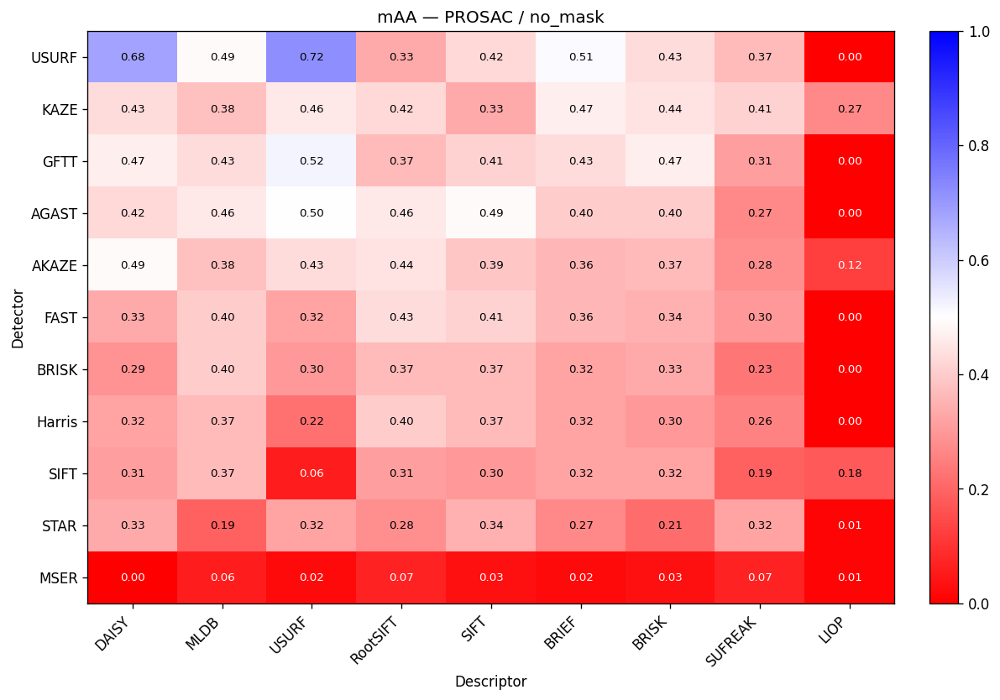
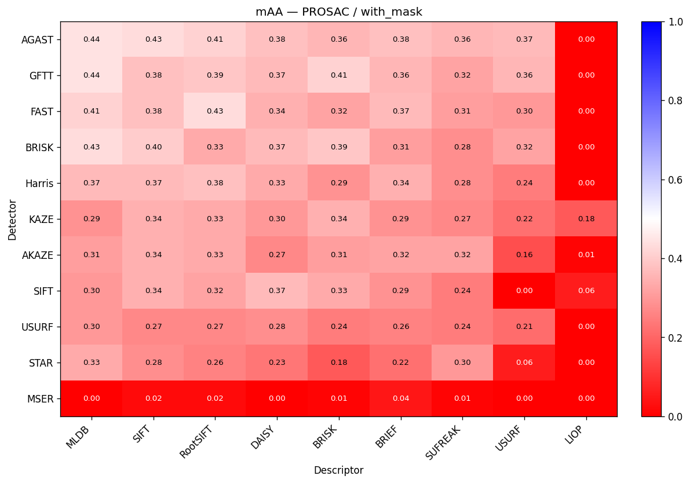
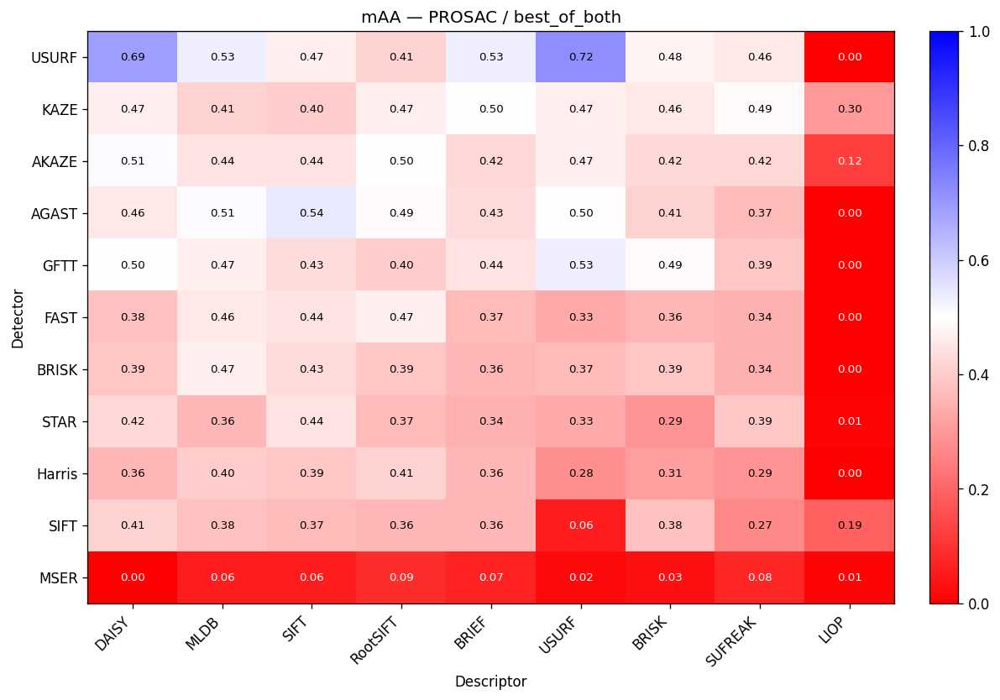
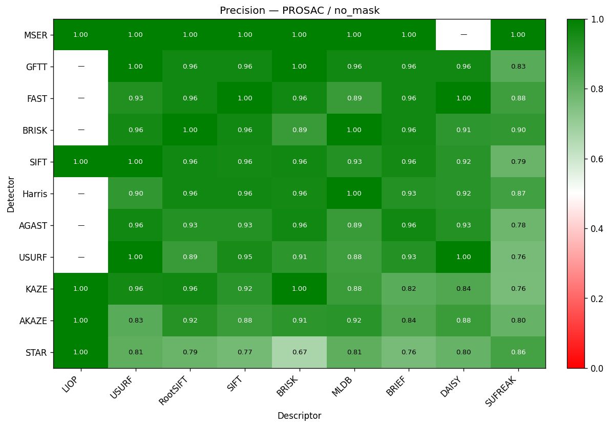
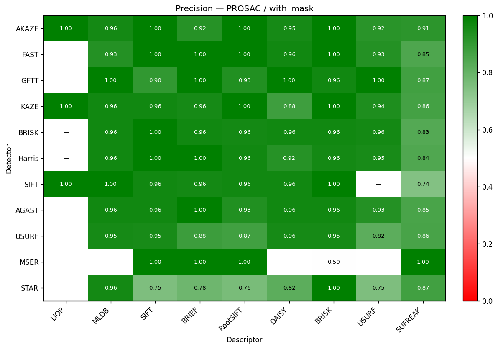
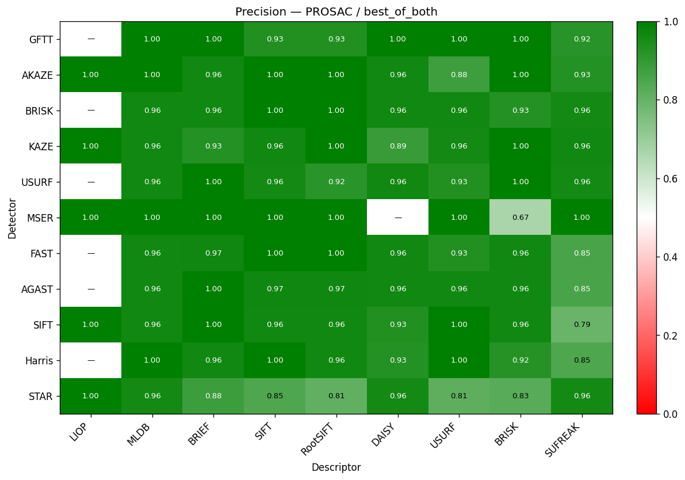

# Overlap Detection Summary Report

> **Note (archival report).** The `mAA` values in this file were produced
> with the older binary-average definition — `mean(acc@3, acc@5, acc@10)`.
> The current code emits the standard AUC-form mAA (see `project_overview.md`
> §Metric definitions). The numbers below are kept as-is for historical
> comparison and are **not** reproducible from `aggregate_results.csv` with
> the current `reporting.py`.

## Overall

Total CSV rows: **2970**.
Accuracy tiers (px): **3, 5, 10**.

| Estimator | Attempt | Pairs | mAA | Precision | acc@3 | acc@5 | acc@10 | false_match | no_match |
|---|---|---|---|---|---|---|---|---|---|
| PROSAC | no_mask | 2970 | 0.309 | 0.917 | 0.080 | 0.227 | 0.621 | 0.056 | 0.323 |
| PROSAC | with_mask | 2970 | 0.259 | 0.939 | 0.031 | 0.124 | 0.624 | 0.041 | 0.336 |
| PROSAC | best_of_both | 2970 | 0.349 | 0.953 | 0.097 | 0.257 | 0.693 | 0.034 | 0.273 |

## Per-configuration scoreboard
One table per estimator. Configurations are detector+descriptor; each attempt gets its own mAA / acc@T / false_match / no_match columns.

### PROSAC

Sorted by mAAbest_of_both (descending). 99 detector+descriptor combinations.

| Configuration | Pairs | mAAno_mask | Precno_mask | acc@3no_mask | acc@5no_mask | acc@10no_mask | false_matchno_mask | no_matchno_mask | mAAwith_mask | Precwith_mask | acc@3with_mask | acc@5with_mask | acc@10with_mask | false_matchwith_mask | no_matchwith_mask | mAAbest_of_both | Precbest_of_both | acc@3best_of_both | acc@5best_of_both | acc@10best_of_both | false_matchbest_of_both | no_matchbest_of_both |
|---|---|---|---|---|---|---|---|---|---|---|---|---|---|---|---|---|---|---|---|---|---|---|
| USURF+USURF | 30 | 0.722 | 1.000 | 0.500 | 0.767 | 0.900 | 0.000 | 0.100 | 0.211 | 0.818 | 0.000 | 0.033 | 0.600 | 0.133 | 0.267 | 0.722 | 0.931 | 0.500 | 0.767 | 0.900 | 0.067 | 0.033 |
| USURF+DAISY | 30 | 0.678 | 1.000 | 0.467 | 0.700 | 0.867 | 0.000 | 0.133 | 0.278 | 0.957 | 0.000 | 0.100 | 0.733 | 0.033 | 0.233 | 0.689 | 0.964 | 0.467 | 0.700 | 0.900 | 0.033 | 0.067 |
| AGAST+SIFT | 30 | 0.489 | 0.929 | 0.200 | 0.400 | 0.867 | 0.067 | 0.067 | 0.433 | 0.964 | 0.067 | 0.333 | 0.900 | 0.033 | 0.067 | 0.544 | 0.966 | 0.233 | 0.467 | 0.933 | 0.033 | 0.033 |
| USURF+BRIEF | 30 | 0.511 | 0.926 | 0.267 | 0.433 | 0.833 | 0.067 | 0.100 | 0.256 | 0.880 | 0.000 | 0.033 | 0.733 | 0.100 | 0.167 | 0.533 | 1.000 | 0.267 | 0.433 | 0.900 | 0.000 | 0.100 |
| USURF+MLDB | 30 | 0.489 | 0.875 | 0.333 | 0.433 | 0.700 | 0.100 | 0.200 | 0.300 | 0.955 | 0.100 | 0.100 | 0.700 | 0.033 | 0.267 | 0.533 | 0.962 | 0.333 | 0.433 | 0.833 | 0.033 | 0.133 |
| GFTT+USURF | 30 | 0.522 | 1.000 | 0.267 | 0.467 | 0.833 | 0.000 | 0.167 | 0.356 | 1.000 | 0.033 | 0.200 | 0.833 | 0.000 | 0.167 | 0.533 | 1.000 | 0.267 | 0.467 | 0.867 | 0.000 | 0.133 |
| AGAST+MLDB | 30 | 0.456 | 0.889 | 0.200 | 0.367 | 0.800 | 0.100 | 0.100 | 0.444 | 0.963 | 0.133 | 0.333 | 0.867 | 0.033 | 0.100 | 0.511 | 0.963 | 0.267 | 0.400 | 0.867 | 0.033 | 0.100 |
| AKAZE+DAISY | 30 | 0.489 | 0.885 | 0.200 | 0.500 | 0.767 | 0.100 | 0.133 | 0.267 | 0.955 | 0.000 | 0.100 | 0.700 | 0.033 | 0.267 | 0.511 | 0.962 | 0.200 | 0.500 | 0.833 | 0.033 | 0.133 |
| AGAST+USURF | 30 | 0.500 | 0.964 | 0.133 | 0.467 | 0.900 | 0.033 | 0.067 | 0.367 | 0.929 | 0.067 | 0.167 | 0.867 | 0.067 | 0.067 | 0.500 | 0.964 | 0.133 | 0.467 | 0.900 | 0.033 | 0.067 |
| AKAZE+RootSIFT | 30 | 0.444 | 0.923 | 0.100 | 0.433 | 0.800 | 0.067 | 0.133 | 0.333 | 1.000 | 0.033 | 0.133 | 0.833 | 0.000 | 0.167 | 0.500 | 1.000 | 0.100 | 0.500 | 0.900 | 0.000 | 0.100 |
| GFTT+DAISY | 30 | 0.467 | 0.962 | 0.167 | 0.400 | 0.833 | 0.033 | 0.133 | 0.367 | 1.000 | 0.067 | 0.167 | 0.867 | 0.000 | 0.133 | 0.500 | 1.000 | 0.200 | 0.400 | 0.900 | 0.000 | 0.100 |
| KAZE+BRIEF | 30 | 0.467 | 0.821 | 0.200 | 0.433 | 0.767 | 0.167 | 0.067 | 0.289 | 0.957 | 0.033 | 0.100 | 0.733 | 0.033 | 0.233 | 0.500 | 0.929 | 0.200 | 0.433 | 0.867 | 0.067 | 0.067 |
| KAZE+SUFREAK | 30 | 0.411 | 0.760 | 0.167 | 0.433 | 0.633 | 0.200 | 0.167 | 0.267 | 0.864 | 0.033 | 0.133 | 0.633 | 0.100 | 0.267 | 0.489 | 0.962 | 0.200 | 0.433 | 0.833 | 0.033 | 0.133 |
| GFTT+BRISK | 30 | 0.467 | 1.000 | 0.167 | 0.333 | 0.900 | 0.000 | 0.100 | 0.411 | 0.963 | 0.133 | 0.233 | 0.867 | 0.033 | 0.100 | 0.489 | 1.000 | 0.200 | 0.367 | 0.900 | 0.000 | 0.100 |
| AGAST+RootSIFT | 30 | 0.456 | 0.929 | 0.100 | 0.400 | 0.867 | 0.067 | 0.067 | 0.411 | 0.931 | 0.067 | 0.267 | 0.900 | 0.067 | 0.033 | 0.489 | 0.966 | 0.133 | 0.400 | 0.933 | 0.033 | 0.033 |
| USURF+BRISK | 30 | 0.433 | 0.913 | 0.233 | 0.367 | 0.700 | 0.067 | 0.233 | 0.244 | 0.955 | 0.000 | 0.033 | 0.700 | 0.033 | 0.267 | 0.478 | 1.000 | 0.233 | 0.367 | 0.833 | 0.000 | 0.167 |
| KAZE+USURF | 30 | 0.456 | 0.960 | 0.200 | 0.367 | 0.800 | 0.033 | 0.167 | 0.222 | 0.938 | 0.033 | 0.133 | 0.500 | 0.033 | 0.467 | 0.467 | 0.960 | 0.200 | 0.400 | 0.800 | 0.033 | 0.167 |
| FAST+RootSIFT | 30 | 0.433 | 0.962 | 0.067 | 0.400 | 0.833 | 0.033 | 0.133 | 0.433 | 1.000 | 0.067 | 0.333 | 0.900 | 0.000 | 0.100 | 0.467 | 1.000 | 0.100 | 0.400 | 0.900 | 0.000 | 0.100 |
| GFTT+MLDB | 30 | 0.433 | 0.963 | 0.133 | 0.300 | 0.867 | 0.033 | 0.100 | 0.444 | 1.000 | 0.167 | 0.267 | 0.900 | 0.000 | 0.100 | 0.467 | 1.000 | 0.200 | 0.300 | 0.900 | 0.000 | 0.100 |
| AKAZE+USURF | 30 | 0.433 | 0.826 | 0.267 | 0.400 | 0.633 | 0.133 | 0.233 | 0.156 | 0.917 | 0.000 | 0.100 | 0.367 | 0.033 | 0.600 | 0.467 | 0.875 | 0.267 | 0.433 | 0.700 | 0.100 | 0.200 |
| USURF+SIFT | 30 | 0.422 | 0.952 | 0.267 | 0.333 | 0.667 | 0.033 | 0.300 | 0.267 | 0.950 | 0.033 | 0.133 | 0.633 | 0.033 | 0.333 | 0.467 | 0.958 | 0.267 | 0.367 | 0.767 | 0.033 | 0.200 |
| BRISK+MLDB | 30 | 0.400 | 1.000 | 0.067 | 0.267 | 0.867 | 0.000 | 0.133 | 0.433 | 0.964 | 0.067 | 0.333 | 0.900 | 0.033 | 0.067 | 0.467 | 0.964 | 0.100 | 0.400 | 0.900 | 0.033 | 0.067 |
| KAZE+RootSIFT | 30 | 0.422 | 0.962 | 0.133 | 0.300 | 0.833 | 0.033 | 0.133 | 0.333 | 1.000 | 0.000 | 0.133 | 0.867 | 0.000 | 0.133 | 0.467 | 1.000 | 0.133 | 0.367 | 0.900 | 0.000 | 0.100 |
| KAZE+DAISY | 30 | 0.433 | 0.840 | 0.167 | 0.433 | 0.700 | 0.133 | 0.167 | 0.300 | 0.875 | 0.033 | 0.167 | 0.700 | 0.100 | 0.200 | 0.467 | 0.889 | 0.167 | 0.433 | 0.800 | 0.100 | 0.100 |
| USURF+SUFREAK | 30 | 0.367 | 0.762 | 0.167 | 0.400 | 0.533 | 0.167 | 0.300 | 0.244 | 0.857 | 0.033 | 0.100 | 0.600 | 0.100 | 0.300 | 0.456 | 0.958 | 0.167 | 0.433 | 0.767 | 0.033 | 0.200 |
| AGAST+DAISY | 30 | 0.422 | 0.929 | 0.100 | 0.300 | 0.867 | 0.067 | 0.067 | 0.378 | 0.964 | 0.067 | 0.167 | 0.900 | 0.033 | 0.067 | 0.456 | 0.964 | 0.133 | 0.333 | 0.900 | 0.033 | 0.067 |
| FAST+MLDB | 30 | 0.400 | 0.889 | 0.067 | 0.333 | 0.800 | 0.100 | 0.100 | 0.411 | 0.929 | 0.067 | 0.300 | 0.867 | 0.067 | 0.067 | 0.456 | 0.964 | 0.067 | 0.400 | 0.900 | 0.033 | 0.067 |
| KAZE+BRISK | 30 | 0.444 | 1.000 | 0.067 | 0.367 | 0.900 | 0.000 | 0.100 | 0.344 | 1.000 | 0.000 | 0.167 | 0.867 | 0.000 | 0.133 | 0.456 | 1.000 | 0.067 | 0.400 | 0.900 | 0.000 | 0.100 |
| GFTT+BRIEF | 30 | 0.433 | 0.963 | 0.100 | 0.333 | 0.867 | 0.033 | 0.100 | 0.356 | 1.000 | 0.033 | 0.133 | 0.900 | 0.000 | 0.100 | 0.444 | 1.000 | 0.100 | 0.333 | 0.900 | 0.000 | 0.100 |
| AKAZE+MLDB | 30 | 0.378 | 0.917 | 0.100 | 0.300 | 0.733 | 0.067 | 0.200 | 0.311 | 0.960 | 0.033 | 0.100 | 0.800 | 0.033 | 0.167 | 0.444 | 1.000 | 0.133 | 0.333 | 0.867 | 0.000 | 0.133 |
| FAST+SIFT | 30 | 0.411 | 1.000 | 0.033 | 0.300 | 0.900 | 0.000 | 0.100 | 0.378 | 1.000 | 0.067 | 0.167 | 0.900 | 0.000 | 0.100 | 0.444 | 1.000 | 0.100 | 0.300 | 0.933 | 0.000 | 0.067 |
| AKAZE+SIFT | 30 | 0.389 | 0.885 | 0.067 | 0.333 | 0.767 | 0.100 | 0.133 | 0.344 | 1.000 | 0.033 | 0.133 | 0.867 | 0.000 | 0.133 | 0.444 | 1.000 | 0.100 | 0.333 | 0.900 | 0.000 | 0.100 |
| STAR+SIFT | 30 | 0.344 | 0.773 | 0.200 | 0.267 | 0.567 | 0.167 | 0.267 | 0.278 | 0.750 | 0.033 | 0.200 | 0.600 | 0.200 | 0.200 | 0.444 | 0.846 | 0.233 | 0.367 | 0.733 | 0.133 | 0.133 |
| GFTT+SIFT | 30 | 0.411 | 0.964 | 0.067 | 0.267 | 0.900 | 0.033 | 0.067 | 0.378 | 0.900 | 0.067 | 0.167 | 0.900 | 0.100 | 0.000 | 0.433 | 0.933 | 0.067 | 0.300 | 0.933 | 0.067 | 0.000 |
| AGAST+BRIEF | 30 | 0.400 | 0.964 | 0.100 | 0.200 | 0.900 | 0.033 | 0.067 | 0.378 | 1.000 | 0.033 | 0.167 | 0.933 | 0.000 | 0.067 | 0.433 | 1.000 | 0.133 | 0.233 | 0.933 | 0.000 | 0.067 |
| BRISK+SIFT | 30 | 0.367 | 0.962 | 0.000 | 0.267 | 0.833 | 0.033 | 0.133 | 0.400 | 1.000 | 0.100 | 0.233 | 0.867 | 0.000 | 0.133 | 0.433 | 1.000 | 0.100 | 0.300 | 0.900 | 0.000 | 0.100 |
| AKAZE+BRIEF | 30 | 0.356 | 0.840 | 0.133 | 0.233 | 0.700 | 0.133 | 0.167 | 0.322 | 0.923 | 0.033 | 0.133 | 0.800 | 0.067 | 0.133 | 0.422 | 0.963 | 0.167 | 0.233 | 0.867 | 0.033 | 0.100 |
| AKAZE+BRISK | 30 | 0.367 | 0.913 | 0.100 | 0.300 | 0.700 | 0.067 | 0.233 | 0.311 | 1.000 | 0.067 | 0.100 | 0.767 | 0.000 | 0.233 | 0.422 | 1.000 | 0.133 | 0.300 | 0.833 | 0.000 | 0.167 |
| AKAZE+SUFREAK | 30 | 0.278 | 0.800 | 0.100 | 0.200 | 0.533 | 0.133 | 0.333 | 0.322 | 0.913 | 0.067 | 0.200 | 0.700 | 0.067 | 0.233 | 0.422 | 0.926 | 0.133 | 0.300 | 0.833 | 0.067 | 0.100 |
| STAR+DAISY | 30 | 0.333 | 0.800 | 0.167 | 0.300 | 0.533 | 0.133 | 0.333 | 0.233 | 0.818 | 0.000 | 0.100 | 0.600 | 0.133 | 0.267 | 0.422 | 0.958 | 0.167 | 0.333 | 0.767 | 0.033 | 0.200 |
| KAZE+MLDB | 30 | 0.378 | 0.885 | 0.067 | 0.300 | 0.767 | 0.100 | 0.133 | 0.289 | 0.962 | 0.000 | 0.033 | 0.833 | 0.033 | 0.133 | 0.411 | 0.963 | 0.067 | 0.300 | 0.867 | 0.033 | 0.100 |
| AGAST+BRISK | 30 | 0.400 | 0.964 | 0.033 | 0.267 | 0.900 | 0.033 | 0.067 | 0.356 | 0.964 | 0.067 | 0.100 | 0.900 | 0.033 | 0.067 | 0.411 | 0.964 | 0.067 | 0.267 | 0.900 | 0.033 | 0.067 |
| Harris+RootSIFT | 30 | 0.400 | 0.964 | 0.033 | 0.267 | 0.900 | 0.033 | 0.067 | 0.378 | 0.963 | 0.033 | 0.233 | 0.867 | 0.033 | 0.100 | 0.411 | 0.964 | 0.067 | 0.267 | 0.900 | 0.033 | 0.067 |
| USURF+RootSIFT | 30 | 0.333 | 0.889 | 0.167 | 0.300 | 0.533 | 0.067 | 0.400 | 0.267 | 0.870 | 0.000 | 0.133 | 0.667 | 0.100 | 0.233 | 0.411 | 0.917 | 0.167 | 0.333 | 0.733 | 0.067 | 0.200 |
| SIFT+DAISY | 30 | 0.311 | 0.920 | 0.000 | 0.167 | 0.767 | 0.067 | 0.167 | 0.367 | 0.962 | 0.033 | 0.233 | 0.833 | 0.033 | 0.133 | 0.411 | 0.931 | 0.033 | 0.300 | 0.900 | 0.067 | 0.033 |
| GFTT+RootSIFT | 30 | 0.367 | 0.964 | 0.000 | 0.200 | 0.900 | 0.033 | 0.067 | 0.389 | 0.931 | 0.000 | 0.267 | 0.900 | 0.067 | 0.033 | 0.400 | 0.931 | 0.000 | 0.300 | 0.900 | 0.067 | 0.033 |
| Harris+MLDB | 30 | 0.367 | 1.000 | 0.000 | 0.233 | 0.867 | 0.000 | 0.133 | 0.367 | 0.963 | 0.000 | 0.233 | 0.867 | 0.033 | 0.100 | 0.400 | 1.000 | 0.000 | 0.300 | 0.900 | 0.000 | 0.100 |
| KAZE+SIFT | 30 | 0.333 | 0.917 | 0.033 | 0.233 | 0.733 | 0.067 | 0.200 | 0.344 | 0.963 | 0.033 | 0.133 | 0.867 | 0.033 | 0.100 | 0.400 | 0.963 | 0.067 | 0.267 | 0.867 | 0.033 | 0.100 |
| BRISK+DAISY | 30 | 0.289 | 0.909 | 0.000 | 0.200 | 0.667 | 0.067 | 0.267 | 0.367 | 0.963 | 0.067 | 0.167 | 0.867 | 0.033 | 0.100 | 0.389 | 0.963 | 0.067 | 0.233 | 0.867 | 0.033 | 0.100 |
| Harris+SIFT | 30 | 0.367 | 0.963 | 0.033 | 0.200 | 0.867 | 0.033 | 0.100 | 0.367 | 1.000 | 0.000 | 0.200 | 0.900 | 0.000 | 0.100 | 0.389 | 1.000 | 0.033 | 0.233 | 0.900 | 0.000 | 0.100 |
| GFTT+SUFREAK | 30 | 0.311 | 0.826 | 0.067 | 0.233 | 0.633 | 0.133 | 0.233 | 0.322 | 0.870 | 0.100 | 0.200 | 0.667 | 0.100 | 0.233 | 0.389 | 0.920 | 0.133 | 0.267 | 0.767 | 0.067 | 0.167 |
| STAR+SUFREAK | 30 | 0.322 | 0.864 | 0.067 | 0.267 | 0.633 | 0.100 | 0.267 | 0.300 | 0.870 | 0.067 | 0.167 | 0.667 | 0.100 | 0.233 | 0.389 | 0.958 | 0.100 | 0.300 | 0.767 | 0.033 | 0.200 |
| BRISK+RootSIFT | 30 | 0.367 | 1.000 | 0.000 | 0.233 | 0.867 | 0.000 | 0.133 | 0.333 | 0.960 | 0.033 | 0.167 | 0.800 | 0.033 | 0.167 | 0.389 | 1.000 | 0.033 | 0.267 | 0.867 | 0.000 | 0.133 |
| BRISK+BRISK | 30 | 0.333 | 0.889 | 0.033 | 0.167 | 0.800 | 0.100 | 0.100 | 0.389 | 0.963 | 0.100 | 0.200 | 0.867 | 0.033 | 0.100 | 0.389 | 0.929 | 0.100 | 0.200 | 0.867 | 0.067 | 0.067 |
| SIFT+MLDB | 30 | 0.367 | 0.929 | 0.000 | 0.233 | 0.867 | 0.067 | 0.067 | 0.300 | 1.000 | 0.000 | 0.033 | 0.867 | 0.000 | 0.133 | 0.378 | 0.964 | 0.000 | 0.233 | 0.900 | 0.033 | 0.067 |
| SIFT+BRISK | 30 | 0.322 | 0.963 | 0.000 | 0.100 | 0.867 | 0.033 | 0.100 | 0.333 | 1.000 | 0.033 | 0.167 | 0.800 | 0.000 | 0.200 | 0.378 | 0.964 | 0.033 | 0.200 | 0.900 | 0.033 | 0.067 |
| FAST+DAISY | 30 | 0.333 | 1.000 | 0.033 | 0.067 | 0.900 | 0.000 | 0.100 | 0.344 | 0.963 | 0.033 | 0.133 | 0.867 | 0.033 | 0.100 | 0.378 | 0.964 | 0.067 | 0.167 | 0.900 | 0.033 | 0.067 |
| STAR+RootSIFT | 30 | 0.278 | 0.789 | 0.100 | 0.233 | 0.500 | 0.133 | 0.367 | 0.256 | 0.760 | 0.033 | 0.100 | 0.633 | 0.200 | 0.167 | 0.367 | 0.808 | 0.133 | 0.267 | 0.700 | 0.167 | 0.133 |
| BRISK+USURF | 30 | 0.300 | 0.958 | 0.000 | 0.133 | 0.767 | 0.033 | 0.200 | 0.322 | 0.958 | 0.067 | 0.133 | 0.767 | 0.033 | 0.200 | 0.367 | 0.962 | 0.067 | 0.200 | 0.833 | 0.033 | 0.133 |
| FAST+BRIEF | 30 | 0.356 | 0.964 | 0.033 | 0.133 | 0.900 | 0.033 | 0.067 | 0.367 | 1.000 | 0.033 | 0.133 | 0.933 | 0.000 | 0.067 | 0.367 | 0.966 | 0.033 | 0.133 | 0.933 | 0.033 | 0.033 |
| SIFT+SIFT | 30 | 0.300 | 0.958 | 0.000 | 0.133 | 0.767 | 0.033 | 0.200 | 0.344 | 0.962 | 0.033 | 0.167 | 0.833 | 0.033 | 0.133 | 0.367 | 0.963 | 0.033 | 0.200 | 0.867 | 0.033 | 0.100 |
| AGAST+SUFREAK | 30 | 0.267 | 0.783 | 0.067 | 0.133 | 0.600 | 0.167 | 0.233 | 0.356 | 0.852 | 0.100 | 0.200 | 0.767 | 0.133 | 0.100 | 0.367 | 0.852 | 0.133 | 0.200 | 0.767 | 0.133 | 0.100 |
| FAST+BRISK | 30 | 0.344 | 0.963 | 0.033 | 0.133 | 0.867 | 0.033 | 0.100 | 0.322 | 1.000 | 0.000 | 0.067 | 0.900 | 0.000 | 0.100 | 0.356 | 0.964 | 0.033 | 0.133 | 0.900 | 0.033 | 0.067 |
| Harris+DAISY | 30 | 0.322 | 0.920 | 0.033 | 0.167 | 0.767 | 0.067 | 0.167 | 0.333 | 0.923 | 0.033 | 0.167 | 0.800 | 0.067 | 0.133 | 0.356 | 0.926 | 0.033 | 0.200 | 0.833 | 0.067 | 0.100 |
| Harris+BRIEF | 30 | 0.322 | 0.929 | 0.000 | 0.100 | 0.867 | 0.067 | 0.067 | 0.344 | 1.000 | 0.000 | 0.167 | 0.867 | 0.000 | 0.133 | 0.356 | 0.964 | 0.000 | 0.167 | 0.900 | 0.033 | 0.067 |
| SIFT+RootSIFT | 30 | 0.311 | 0.962 | 0.000 | 0.100 | 0.833 | 0.033 | 0.133 | 0.322 | 0.962 | 0.000 | 0.133 | 0.833 | 0.033 | 0.133 | 0.356 | 0.963 | 0.000 | 0.200 | 0.867 | 0.033 | 0.100 |
| STAR+MLDB | 30 | 0.189 | 0.812 | 0.000 | 0.133 | 0.433 | 0.100 | 0.467 | 0.333 | 0.958 | 0.067 | 0.167 | 0.767 | 0.033 | 0.200 | 0.356 | 0.958 | 0.067 | 0.233 | 0.767 | 0.033 | 0.200 |
| BRISK+BRIEF | 30 | 0.322 | 0.962 | 0.033 | 0.100 | 0.833 | 0.033 | 0.133 | 0.311 | 0.963 | 0.000 | 0.067 | 0.867 | 0.033 | 0.100 | 0.356 | 0.964 | 0.033 | 0.133 | 0.900 | 0.033 | 0.067 |
| SIFT+BRIEF | 30 | 0.322 | 0.960 | 0.033 | 0.133 | 0.800 | 0.033 | 0.167 | 0.289 | 0.960 | 0.000 | 0.067 | 0.800 | 0.033 | 0.167 | 0.356 | 1.000 | 0.033 | 0.167 | 0.867 | 0.000 | 0.133 |
| BRISK+SUFREAK | 30 | 0.233 | 0.900 | 0.000 | 0.100 | 0.600 | 0.067 | 0.333 | 0.278 | 0.833 | 0.033 | 0.133 | 0.667 | 0.133 | 0.200 | 0.344 | 0.960 | 0.033 | 0.200 | 0.800 | 0.033 | 0.167 |
| FAST+SUFREAK | 30 | 0.300 | 0.875 | 0.000 | 0.200 | 0.700 | 0.100 | 0.200 | 0.311 | 0.846 | 0.033 | 0.167 | 0.733 | 0.133 | 0.133 | 0.344 | 0.852 | 0.033 | 0.233 | 0.767 | 0.133 | 0.100 |
| STAR+BRIEF | 30 | 0.267 | 0.762 | 0.067 | 0.200 | 0.533 | 0.167 | 0.300 | 0.222 | 0.783 | 0.033 | 0.033 | 0.600 | 0.167 | 0.233 | 0.344 | 0.880 | 0.100 | 0.200 | 0.733 | 0.100 | 0.167 |
| STAR+USURF | 30 | 0.322 | 0.812 | 0.167 | 0.367 | 0.433 | 0.100 | 0.467 | 0.056 | 0.750 | 0.033 | 0.033 | 0.100 | 0.033 | 0.867 | 0.333 | 0.812 | 0.200 | 0.367 | 0.433 | 0.100 | 0.467 |
| FAST+USURF | 30 | 0.322 | 0.933 | 0.000 | 0.033 | 0.933 | 0.067 | 0.000 | 0.300 | 0.926 | 0.000 | 0.067 | 0.833 | 0.067 | 0.100 | 0.333 | 0.933 | 0.000 | 0.067 | 0.933 | 0.067 | 0.000 |
| Harris+BRISK | 30 | 0.300 | 0.960 | 0.000 | 0.100 | 0.800 | 0.033 | 0.167 | 0.289 | 0.958 | 0.000 | 0.100 | 0.767 | 0.033 | 0.200 | 0.311 | 0.923 | 0.000 | 0.133 | 0.800 | 0.067 | 0.133 |
| KAZE+LIOP | 30 | 0.267 | 1.000 | 0.100 | 0.200 | 0.500 | 0.000 | 0.500 | 0.178 | 1.000 | 0.033 | 0.167 | 0.333 | 0.000 | 0.667 | 0.300 | 1.000 | 0.100 | 0.267 | 0.533 | 0.000 | 0.467 |
| STAR+BRISK | 30 | 0.211 | 0.667 | 0.000 | 0.167 | 0.467 | 0.233 | 0.300 | 0.178 | 1.000 | 0.000 | 0.100 | 0.433 | 0.000 | 0.567 | 0.289 | 0.826 | 0.000 | 0.233 | 0.633 | 0.133 | 0.233 |
| Harris+SUFREAK | 30 | 0.256 | 0.870 | 0.000 | 0.100 | 0.667 | 0.100 | 0.233 | 0.278 | 0.840 | 0.000 | 0.133 | 0.700 | 0.133 | 0.167 | 0.289 | 0.846 | 0.000 | 0.133 | 0.733 | 0.133 | 0.133 |
| Harris+USURF | 30 | 0.222 | 0.900 | 0.000 | 0.067 | 0.600 | 0.067 | 0.333 | 0.244 | 0.950 | 0.000 | 0.100 | 0.633 | 0.033 | 0.333 | 0.278 | 1.000 | 0.000 | 0.100 | 0.733 | 0.000 | 0.267 |
| SIFT+SUFREAK | 30 | 0.189 | 0.789 | 0.000 | 0.067 | 0.500 | 0.133 | 0.367 | 0.244 | 0.739 | 0.000 | 0.167 | 0.567 | 0.200 | 0.233 | 0.267 | 0.792 | 0.000 | 0.167 | 0.633 | 0.167 | 0.200 |
| SIFT+LIOP | 30 | 0.178 | 1.000 | 0.033 | 0.167 | 0.333 | 0.000 | 0.667 | 0.056 | 1.000 | 0.000 | 0.000 | 0.167 | 0.000 | 0.833 | 0.189 | 1.000 | 0.033 | 0.167 | 0.367 | 0.000 | 0.633 |
| AKAZE+LIOP | 30 | 0.122 | 1.000 | 0.067 | 0.133 | 0.167 | 0.000 | 0.833 | 0.011 | 1.000 | 0.000 | 0.000 | 0.033 | 0.000 | 0.967 | 0.122 | 1.000 | 0.067 | 0.133 | 0.167 | 0.000 | 0.833 |
| MSER+RootSIFT | 30 | 0.067 | 1.000 | 0.033 | 0.067 | 0.100 | 0.000 | 0.900 | 0.022 | 1.000 | 0.000 | 0.033 | 0.033 | 0.000 | 0.967 | 0.089 | 1.000 | 0.033 | 0.100 | 0.133 | 0.000 | 0.867 |
| MSER+SUFREAK | 30 | 0.067 | 1.000 | 0.000 | 0.100 | 0.100 | 0.000 | 0.900 | 0.011 | 1.000 | 0.000 | 0.000 | 0.033 | 0.000 | 0.967 | 0.078 | 1.000 | 0.000 | 0.100 | 0.133 | 0.000 | 0.867 |
| MSER+BRIEF | 30 | 0.022 | 1.000 | 0.000 | 0.033 | 0.033 | 0.000 | 0.967 | 0.044 | 1.000 | 0.000 | 0.000 | 0.133 | 0.000 | 0.867 | 0.067 | 1.000 | 0.000 | 0.033 | 0.167 | 0.000 | 0.833 |
| MSER+MLDB | 30 | 0.056 | 1.000 | 0.000 | 0.067 | 0.100 | 0.000 | 0.900 | 0.000 | N/A | 0.000 | 0.000 | 0.000 | 0.000 | 1.000 | 0.056 | 1.000 | 0.000 | 0.067 | 0.100 | 0.000 | 0.900 |
| MSER+SIFT | 30 | 0.033 | 1.000 | 0.000 | 0.033 | 0.067 | 0.000 | 0.933 | 0.022 | 1.000 | 0.000 | 0.033 | 0.033 | 0.000 | 0.967 | 0.056 | 1.000 | 0.000 | 0.067 | 0.100 | 0.000 | 0.900 |
| SIFT+USURF | 30 | 0.056 | 1.000 | 0.000 | 0.067 | 0.100 | 0.000 | 0.900 | 0.000 | N/A | 0.000 | 0.000 | 0.000 | 0.000 | 1.000 | 0.056 | 1.000 | 0.000 | 0.067 | 0.100 | 0.000 | 0.900 |
| MSER+BRISK | 30 | 0.033 | 1.000 | 0.000 | 0.033 | 0.067 | 0.000 | 0.933 | 0.011 | 0.500 | 0.000 | 0.000 | 0.033 | 0.033 | 0.933 | 0.033 | 0.667 | 0.000 | 0.033 | 0.067 | 0.033 | 0.900 |
| MSER+USURF | 30 | 0.022 | 1.000 | 0.000 | 0.033 | 0.033 | 0.000 | 0.967 | 0.000 | N/A | 0.000 | 0.000 | 0.000 | 0.000 | 1.000 | 0.022 | 1.000 | 0.000 | 0.033 | 0.033 | 0.000 | 0.967 |
| MSER+LIOP | 30 | 0.011 | 1.000 | 0.000 | 0.000 | 0.033 | 0.000 | 0.967 | 0.000 | N/A | 0.000 | 0.000 | 0.000 | 0.000 | 1.000 | 0.011 | 1.000 | 0.000 | 0.000 | 0.033 | 0.000 | 0.967 |
| STAR+LIOP | 30 | 0.011 | 1.000 | 0.000 | 0.000 | 0.033 | 0.000 | 0.967 | 0.000 | N/A | 0.000 | 0.000 | 0.000 | 0.000 | 1.000 | 0.011 | 1.000 | 0.000 | 0.000 | 0.033 | 0.000 | 0.967 |
| FAST+LIOP | 30 | 0.000 | N/A | 0.000 | 0.000 | 0.000 | 0.000 | 1.000 | 0.000 | N/A | 0.000 | 0.000 | 0.000 | 0.000 | 1.000 | 0.000 | N/A | 0.000 | 0.000 | 0.000 | 0.000 | 1.000 |
| Harris+LIOP | 30 | 0.000 | N/A | 0.000 | 0.000 | 0.000 | 0.000 | 1.000 | 0.000 | N/A | 0.000 | 0.000 | 0.000 | 0.000 | 1.000 | 0.000 | N/A | 0.000 | 0.000 | 0.000 | 0.000 | 1.000 |
| GFTT+LIOP | 30 | 0.000 | N/A | 0.000 | 0.000 | 0.000 | 0.000 | 1.000 | 0.000 | N/A | 0.000 | 0.000 | 0.000 | 0.000 | 1.000 | 0.000 | N/A | 0.000 | 0.000 | 0.000 | 0.000 | 1.000 |
| USURF+LIOP | 30 | 0.000 | N/A | 0.000 | 0.000 | 0.000 | 0.000 | 1.000 | 0.000 | N/A | 0.000 | 0.000 | 0.000 | 0.000 | 1.000 | 0.000 | N/A | 0.000 | 0.000 | 0.000 | 0.000 | 1.000 |
| BRISK+LIOP | 30 | 0.000 | N/A | 0.000 | 0.000 | 0.000 | 0.000 | 1.000 | 0.000 | N/A | 0.000 | 0.000 | 0.000 | 0.000 | 1.000 | 0.000 | N/A | 0.000 | 0.000 | 0.000 | 0.000 | 1.000 |
| AGAST+LIOP | 30 | 0.000 | N/A | 0.000 | 0.000 | 0.000 | 0.000 | 1.000 | 0.000 | N/A | 0.000 | 0.000 | 0.000 | 0.000 | 1.000 | 0.000 | N/A | 0.000 | 0.000 | 0.000 | 0.000 | 1.000 |
| MSER+DAISY | 30 | 0.000 | N/A | 0.000 | 0.000 | 0.000 | 0.000 | 1.000 | 0.000 | N/A | 0.000 | 0.000 | 0.000 | 0.000 | 1.000 | 0.000 | N/A | 0.000 | 0.000 | 0.000 | 0.000 | 1.000 |

## mAA matrices (detector × descriptor)
One heatmap per (estimator × attempt). Rows/columns are sorted by descending mean mAA, so the strongest detectors sit at the top and the strongest descriptors at the left. Colour: red (low) → white → blue (high).

### PROSAC — no_mask

| Detector | DAISY | MLDB | USURF | RootSIFT | SIFT | BRIEF | BRISK | SUFREAK | LIOP |
|---|---|---|---|---|---|---|---|---|---|
| USURF | 0.678 | 0.489 | 0.722 | 0.333 | 0.422 | 0.511 | 0.433 | 0.367 | 0.000 |
| KAZE | 0.433 | 0.378 | 0.456 | 0.422 | 0.333 | 0.467 | 0.444 | 0.411 | 0.267 |
| GFTT | 0.467 | 0.433 | 0.522 | 0.367 | 0.411 | 0.433 | 0.467 | 0.311 | 0.000 |
| AGAST | 0.422 | 0.456 | 0.500 | 0.456 | 0.489 | 0.400 | 0.400 | 0.267 | 0.000 |
| AKAZE | 0.489 | 0.378 | 0.433 | 0.444 | 0.389 | 0.356 | 0.367 | 0.278 | 0.122 |
| FAST | 0.333 | 0.400 | 0.322 | 0.433 | 0.411 | 0.356 | 0.344 | 0.300 | 0.000 |
| BRISK | 0.289 | 0.400 | 0.300 | 0.367 | 0.367 | 0.322 | 0.333 | 0.233 | 0.000 |
| Harris | 0.322 | 0.367 | 0.222 | 0.400 | 0.367 | 0.322 | 0.300 | 0.256 | 0.000 |
| SIFT | 0.311 | 0.367 | 0.056 | 0.311 | 0.300 | 0.322 | 0.322 | 0.189 | 0.178 |
| STAR | 0.333 | 0.189 | 0.322 | 0.278 | 0.344 | 0.267 | 0.211 | 0.322 | 0.011 |
| MSER | 0.000 | 0.056 | 0.022 | 0.067 | 0.033 | 0.022 | 0.033 | 0.067 | 0.011 |

### PROSAC — with_mask

| Detector | MLDB | SIFT | RootSIFT | DAISY | BRISK | BRIEF | SUFREAK | USURF | LIOP |
|---|---|---|---|---|---|---|---|---|---|
| AGAST | 0.444 | 0.433 | 0.411 | 0.378 | 0.356 | 0.378 | 0.356 | 0.367 | 0.000 |
| GFTT | 0.444 | 0.378 | 0.389 | 0.367 | 0.411 | 0.356 | 0.322 | 0.356 | 0.000 |
| FAST | 0.411 | 0.378 | 0.433 | 0.344 | 0.322 | 0.367 | 0.311 | 0.300 | 0.000 |
| BRISK | 0.433 | 0.400 | 0.333 | 0.367 | 0.389 | 0.311 | 0.278 | 0.322 | 0.000 |
| Harris | 0.367 | 0.367 | 0.378 | 0.333 | 0.289 | 0.344 | 0.278 | 0.244 | 0.000 |
| KAZE | 0.289 | 0.344 | 0.333 | 0.300 | 0.344 | 0.289 | 0.267 | 0.222 | 0.178 |
| AKAZE | 0.311 | 0.344 | 0.333 | 0.267 | 0.311 | 0.322 | 0.322 | 0.156 | 0.011 |
| SIFT | 0.300 | 0.344 | 0.322 | 0.367 | 0.333 | 0.289 | 0.244 | 0.000 | 0.056 |
| USURF | 0.300 | 0.267 | 0.267 | 0.278 | 0.244 | 0.256 | 0.244 | 0.211 | 0.000 |
| STAR | 0.333 | 0.278 | 0.256 | 0.233 | 0.178 | 0.222 | 0.300 | 0.056 | 0.000 |
| MSER | 0.000 | 0.022 | 0.022 | 0.000 | 0.011 | 0.044 | 0.011 | 0.000 | 0.000 |

### PROSAC — best_of_both

| Detector | DAISY | MLDB | SIFT | RootSIFT | BRIEF | USURF | BRISK | SUFREAK | LIOP |
|---|---|---|---|---|---|---|---|---|---|
| USURF | 0.689 | 0.533 | 0.467 | 0.411 | 0.533 | 0.722 | 0.478 | 0.456 | 0.000 |
| KAZE | 0.467 | 0.411 | 0.400 | 0.467 | 0.500 | 0.467 | 0.456 | 0.489 | 0.300 |
| AKAZE | 0.511 | 0.444 | 0.444 | 0.500 | 0.422 | 0.467 | 0.422 | 0.422 | 0.122 |
| AGAST | 0.456 | 0.511 | 0.544 | 0.489 | 0.433 | 0.500 | 0.411 | 0.367 | 0.000 |
| GFTT | 0.500 | 0.467 | 0.433 | 0.400 | 0.444 | 0.533 | 0.489 | 0.389 | 0.000 |
| FAST | 0.378 | 0.456 | 0.444 | 0.467 | 0.367 | 0.333 | 0.356 | 0.344 | 0.000 |
| BRISK | 0.389 | 0.467 | 0.433 | 0.389 | 0.356 | 0.367 | 0.389 | 0.344 | 0.000 |
| STAR | 0.422 | 0.356 | 0.444 | 0.367 | 0.344 | 0.333 | 0.289 | 0.389 | 0.011 |
| Harris | 0.356 | 0.400 | 0.389 | 0.411 | 0.356 | 0.278 | 0.311 | 0.289 | 0.000 |
| SIFT | 0.411 | 0.378 | 0.367 | 0.356 | 0.356 | 0.056 | 0.378 | 0.267 | 0.189 |
| MSER | 0.000 | 0.056 | 0.056 | 0.089 | 0.067 | 0.022 | 0.033 | 0.078 | 0.011 |

## Precision matrices (detector × descriptor)
One heatmap per (estimator × attempt). Rows/columns are sorted by descending mean Precision, so the strongest detectors sit at the top and the strongest descriptors at the left. Colour: red (low) → white → green (high).

### PROSAC — no_mask

| Detector | LIOP | USURF | RootSIFT | SIFT | BRISK | MLDB | BRIEF | DAISY | SUFREAK |
|---|---|---|---|---|---|---|---|---|---|
| MSER | 1.000 | 1.000 | 1.000 | 1.000 | 1.000 | 1.000 | 1.000 | N/A | 1.000 |
| GFTT | N/A | 1.000 | 0.964 | 0.964 | 1.000 | 0.963 | 0.963 | 0.962 | 0.826 |
| FAST | N/A | 0.933 | 0.962 | 1.000 | 0.963 | 0.889 | 0.964 | 1.000 | 0.875 |
| BRISK | N/A | 0.958 | 1.000 | 0.962 | 0.889 | 1.000 | 0.962 | 0.909 | 0.900 |
| SIFT | 1.000 | 1.000 | 0.962 | 0.958 | 0.963 | 0.929 | 0.960 | 0.920 | 0.789 |
| Harris | N/A | 0.900 | 0.964 | 0.963 | 0.960 | 1.000 | 0.929 | 0.920 | 0.870 |
| AGAST | N/A | 0.964 | 0.929 | 0.929 | 0.964 | 0.889 | 0.964 | 0.929 | 0.783 |
| USURF | N/A | 1.000 | 0.889 | 0.952 | 0.913 | 0.875 | 0.926 | 1.000 | 0.762 |
| KAZE | 1.000 | 0.960 | 0.962 | 0.917 | 1.000 | 0.885 | 0.821 | 0.840 | 0.760 |
| AKAZE | 1.000 | 0.826 | 0.923 | 0.885 | 0.913 | 0.917 | 0.840 | 0.885 | 0.800 |
| STAR | 1.000 | 0.812 | 0.789 | 0.773 | 0.667 | 0.812 | 0.762 | 0.800 | 0.864 |

### PROSAC — with_mask

| Detector | LIOP | MLDB | SIFT | BRIEF | RootSIFT | DAISY | BRISK | USURF | SUFREAK |
|---|---|---|---|---|---|---|---|---|---|
| AKAZE | 1.000 | 0.960 | 1.000 | 0.923 | 1.000 | 0.955 | 1.000 | 0.917 | 0.913 |
| FAST | N/A | 0.929 | 1.000 | 1.000 | 1.000 | 0.963 | 1.000 | 0.926 | 0.846 |
| GFTT | N/A | 1.000 | 0.900 | 1.000 | 0.931 | 1.000 | 0.963 | 1.000 | 0.870 |
| KAZE | 1.000 | 0.962 | 0.963 | 0.957 | 1.000 | 0.875 | 1.000 | 0.938 | 0.864 |
| BRISK | N/A | 0.964 | 1.000 | 0.963 | 0.960 | 0.963 | 0.963 | 0.958 | 0.833 |
| Harris | N/A | 0.963 | 1.000 | 1.000 | 0.963 | 0.923 | 0.958 | 0.950 | 0.840 |
| SIFT | 1.000 | 1.000 | 0.962 | 0.960 | 0.962 | 0.962 | 1.000 | N/A | 0.739 |
| AGAST | N/A | 0.963 | 0.964 | 1.000 | 0.931 | 0.964 | 0.964 | 0.929 | 0.852 |
| USURF | N/A | 0.955 | 0.950 | 0.880 | 0.870 | 0.957 | 0.955 | 0.818 | 0.857 |
| MSER | N/A | N/A | 1.000 | 1.000 | 1.000 | N/A | 0.500 | N/A | 1.000 |
| STAR | N/A | 0.958 | 0.750 | 0.783 | 0.760 | 0.818 | 1.000 | 0.750 | 0.870 |

### PROSAC — best_of_both

| Detector | LIOP | MLDB | BRIEF | SIFT | RootSIFT | DAISY | USURF | BRISK | SUFREAK |
|---|---|---|---|---|---|---|---|---|---|
| GFTT | N/A | 1.000 | 1.000 | 0.933 | 0.931 | 1.000 | 1.000 | 1.000 | 0.920 |
| AKAZE | 1.000 | 1.000 | 0.963 | 1.000 | 1.000 | 0.962 | 0.875 | 1.000 | 0.926 |
| BRISK | N/A | 0.964 | 0.964 | 1.000 | 1.000 | 0.963 | 0.962 | 0.929 | 0.960 |
| KAZE | 1.000 | 0.963 | 0.929 | 0.963 | 1.000 | 0.889 | 0.960 | 1.000 | 0.962 |
| USURF | N/A | 0.962 | 1.000 | 0.958 | 0.917 | 0.964 | 0.931 | 1.000 | 0.958 |
| MSER | 1.000 | 1.000 | 1.000 | 1.000 | 1.000 | N/A | 1.000 | 0.667 | 1.000 |
| FAST | N/A | 0.964 | 0.966 | 1.000 | 1.000 | 0.964 | 0.933 | 0.964 | 0.852 |
| AGAST | N/A | 0.963 | 1.000 | 0.966 | 0.966 | 0.964 | 0.964 | 0.964 | 0.852 |
| SIFT | 1.000 | 0.964 | 1.000 | 0.963 | 0.963 | 0.931 | 1.000 | 0.964 | 0.792 |
| Harris | N/A | 1.000 | 0.964 | 1.000 | 0.964 | 0.926 | 1.000 | 0.923 | 0.846 |
| STAR | 1.000 | 0.958 | 0.880 | 0.846 | 0.808 | 0.958 | 0.812 | 0.826 | 0.958 |

## Fallback benefit (best_of_both vs. single attempt)
For each detector+descriptor combo, how much would mAA improve if the policy ran `mask_mode = both` and kept the better of the two attempts per pair? Δ < 0 means a single attempt is already as good as the picker. One table per estimator.

### PROSAC

| Configuration | mAAno_mask | mAAwith_mask | mAAbest | Δ vs. no_mask | Δ vs. with_mask |
|---|---|---|---|---|---|
| USURF+USURF | 0.722 | 0.211 | 0.722 | 0.000 | 0.511 |
| USURF+DAISY | 0.678 | 0.278 | 0.689 | 0.011 | 0.411 |
| AKAZE+USURF | 0.433 | 0.156 | 0.467 | 0.033 | 0.311 |
| USURF+BRIEF | 0.511 | 0.256 | 0.533 | 0.022 | 0.278 |
| STAR+USURF | 0.322 | 0.056 | 0.333 | 0.011 | 0.278 |
| KAZE+USURF | 0.456 | 0.222 | 0.467 | 0.011 | 0.244 |
| AKAZE+DAISY | 0.489 | 0.267 | 0.511 | 0.022 | 0.244 |
| USURF+BRISK | 0.433 | 0.244 | 0.478 | 0.044 | 0.233 |
| USURF+MLDB | 0.489 | 0.300 | 0.533 | 0.044 | 0.233 |
| KAZE+SUFREAK | 0.411 | 0.267 | 0.489 | 0.078 | 0.222 |
| KAZE+BRIEF | 0.467 | 0.289 | 0.500 | 0.033 | 0.211 |
| USURF+SUFREAK | 0.367 | 0.244 | 0.456 | 0.089 | 0.211 |
| USURF+SIFT | 0.422 | 0.267 | 0.467 | 0.044 | 0.200 |
| STAR+DAISY | 0.333 | 0.233 | 0.422 | 0.089 | 0.189 |
| GFTT+USURF | 0.522 | 0.356 | 0.533 | 0.011 | 0.178 |
| STAR+SIFT | 0.344 | 0.278 | 0.444 | 0.100 | 0.167 |
| AKAZE+RootSIFT | 0.444 | 0.333 | 0.500 | 0.056 | 0.167 |
| KAZE+DAISY | 0.433 | 0.300 | 0.467 | 0.033 | 0.167 |
| USURF+RootSIFT | 0.333 | 0.267 | 0.411 | 0.078 | 0.144 |
| AKAZE+MLDB | 0.378 | 0.311 | 0.444 | 0.067 | 0.133 |
| SIFT+LIOP | 0.178 | 0.056 | 0.189 | 0.011 | 0.133 |
| GFTT+DAISY | 0.467 | 0.367 | 0.500 | 0.033 | 0.133 |
| KAZE+RootSIFT | 0.422 | 0.333 | 0.467 | 0.044 | 0.133 |
| AGAST+USURF | 0.500 | 0.367 | 0.500 | 0.000 | 0.133 |
| KAZE+MLDB | 0.378 | 0.289 | 0.411 | 0.033 | 0.122 |
| KAZE+LIOP | 0.267 | 0.178 | 0.300 | 0.033 | 0.122 |
| STAR+BRIEF | 0.267 | 0.222 | 0.344 | 0.078 | 0.122 |
| STAR+RootSIFT | 0.278 | 0.256 | 0.367 | 0.089 | 0.111 |
| STAR+BRISK | 0.211 | 0.178 | 0.289 | 0.078 | 0.111 |
| AKAZE+LIOP | 0.122 | 0.011 | 0.122 | 0.000 | 0.111 |
| AKAZE+BRISK | 0.367 | 0.311 | 0.422 | 0.056 | 0.111 |
| AGAST+SIFT | 0.489 | 0.433 | 0.544 | 0.056 | 0.111 |
| KAZE+BRISK | 0.444 | 0.344 | 0.456 | 0.011 | 0.111 |
| AKAZE+SUFREAK | 0.278 | 0.322 | 0.422 | 0.144 | 0.100 |
| AKAZE+SIFT | 0.389 | 0.344 | 0.444 | 0.056 | 0.100 |
| AKAZE+BRIEF | 0.356 | 0.322 | 0.422 | 0.067 | 0.100 |
| STAR+SUFREAK | 0.322 | 0.300 | 0.389 | 0.067 | 0.089 |
| GFTT+BRIEF | 0.433 | 0.356 | 0.444 | 0.011 | 0.089 |
| SIFT+MLDB | 0.367 | 0.300 | 0.378 | 0.011 | 0.078 |
| AGAST+DAISY | 0.422 | 0.378 | 0.456 | 0.033 | 0.078 |
| AGAST+RootSIFT | 0.456 | 0.411 | 0.489 | 0.033 | 0.078 |
| GFTT+BRISK | 0.467 | 0.411 | 0.489 | 0.022 | 0.078 |
| BRISK+SUFREAK | 0.233 | 0.278 | 0.344 | 0.111 | 0.067 |
| FAST+SIFT | 0.411 | 0.378 | 0.444 | 0.033 | 0.067 |
| AGAST+MLDB | 0.456 | 0.444 | 0.511 | 0.056 | 0.067 |
| MSER+RootSIFT | 0.067 | 0.022 | 0.089 | 0.022 | 0.067 |
| MSER+SUFREAK | 0.067 | 0.011 | 0.078 | 0.011 | 0.067 |
| GFTT+SUFREAK | 0.311 | 0.322 | 0.389 | 0.078 | 0.067 |
| SIFT+BRIEF | 0.322 | 0.289 | 0.356 | 0.033 | 0.067 |
| BRISK+RootSIFT | 0.367 | 0.333 | 0.389 | 0.022 | 0.056 |
| GFTT+SIFT | 0.411 | 0.378 | 0.433 | 0.022 | 0.056 |
| AGAST+BRISK | 0.400 | 0.356 | 0.411 | 0.011 | 0.056 |
| AGAST+BRIEF | 0.400 | 0.378 | 0.433 | 0.033 | 0.056 |
| SIFT+USURF | 0.056 | 0.000 | 0.056 | 0.000 | 0.056 |
| MSER+MLDB | 0.056 | 0.000 | 0.056 | 0.000 | 0.056 |
| KAZE+SIFT | 0.333 | 0.344 | 0.400 | 0.067 | 0.056 |
| BRISK+BRIEF | 0.322 | 0.311 | 0.356 | 0.033 | 0.044 |
| SIFT+DAISY | 0.311 | 0.367 | 0.411 | 0.100 | 0.044 |
| SIFT+BRISK | 0.322 | 0.333 | 0.378 | 0.056 | 0.044 |
| BRISK+USURF | 0.300 | 0.322 | 0.367 | 0.067 | 0.044 |
| FAST+MLDB | 0.400 | 0.411 | 0.456 | 0.056 | 0.044 |
| FAST+SUFREAK | 0.300 | 0.311 | 0.344 | 0.044 | 0.033 |
| Harris+RootSIFT | 0.400 | 0.378 | 0.411 | 0.011 | 0.033 |
| MSER+SIFT | 0.033 | 0.022 | 0.056 | 0.022 | 0.033 |
| FAST+BRISK | 0.344 | 0.322 | 0.356 | 0.011 | 0.033 |
| FAST+USURF | 0.322 | 0.300 | 0.333 | 0.011 | 0.033 |
| SIFT+RootSIFT | 0.311 | 0.322 | 0.356 | 0.044 | 0.033 |
| Harris+USURF | 0.222 | 0.244 | 0.278 | 0.056 | 0.033 |
| BRISK+MLDB | 0.400 | 0.433 | 0.467 | 0.067 | 0.033 |
| FAST+DAISY | 0.333 | 0.344 | 0.378 | 0.044 | 0.033 |
| BRISK+SIFT | 0.367 | 0.400 | 0.433 | 0.067 | 0.033 |
| FAST+RootSIFT | 0.433 | 0.433 | 0.467 | 0.033 | 0.033 |
| Harris+MLDB | 0.367 | 0.367 | 0.400 | 0.033 | 0.033 |
| STAR+MLDB | 0.189 | 0.333 | 0.356 | 0.167 | 0.022 |
| Harris+DAISY | 0.322 | 0.333 | 0.356 | 0.033 | 0.022 |
| SIFT+SUFREAK | 0.189 | 0.244 | 0.267 | 0.078 | 0.022 |
| MSER+USURF | 0.022 | 0.000 | 0.022 | 0.000 | 0.022 |
| MSER+BRIEF | 0.022 | 0.044 | 0.067 | 0.044 | 0.022 |
| MSER+BRISK | 0.033 | 0.011 | 0.033 | 0.000 | 0.022 |
| SIFT+SIFT | 0.300 | 0.344 | 0.367 | 0.067 | 0.022 |
| Harris+BRISK | 0.300 | 0.289 | 0.311 | 0.011 | 0.022 |
| Harris+SIFT | 0.367 | 0.367 | 0.389 | 0.022 | 0.022 |
| BRISK+DAISY | 0.289 | 0.367 | 0.389 | 0.100 | 0.022 |
| GFTT+MLDB | 0.433 | 0.444 | 0.467 | 0.033 | 0.022 |
| Harris+SUFREAK | 0.256 | 0.278 | 0.289 | 0.033 | 0.011 |
| MSER+LIOP | 0.011 | 0.000 | 0.011 | 0.000 | 0.011 |
| STAR+LIOP | 0.011 | 0.000 | 0.011 | 0.000 | 0.011 |
| Harris+BRIEF | 0.322 | 0.344 | 0.356 | 0.033 | 0.011 |
| GFTT+RootSIFT | 0.367 | 0.389 | 0.400 | 0.033 | 0.011 |
| AGAST+SUFREAK | 0.267 | 0.356 | 0.367 | 0.100 | 0.011 |
| GFTT+LIOP | 0.000 | 0.000 | 0.000 | 0.000 | 0.000 |
| FAST+BRIEF | 0.356 | 0.367 | 0.367 | 0.011 | 0.000 |
| FAST+LIOP | 0.000 | 0.000 | 0.000 | 0.000 | 0.000 |
| Harris+LIOP | 0.000 | 0.000 | 0.000 | 0.000 | 0.000 |
| BRISK+LIOP | 0.000 | 0.000 | 0.000 | 0.000 | 0.000 |
| USURF+LIOP | 0.000 | 0.000 | 0.000 | 0.000 | 0.000 |
| AGAST+LIOP | 0.000 | 0.000 | 0.000 | 0.000 | 0.000 |
| BRISK+BRISK | 0.333 | 0.389 | 0.389 | 0.056 | 0.000 |
| MSER+DAISY | 0.000 | 0.000 | 0.000 | 0.000 | 0.000 |