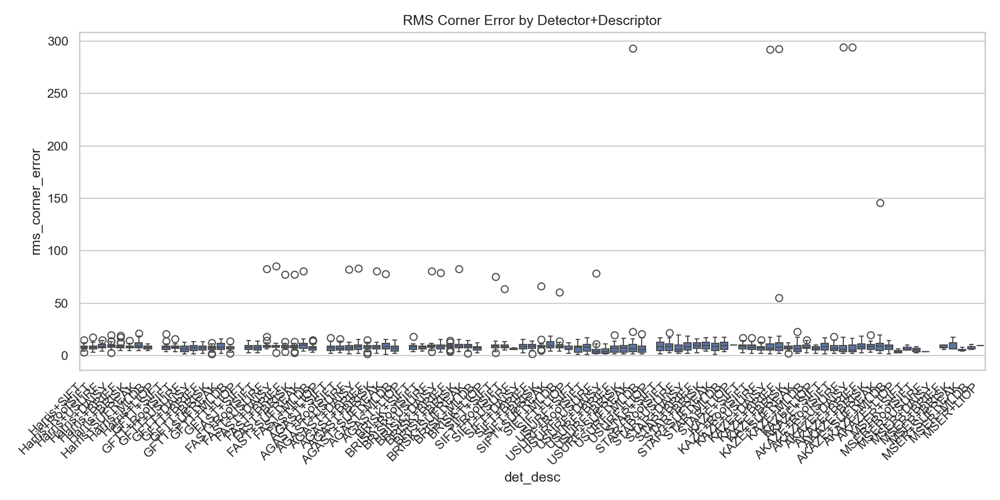
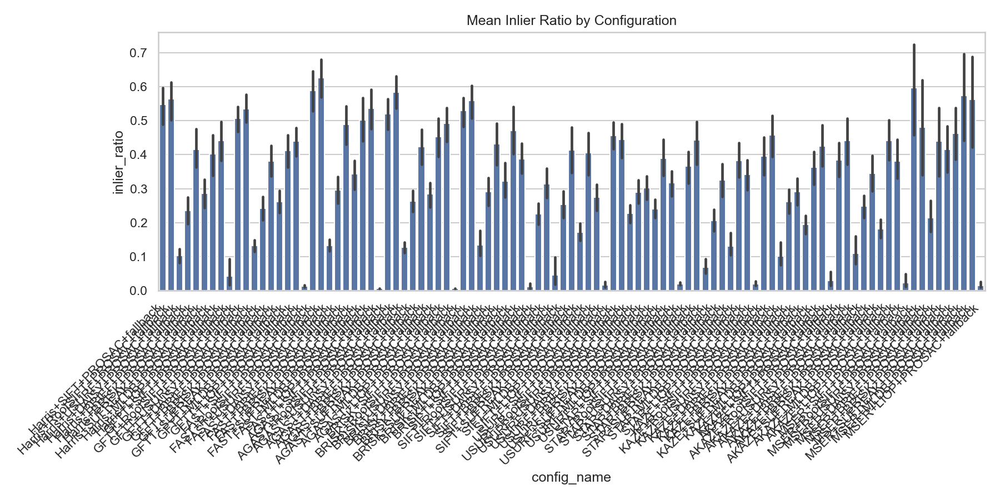
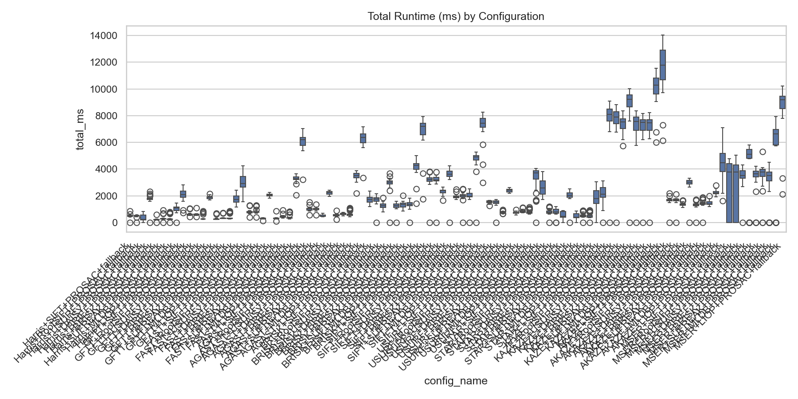
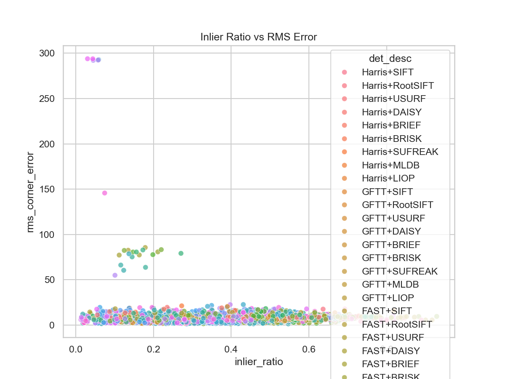
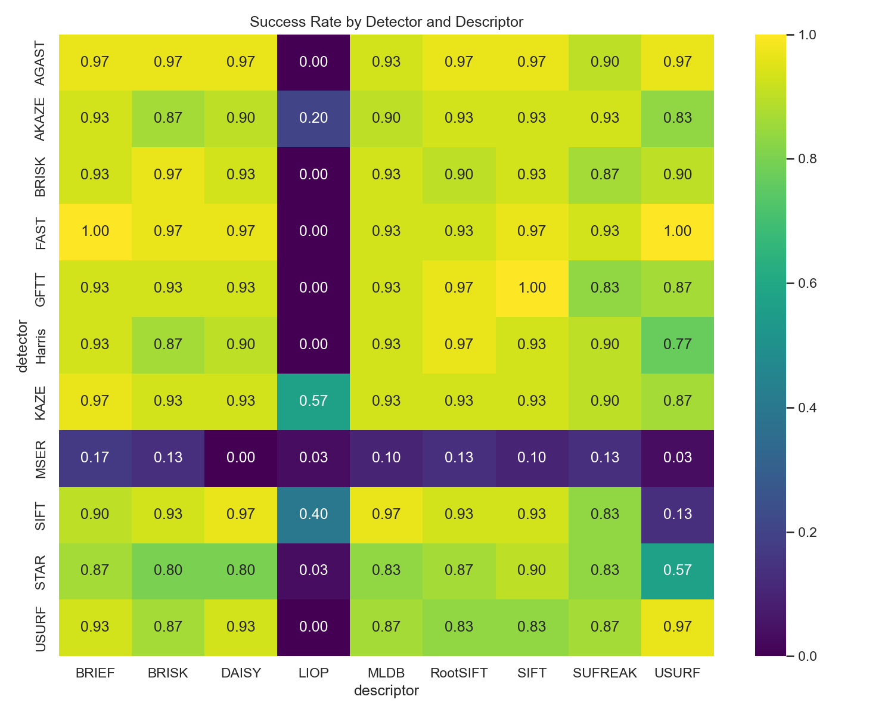

# Overlap Detection Summary Report

Total runs executed: 2970

Overall success rate: 74.88%

Best configuration by median RMS error: **MSER+USURF+PROSAC+fallback**

Best configuration by speed: **Harris+BRIEF+PROSAC+fallback**

Best configuration by IoU: **MSER+USURF+PROSAC+fallback**

## Warning: Low Inlier Ratio Runs (Potential Periodicity Failures)

618 runs had <10% inliers.

## Success Rate by Detector × Descriptor

| Detector | BRIEF | BRISK | DAISY | LIOP | MLDB | RootSIFT | SIFT | SUFREAK | USURF |
|---|---|---|---|---|---|---|---|---|---|
| AGAST | 0.97 | 0.97 | 0.97 | 0.00 | 0.93 | 0.97 | 0.97 | 0.90 | 0.97 |
| AKAZE | 0.93 | 0.87 | 0.90 | 0.20 | 0.90 | 0.93 | 0.93 | 0.93 | 0.83 |
| BRISK | 0.93 | 0.97 | 0.93 | 0.00 | 0.93 | 0.90 | 0.93 | 0.87 | 0.90 |
| FAST | 1.00 | 0.97 | 0.97 | 0.00 | 0.93 | 0.93 | 0.97 | 0.93 | 1.00 |
| GFTT | 0.93 | 0.93 | 0.93 | 0.00 | 0.93 | 0.97 | 1.00 | 0.83 | 0.87 |
| Harris | 0.93 | 0.87 | 0.90 | 0.00 | 0.93 | 0.97 | 0.93 | 0.90 | 0.77 |
| KAZE | 0.97 | 0.93 | 0.93 | 0.57 | 0.93 | 0.93 | 0.93 | 0.90 | 0.87 |
| MSER | 0.17 | 0.13 | 0.00 | 0.03 | 0.10 | 0.13 | 0.10 | 0.13 | 0.03 |
| SIFT | 0.90 | 0.93 | 0.97 | 0.40 | 0.97 | 0.93 | 0.93 | 0.83 | 0.13 |
| STAR | 0.87 | 0.80 | 0.80 | 0.03 | 0.83 | 0.87 | 0.90 | 0.83 | 0.57 |
| USURF | 0.93 | 0.87 | 0.93 | 0.00 | 0.87 | 0.83 | 0.83 | 0.87 | 0.97 |

## Median RMS Error Table

| Configuration | Median RMS Error (px) |
|--------------|----------------------|
| MSER+USURF+PROSAC+fallback | 3.59 |
| USURF+DAISY+PROSAC+fallback | 3.64 |
| USURF+USURF+PROSAC+fallback | 3.70 |
| AKAZE+LIOP+PROSAC+fallback | 3.85 |
| MSER+RootSIFT+PROSAC+fallback | 5.08 |
| MSER+SUFREAK+PROSAC+fallback | 5.27 |
| AKAZE+DAISY+PROSAC+fallback | 5.28 |
| MSER+SIFT+PROSAC+fallback | 5.73 |
| SIFT+USURF+PROSAC+fallback | 5.79 |
| STAR+USURF+PROSAC+fallback | 5.81 |
| AKAZE+USURF+PROSAC+fallback | 6.06 |
| USURF+MLDB+PROSAC+fallback | 6.11 |
| GFTT+USURF+PROSAC+fallback | 6.34 |
| KAZE+SUFREAK+PROSAC+fallback | 6.38 |
| USURF+SUFREAK+PROSAC+fallback | 6.39 |
| MSER+MLDB+PROSAC+fallback | 6.52 |
| SIFT+LIOP+PROSAC+fallback | 6.65 |
| MSER+BRISK+PROSAC+fallback | 6.65 |
| USURF+BRIEF+PROSAC+fallback | 6.78 |
| AGAST+RootSIFT+PROSAC+fallback | 6.86 |
| AKAZE+RootSIFT+PROSAC+fallback | 6.87 |
| KAZE+DAISY+PROSAC+fallback | 6.99 |
| AGAST+MLDB+PROSAC+fallback | 6.99 |
| KAZE+LIOP+PROSAC+fallback | 7.00 |
| GFTT+MLDB+PROSAC+fallback | 7.18 |
| KAZE+USURF+PROSAC+fallback | 7.32 |
| AGAST+USURF+PROSAC+fallback | 7.32 |
| GFTT+BRISK+PROSAC+fallback | 7.35 |
| AGAST+SIFT+PROSAC+fallback | 7.37 |
| FAST+MLDB+PROSAC+fallback | 7.41 |
| USURF+BRISK+PROSAC+fallback | 7.48 |
| BRISK+MLDB+PROSAC+fallback | 7.56 |
| GFTT+DAISY+PROSAC+fallback | 7.57 |
| FAST+RootSIFT+PROSAC+fallback | 7.62 |
| GFTT+BRIEF+PROSAC+fallback | 7.64 |
| KAZE+BRISK+PROSAC+fallback | 7.70 |
| USURF+SIFT+PROSAC+fallback | 7.72 |
| KAZE+BRIEF+PROSAC+fallback | 7.87 |
| USURF+RootSIFT+PROSAC+fallback | 7.88 |
| Harris+MLDB+PROSAC+fallback | 7.93 |
| KAZE+RootSIFT+PROSAC+fallback | 7.95 |
| MSER+BRIEF+PROSAC+fallback | 7.99 |
| AGAST+BRISK+PROSAC+fallback | 8.04 |
| GFTT+SUFREAK+PROSAC+fallback | 8.04 |
| KAZE+MLDB+PROSAC+fallback | 8.14 |
| Harris+RootSIFT+PROSAC+fallback | 8.14 |
| BRISK+RootSIFT+PROSAC+fallback | 8.19 |
| GFTT+SIFT+PROSAC+fallback | 8.21 |
| GFTT+RootSIFT+PROSAC+fallback | 8.22 |
| Harris+SIFT+PROSAC+fallback | 8.24 |
| FAST+SIFT+PROSAC+fallback | 8.24 |
| AKAZE+MLDB+PROSAC+fallback | 8.29 |
| AGAST+DAISY+PROSAC+fallback | 8.29 |
| STAR+DAISY+PROSAC+fallback | 8.32 |
| AKAZE+SIFT+PROSAC+fallback | 8.48 |
| Harris+BRISK+PROSAC+fallback | 8.49 |
| STAR+SUFREAK+PROSAC+fallback | 8.50 |
| AGAST+BRIEF+PROSAC+fallback | 8.55 |
| Harris+USURF+PROSAC+fallback | 8.56 |
| FAST+BRISK+PROSAC+fallback | 8.56 |
| BRISK+SIFT+PROSAC+fallback | 8.57 |
| SIFT+RootSIFT+PROSAC+fallback | 8.58 |
| AKAZE+BRISK+PROSAC+fallback | 8.61 |
| STAR+RootSIFT+PROSAC+fallback | 8.63 |
| AKAZE+BRIEF+PROSAC+fallback | 8.65 |
| Harris+BRIEF+PROSAC+fallback | 8.69 |
| SIFT+MLDB+PROSAC+fallback | 8.69 |
| BRISK+DAISY+PROSAC+fallback | 8.71 |
| AGAST+SUFREAK+PROSAC+fallback | 8.73 |
| SIFT+BRISK+PROSAC+fallback | 8.74 |
| SIFT+DAISY+PROSAC+fallback | 8.76 |
| STAR+SIFT+PROSAC+fallback | 8.77 |
| Harris+DAISY+PROSAC+fallback | 8.80 |
| FAST+DAISY+PROSAC+fallback | 8.82 |
| KAZE+SIFT+PROSAC+fallback | 8.88 |
| FAST+BRIEF+PROSAC+fallback | 8.88 |
| SIFT+SIFT+PROSAC+fallback | 8.93 |
| Harris+SUFREAK+PROSAC+fallback | 8.95 |
| AKAZE+SUFREAK+PROSAC+fallback | 8.96 |
| FAST+USURF+PROSAC+fallback | 8.96 |
| BRISK+BRIEF+PROSAC+fallback | 9.06 |
| SIFT+BRIEF+PROSAC+fallback | 9.14 |
| BRISK+BRISK+PROSAC+fallback | 9.16 |
| BRISK+USURF+PROSAC+fallback | 9.18 |
| BRISK+SUFREAK+PROSAC+fallback | 9.24 |
| STAR+BRIEF+PROSAC+fallback | 9.34 |
| STAR+MLDB+PROSAC+fallback | 9.40 |
| SIFT+SUFREAK+PROSAC+fallback | 9.50 |
| MSER+LIOP+PROSAC+fallback | 9.75 |
| STAR+BRISK+PROSAC+fallback | 9.77 |
| STAR+LIOP+PROSAC+fallback | 9.91 |
| FAST+SUFREAK+PROSAC+fallback | 9.97 |
| AGAST+LIOP+PROSAC+fallback | nan |
| BRISK+LIOP+PROSAC+fallback | nan |
| FAST+LIOP+PROSAC+fallback | nan |
| GFTT+LIOP+PROSAC+fallback | nan |
| Harris+LIOP+PROSAC+fallback | nan |
| MSER+DAISY+PROSAC+fallback | nan |
| USURF+LIOP+PROSAC+fallback | nan |

## Visualizations

